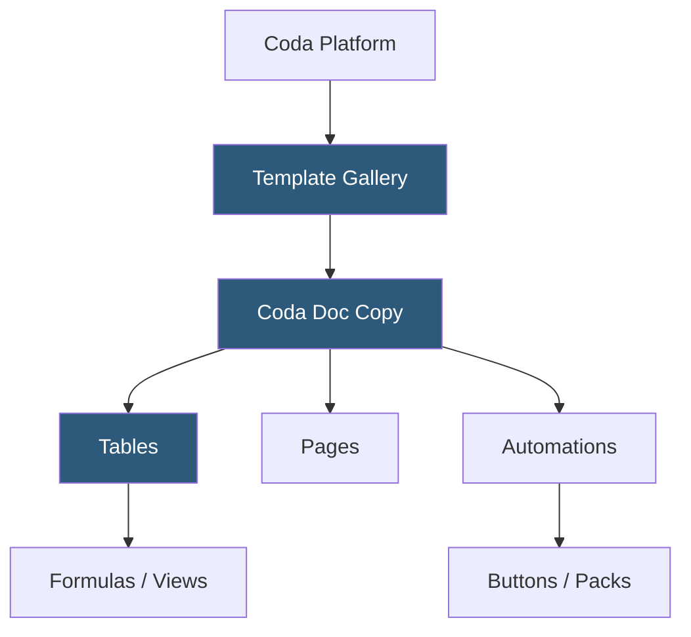

**Category:** Template Marketplaces
**Difficulty:** Beginner
**Reading time:** 5 min read

---

The Coda Template Gallery is a collection of pre-built docs and applications created on the Coda platform, which combines document editing with database-like tables and programmable buttons. Templates range from simple meeting notes to complex OKR tracking systems, leveraging Coda's formula engine and automation capabilities.

- **Coda Doc** — a Coda document is a single workspace containing pages, tables, views, and formulas
- **Tables** — Coda's spreadsheet-like data containers with typed columns, formulas, and multiple view types
- **Packs** — Coda's integration system connecting docs to external services (Jira, Slack, Google Calendar)
- **Buttons and Automations** — programmatic actions within docs triggering row modifications, notifications, or API calls
- **Cross-Doc** — Coda's feature for syncing data between separate Coda docs like a live reference
- **Gallery Sections** — template categories organized by use case: product, sales, engineering, HR, personal
- **Copy to Doc** — one-click template installation copying the full doc structure to a user's workspace

Coda templates are shared Coda docs with a "Copy to your account" button. Copying triggers a server-side duplication that clones all pages, tables, column schemas, formulas, buttons, and automations into the recipient's workspace. Cross-Doc references in templates point to the original shared doc by default; users must reconfigure them to point to their own data sources after copying.

Coda's formula language—Coda Formula Language (CFL)—is similar to spreadsheet formulas but operates across tables. Templates use CFL to create calculated columns (e.g., `Days Until Deadline = Today() - DueDate`), roll-up summaries (e.g., total budget across project rows), and conditional formatting logic. Buttons execute action formulas: a "Mark Complete" button might run `ModifyRows(Tasks, thisRow, [Status, "Done"])` updating the current row's status field.

Automations in templates define scheduled or trigger-based workflows. A daily Slack notification automation uses a Pack connection (Slack Pack) combined with a scheduled trigger and a formula computing which tasks are due today. Pack configurations are not transferred with template copies—users must authenticate their own Pack connections after installing a template, ensuring credential security. The gallery is browsable without a Coda account, and templates can be previewed in read-only mode before copying.

- Product teams tracking OKRs, roadmaps, and sprint planning
- Sales teams managing CRM pipelines and activity tracking
- HR teams building hiring pipelines and employee onboarding trackers
- Content creators managing editorial calendars with automated reminders
- Engineering teams linking feature requests to sprint tasks

| Advantage | Disadvantage |
|-----------|--------------|
| Formula-powered templates provide true interactivity beyond passive documents | Pack connections must be reconfigured after template copy |
| Automations enable workflow orchestration within a single doc | Formula language has learning curve for non-spreadsheet users |
| Templates can integrate with external services via Packs | Complex templates can have performance issues with large datasets |
| Free tier enables template exploration without payment | Advanced Pack usage and automations require paid plans |

- [Notion Template Gallery](notion-template-gallery.md)
- [Airtable Template Marketplace](airtable-template-marketplace.md)
- [Monday.com Template Center](monday-com-template-center.md)

---
*Part of the [Template Marketplaces](index.md) category · [Back to Master Index](../../index.md)*
