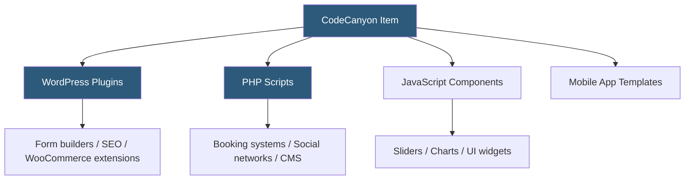

**Category:** Template Marketplaces
**Difficulty:** Intermediate
**Reading time:** 5 min read

---

CodeCanyon is Envato's marketplace for code items including WordPress plugins, PHP scripts, JavaScript components, mobile app templates, and miscellaneous code tools. Unlike ThemeForest's design-centric catalog, CodeCanyon items are primarily functional software components that extend applications or provide standalone functionality.

- **WordPress Plugin** — installable extension adding specific functionality to WordPress sites
- **PHP Script** — standalone server-side application (booking systems, CRM, forums) distributed as source code
- **JavaScript Plugin** — client-side component (sliders, galleries, form validators) for integration into any site
- **Regular License** — covers single end-product that's free to end users
- **SaaS/OEM Add-On** — extended license for products sold to customers or used in commercial software
- **Envato Market API** — programmatic license verification system authors integrate for activation checks
- **Item Support Policy** — Envato mandates minimum response times and defines what support must cover
- **Code Quality Review** — Envato staff review submissions for security, performance, and documentation standards

CodeCanyon items span a broader technical spectrum than design marketplaces. PHP scripts in particular represent complete application frameworks — a social networking script might include user profiles, messaging, newsfeeds, and payment integration, giving entrepreneurs a foundation for a startup without building from scratch.

The license verification model is important to understand for PHP scripts. Many authors implement the Envato Market API for license validation, requiring the buyer to enter their purchase code during installation. This call validates the purchase against Envato's servers and may check that the license isn't being used beyond its scope. Some authors implement domain-locked licensing, preventing use beyond a registered domain.

WordPress plugins on CodeCanyon often compete directly with premium plugins sold through independent author sites. The advantage of CodeCanyon is discoverability and Envato's buyer protection guarantee; the disadvantage is that plugin updates on CodeCanyon sometimes lag behind standalone sales channels, and auto-update functionality requires the Envato Market plugin.

JavaScript components like jQuery plugins, Vue components, and React widgets provide reusable UI elements. These are typically framework-specific and require integration into an existing project's build system. Quality ranges from well-maintained modern ES modules to legacy jQuery code that may conflict with newer frameworks.

Security auditing at CodeCanyon is more important for buyers than on ThemeForest. PHP scripts that handle authentication, payments, or user data need careful security evaluation. Envato's review catches obvious vulnerabilities but isn't a comprehensive security audit; buyers running public-facing PHP scripts should conduct their own code review or engage a developer to assess risk.

- Deploying a booking/reservation system for a service business
- Adding advanced form functionality to a WordPress site
- Implementing a complete PHP-based community or marketplace platform
- Acquiring a ready-made mobile app template for iOS/Android
- Integrating specialized JavaScript UI components into a web application

| Advantage | Disadvantage |
|-----------|--------------|
| Complete functional applications available at low cost | PHP script code quality and security varies widely |
| Massive selection of WordPress plugin categories | License verification can fail during Envato API downtime |
| One-time cost vs ongoing SaaS subscriptions | Support commitments end; scripts may be unmaintained |
| Envato buyer protection and refund process | Domain locking prevents legitimate multi-site use |
| Community ratings expose poor-quality items | Competition from free open-source alternatives |

- [ThemeForest Templates Marketplace](themeforest-templates-marketplace.md)
- [Envato Elements Subscription](envato-elements-subscription.md)
- [ThemeForest HTML Templates](themeforest-html-templates.md)

---
*Part of the [Template Marketplaces](index.md) category · [Back to Master Index](../../index.md)*
