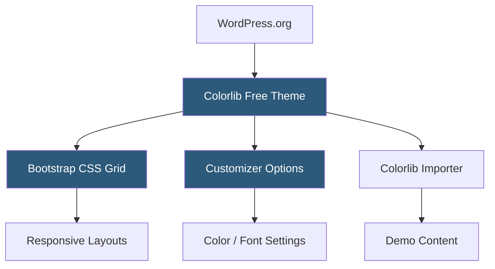

**Category:** Template Marketplaces
**Difficulty:** Beginner
**Reading time:** 5 min read

---

Colorlib is one of the largest providers of free WordPress themes, offering over 200 GPL-licensed themes covering blogs, portfolios, e-commerce, and business sites. Their themes are distributed through WordPress.org and their own site, with optional premium upgrades available for advanced features.

- **GPL Licensing** — all free themes released under the GNU General Public License, permitting modification and redistribution
- **WordPress.org Distribution** — themes reviewed and listed in the official WordPress theme directory for trust and discoverability
- **Freemium Model** — free base themes with paid "Pro" upgrades unlocking additional customization options
- **Bootstrap Framework** — many Colorlib themes built on Bootstrap CSS grid for responsive layout consistency
- **Customizer Integration** — theme options delivered through the standard WordPress Customizer API
- **One-Click Demo Import** — Colorlib Importer plugin for loading demo content into free themes
- **Regular Update Cadence** — themes updated for WordPress compatibility after major core releases

Colorlib themes follow the standard WordPress theme structure with functions.php handling enqueues, setup, and widget registrations. Bootstrap CSS is loaded as the primary grid framework, with custom Colorlib CSS layered on top for typography, color, and component styling. JavaScript dependencies (Bootstrap JS, jQuery plugins) are registered and enqueued conditionally based on active template features.

The Customizer integration uses WordPress's native `WP_Customize_Manager` API to register sections, settings, and controls. Most Colorlib themes expose panels for site identity, colors, typography, and layout width. Customizer settings are saved as theme mods and output via an inline `<style>` block in `wp_head`, which is generated by a PHP function that reads theme mod values and builds CSS rules dynamically.

Demo content import relies on the Colorlib Importer plugin, which uses the WordPress Import API to load XML content files bundled with the theme. Widget data is restored through a separate JSON import step. The free-to-pro upgrade path typically involves purchasing a companion plugin that extends the Customizer with additional sections—rather than requiring a full theme switch—preserving existing content.

- Budget-conscious bloggers needing polished designs at zero cost
- WordPress beginners learning theme customization safely
- Non-profit organizations with limited web budgets
- Small businesses evaluating WordPress before committing to premium
- Developers prototyping sites before selecting a premium theme

| Advantage | Disadvantage |
|-----------|--------------|
| Zero cost with GPL freedom to modify | Free version has limited customization depth |
| WordPress.org listing provides trust and auto-updates | Bootstrap dependency adds CSS overhead versus utility-first approaches |
| Large catalog covers most common use cases | Freemium upsell prompts can feel intrusive in the admin |
| Regular compatibility updates maintain stability | Design quality varies across the catalog |

- [WordPress.org Theme Directory](wordpress-org-theme-directory.md)
- [ThemeIsle WordPress Themes](themeisle-wordpress-themes.md)
- [Array Themes Collection](array-themes-collection.md)

---
*Part of the [Template Marketplaces](index.md) category · [Back to Master Index](../../index.md)*
