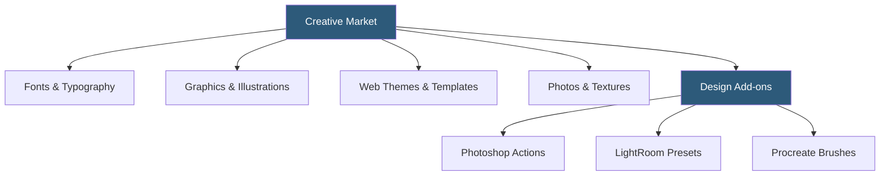

**Category:** Template Marketplaces
**Difficulty:** Beginner
**Reading time:** 5 min read

---

Creative Market is a community-driven marketplace for design assets created by independent designers, covering fonts, graphics, templates, themes, photos, and add-ons for design applications. Unlike code-focused marketplaces, Creative Market targets graphic designers and marketers who need print-ready and digital design resources for Photoshop, Illustrator, Figma, Canva, and similar tools.

- **Commercial License** — default license permitting use in client work and products sold to end users
- **Extended License** — required for items used in products sold to multiple customers or for print-on-demand
- **Freebies** — weekly rotating selection of free items used as a discovery mechanism
- **Bundle Deals** — curated collections from a single creator sold at a discount versus individual prices
- **Asset Types** — fonts, graphics, templates, themes, photos, add-ons, 3D models
- **Canva-Ready Assets** — templates formatted for direct import into Canva's editor
- **Figma UI Kits** — component libraries and design system starters for Figma
- **Shop Followers** — subscription model where buyers follow creators and receive notifications of new releases

Creative Market operates as a pure marketplace — all products are created by independent designers who retain their intellectual property and set their own prices. The platform takes a commission (approximately 40%) on each sale. This structure attracts high-quality work from professional designers, since the platform's reputation incentivizes quality over volume.

The licensing model is simpler than Envato's. Most products come with a standard commercial license by default, which covers use in client projects, marketing materials, and digital products sold to others — as long as the asset itself is not the primary deliverable (i.e., you can't resell the font as a font, but you can use it in a logo you sell). Extended licenses cover print-on-demand merchandise and unlimited-seat enterprise use.

The weekly free goods system is central to Creative Market's growth engine. Each Monday, creators offer 6 free products ranging from font families to complete Figma UI kits. These freebies use the standard commercial license, making them genuinely usable in professional work — not just personal projects. Collectors accumulate these assets aggressively, and the system drives new user registration.

Search and discovery uses keyword tagging and category browsing, but Creative Market's most powerful discovery mechanism is the curated editorial collections. The platform regularly publishes "10 Fresh Fonts This Week" and similar roundups that surface new creators and drive traffic to their shops. This editorial layer helps buyers surface quality items above the commodity-level noise.

The download experience is immediate — files are hosted on Creative Market's CDN and download as ZIP archives. Files may include multiple format variants (OTF+TTF for fonts, AI+EPS+PNG for graphics) and sometimes include bonus items not listed in the product description.

- Licensing commercial fonts for brand identity and marketing materials
- Acquiring illustration packs for social media content creation
- Downloading Figma UI component libraries for design system work
- Finding Photoshop mockup templates for product presentation
- Sourcing Canva-ready social media template packs for marketing teams

| Advantage | Disadvantage |
|-----------|--------------|
| High-quality design assets from professional creators | Prices can be high for premium items |
| Commercial license included by default | Platform search lacks advanced filtering |
| Weekly free goods with commercial license | No code items; purely design-focused |
| Large font library with preview tools | License compliance requires careful reading for edge cases |
| Multi-format downloads for broad compatibility | No subscription option for high-volume users |

- [Creative Market Templates](creative-market-templates.md)
- [Envato Elements Subscription](envato-elements-subscription.md)
- [Canva Template Library](canva-template-library.md)

---
*Part of the [Template Marketplaces](index.md) category · [Back to Master Index](../../index.md)*
