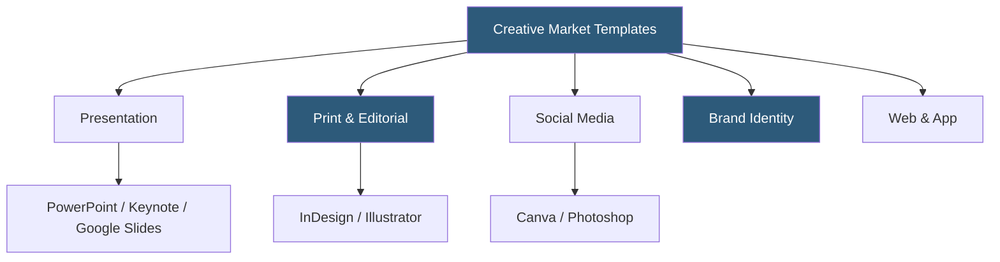

**Category:** Template Marketplaces
**Difficulty:** Beginner
**Reading time:** 5 min read

---

Creative Market's templates subcategory focuses on ready-to-use layout files for presentation software, print design, social media, and web design applications — distinct from code templates found on ThemeForest. These are design-layer files in formats like PowerPoint, Keynote, InDesign, Canva, Figma, and Adobe XD that buyers customize with their own content.

- **Presentation Templates** — PowerPoint/Keynote/Google Slides decks with professional slide layouts
- **Print Templates** — InDesign or Illustrator files for brochures, business cards, flyers, and annual reports
- **Social Media Templates** — Canva, Photoshop, or Figma files sized for Instagram, LinkedIn, and other platforms
- **Brand Identity Kits** — bundled logo templates, business card, letterhead, and brand guide files
- **Mock-up Templates** — Photoshop PSD smart-object files for presenting designs in real-world contexts
- **Editable PDF** — form-fillable PDF templates for invoices, contracts, and documents
- **Smart Objects** — Photoshop layer feature allowing one-click image replacement in mockups
- **Bleed & Trim Marks** — print-ready settings included in professional print template files

Creative Market templates are application-specific files — a buyer must own the corresponding software to use them. A Keynote template requires macOS and Keynote; an InDesign brochure template requires an active Adobe Creative Cloud subscription. This creates a more niche but highly targeted audience compared to web templates that only require a browser.

Presentation templates are the highest-volume category, driven by business professionals who need polished slide decks quickly. A typical professional presentation template includes 30–80 unique slide layouts, master slide definitions, icon libraries, infographic components, and chart placeholders. The presentation is purchased as a PPTX, KEY, or Google Slides link (the last requiring a Google account for direct import).

Print templates from InDesign are often sold as INDD package files that include linked fonts and images, or IDML files for backward compatibility with older InDesign versions. Professional print templates include proper bleed settings (typically 3mm or 0.125 inches), CMYK color profiles, and embedded trim marks to meet professional print shop specifications.

The social media template segment has grown substantially with the creator economy. Multi-pack bundles of Instagram story, post, and Reel templates in Canva are among the best-sellers, offering consistent visual branding across content types. Canva templates are distributed as share links that buyers click to copy the template to their Canva account — a frictionless distribution mechanism that doesn't require file downloads.

Mock-up templates occupy a specialty niche. Photoshop PSD mockups use smart objects to let buyers insert their own design with a double-click, then the file's lighting and shadow layers composite the design realistically onto the product or environment. Device mockups, packaging mockups, and apparel mockups are popular for product and brand presentations.

- Creating professional pitch decks with slide designs beyond PowerPoint defaults
- Designing print materials (brochures, business cards) with print-shop-ready specs
- Building a consistent social media visual identity with template packs
- Producing product presentation images using device or packaging mockups
- Developing brand identity packages from bundled logo and collateral templates

| Advantage | Disadvantage |
|-----------|--------------|
| Application-native files for professional editing | Requires owning the specific design software |
| Print templates meet professional production standards | InDesign font licensing separate from template |
| Canva templates need no software installation | Canva templates tied to Canva's ecosystem |
| High visual quality from professional designers | Fonts may require separate purchase if not bundled |
| Immediate download and use | Template style may date quickly in fast-moving design trends |

- [Creative Market Design Assets](creative-market-design-assets.md)
- [Canva Template Library](canva-template-library.md)
- [Envato Elements Subscription](envato-elements-subscription.md)

---
*Part of the [Template Marketplaces](index.md) category · [Back to Master Index](../../index.md)*
