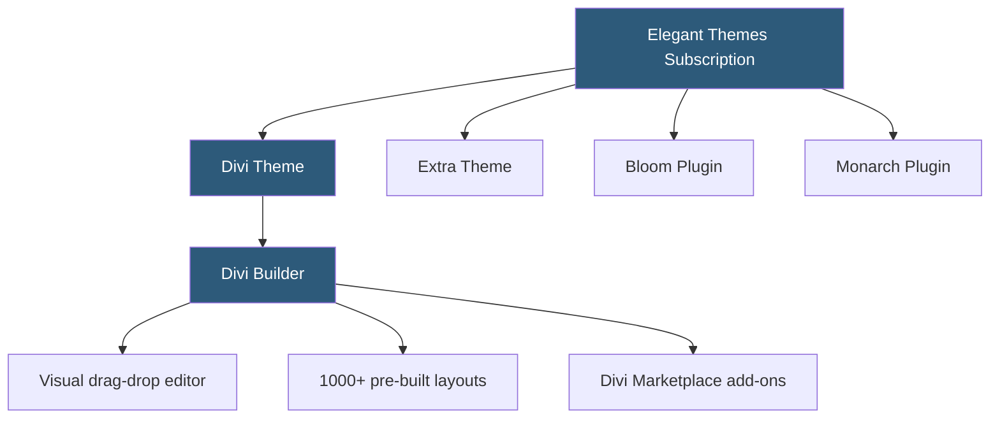

**Category:** Template Marketplaces
**Difficulty:** Beginner
**Reading time:** 5 min read

---

Elegant Themes is a WordPress theme and plugin company best known for the Divi multipurpose theme and Divi Builder page builder. Operating on a subscription model rather than one-time purchases, it offers access to all themes and plugins for a flat annual or lifetime fee, positioning itself as a comprehensive WordPress design platform for professionals.

- **Divi Builder** — proprietary visual page builder using a row-column-module system with front-end and back-end editing modes
- **Divi Theme** — flagship multipurpose WordPress theme that bundles the Divi Builder
- **Extra Theme** — magazine-focused WordPress theme also using the Divi Builder
- **Bloom Email Opt-in Plugin** — opt-in form plugin with multiple display triggers and form types
- **Monarch Social Sharing Plugin** — social share button plugin with multiple placement options
- **Annual License** — yearly subscription providing access to all themes, plugins, and updates
- **Lifetime License** — one-time payment for perpetual access to all products and updates
- **Divi Marketplace** — third-party layout packs, child themes, and modules sold by independent developers

Elegant Themes operates a closed ecosystem centered on the Divi Builder. Unlike Elementor or WPBakery, which are plugins installable on any theme, the Divi Builder is tightly integrated with the Divi Theme, though it can also be used as a standalone plugin on non-Divi themes.

The subscription model grants access to the entire product suite and unlimited website use. Annual subscribers pay roughly $89/year; lifetime licenses cost approximately $249 as a one-time payment. The lifetime model is unusual in the commercial theme space and appeals strongly to agencies and long-term WordPress practitioners who calculate the break-even against annual renewals.

The Divi Builder uses a section-row-column-module hierarchy. Sections are the outermost containers; rows define the column structure (1-4 columns); modules are the actual content elements — text, images, buttons, accordions, galleries, and 40+ others. The visual editor works on a real-time front-end preview mode where changes appear as they would look on the published site, plus a back-end wireframe mode for faster bulk editing.

The pre-built layout library has grown to over 1,000 complete page designs organized by industry and purpose. Each layout pack contains a homepage, about page, services, blog, and contact page designed to work cohesively. Users can import a complete layout pack to establish a site's visual direction, then customize module content.

The Divi Marketplace, launched in 2018, added a third-party ecosystem where developers sell custom layout packs, child themes, and custom modules. This ecosystem added the long-tail of specialized designs Elegant Themes couldn't produce in-house, though it's smaller and less mature than the broader WordPress theme market.

- Building multi-page WordPress websites with consistent visual design
- Creating custom landing pages without coding for marketing campaigns
- Magazine and blog sites needing the Extra theme's content organization features
- Agencies deploying dozens of WordPress sites using one subscription
- Developers building complex page layouts with Divi's row and module system

| Advantage | Disadvantage |
|-----------|--------------|
| Lifetime license provides perpetual access | Divi creates significant theme lock-in |
| Large pre-built layout library for rapid starts | Divi-generated code is verbose and complex |
| Unlimited website use on single subscription | Performance slower than lightweight theme alternatives |
| Active development with frequent feature releases | Harder to migrate to Gutenberg or other builders |
| Third-party Divi Marketplace extends capabilities | Ecosystem smaller than Elementor's plugin library |

- [Astra Theme Ecosystem](astra-theme-ecosystem.md)
- [ThemeForest WordPress Themes](themeforest-wordpress-themes.md)
- [Kadence Theme Blocks](kadence-theme-blocks.md)

---
*Part of the [Template Marketplaces](index.md) category · [Back to Master Index](../../index.md)*
