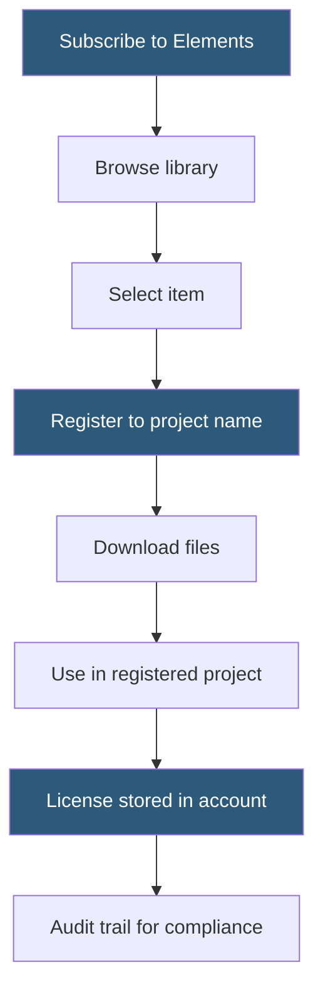

**Category:** Template Marketplaces
**Difficulty:** Beginner
**Reading time:** 5 min read

---

Envato Elements is a subscription service offering unlimited downloads from a library of over 16 million digital assets including website templates, WordPress themes, fonts, photos, videos, audio, and graphic templates. Unlike individual purchases on ThemeForest or CodeCanyon, Elements provides all-you-can-download access for a flat monthly or annual fee, making it economically superior for high-volume users.

- **Item Licensing** — each downloaded item generates a single-use license registered to a specific project
- **Project-Based Licensing** — subscribers must register each download to a named project before use
- **Commercial License** — standard Elements license covers commercial use in client work
- **WordPress Plugin** — Envato Elements WordPress plugin enables theme installation directly from the dashboard
- **Annual vs Monthly Pricing** — significant discount for annual commitment versus month-to-month
- **Team Plan** — multi-seat subscription for agencies and teams with shared access
- **Content Removal** — items may be removed from the library, but previously licensed downloads remain usable
- **Elements vs Marketplace** — Elements is subscription; ThemeForest/CodeCanyon are individual purchases

Envato Elements' subscription model creates a different economic relationship than one-time marketplace purchases. For individuals and teams producing multiple projects per month, the flat subscription cost amortizes across projects in a way that individual purchases cannot match. A freelance designer who uses 5 premium fonts, 3 presentation templates, and 2 website themes per month would pay significantly more on individual marketplaces.

The project-based licensing system is the critical compliance mechanism. When a subscriber downloads any item, they must first create or select a project — a named container that represents the end use. The license is tied to that specific project, meaning the same template downloaded twice generates two separate licenses if registered to two projects. This allows unlimited project use while maintaining license record-keeping.

The library spans multiple content types: graphic templates (logos, presentations, social media), website templates (HTML, WordPress, Shopify), fonts, photos, music, video templates (After Effects, Premiere Pro, Motion), and 3D assets. This breadth makes Elements particularly valuable for agencies and content creators who work across multiple media types.

Content removal is an important risk factor. Envato can remove items from the library at any time (due to copyright disputes, author requests, or quality issues). Items downloaded and licensed before removal remain covered by their original licenses, but subscribers can no longer access the files if they didn't download them previously — which creates a practice of downloading and archiving items preemptively for high-use assets.

The WordPress plugin integration is a practical differentiator. Subscribers can browse the Elements library from within the WordPress admin panel, install themes directly to their site, and manage licenses from the dashboard — eliminating the manual download-and-upload workflow.

- Agencies and freelancers producing multiple client websites per year
- Content creators who need stock photos, music, and video templates regularly
- Developers who use multiple HTML/Bootstrap templates for different projects
- Marketers producing high-volume social media and presentation assets
- Teams needing shared access to a single design asset subscription

| Advantage | Disadvantage |
|-----------|--------------|
| Unlimited downloads across 16M+ assets | Project-based licensing requires administrative tracking |
| Covers multiple asset types in one subscription | Items can be removed from library after subscription |
| Significant cost savings at high-volume usage | No perpetual ownership; stops if subscription lapses |
| Team plans for shared agency access | Not all ThemeForest items available on Elements |
| WordPress plugin for direct installation | Annual commitment required for best pricing |

- [ThemeForest Templates Marketplace](themeforest-templates-marketplace.md)
- [Creative Market Design Assets](creative-market-design-assets.md)
- [Envato Elements Unlimited Downloads](envato-elements-unlimited-downloads.md)

---
*Part of the [Template Marketplaces](index.md) category · [Back to Master Index](../../index.md)*
