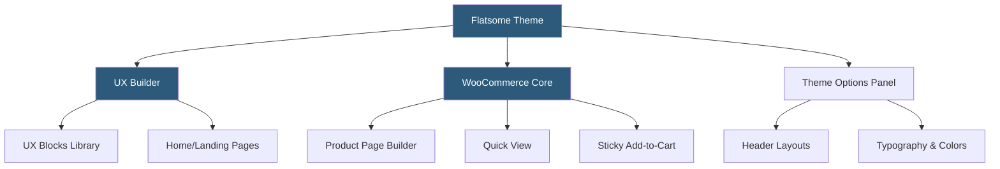

**Category:** Template Marketplaces
**Difficulty:** Intermediate
**Reading time:** 6 min read

---

Flatsome is the best-selling WooCommerce theme on ThemeForest, built by UX-Themes specifically for e-commerce. It bundles the proprietary UX Builder page builder and focuses on store performance, conversion-optimized product page layouts, and extensive WooCommerce customization options not available in general-purpose themes.

- **UX Builder** — Flatsome's proprietary front-end page builder with live editing directly on the page, optimized for WooCommerce product pages
- **UX Blocks** — reusable saved sections and layouts shared across pages and post types
- **WooCommerce Quick View** — product modal preview without navigating to the product page
- **Lazy Load** — built-in image lazy loading reducing initial page load weight for product catalog pages
- **Product Layout Builder** — WooCommerce-specific layout customizer for product page element ordering
- **Mega Menu** — built-in multi-column menu system for extensive navigation structures
- **Sticky Add-to-Cart** — floating add-to-cart bar that appears when the main button scrolls out of view
- **WooCommerce Account Pages** — styled account dashboard, order history, and checkout pages included

Flatsome's architecture is purpose-built for e-commerce conversion, and every major feature decision reflects the needs of WooCommerce store owners rather than general website builders. The UX Builder was designed to create sales-oriented page layouts — hero sections, featured product rows, promotional banners, countdown timers, and category grids — using a visual front-end editing experience.

The UX Builder operates in a live front-end mode where clicking elements on the actual page reveals edit controls in an overlay panel. This is distinct from builders like Elementor that open a separate editing frame; UX Builder edits are applied directly to the live page view. The building blocks (called Sections, Boxes, and Elements) are WooCommerce-aware — a Flatsome "Products" element connects directly to WooCommerce product queries with filtering by category, tag, or custom attributes.

UX Blocks solves the content reuse problem for store owners building promotional campaigns. A sale banner or featured category section can be saved as a named block and inserted into multiple pages from a dropdown selector. Updating the block updates all its instances simultaneously — critical for time-sensitive promotional content.

The Product Layout Builder is one of Flatsome's most valuable features. WooCommerce by default renders product pages in a fixed sequence: images, title, price, description, add-to-cart, tabs. Flatsome's product layout builder replaces this with a drag-and-drop interface for reordering these elements, controlling whether they appear in the main column or summary column, and adding UX Builder content between WooCommerce native elements.

Flatsome's performance focus includes conditional script loading (scripts load only when their feature is actively used), webp image support, and built-in lazy loading for all images. The product catalog benefits from infinite scroll options and AJAX-powered price range sliders and attribute filters.

- WooCommerce stores prioritizing conversion optimization through product page layout control
- Fashion, electronics, or specialty retail stores needing branded catalog presentations
- Stores using promotional campaigns that benefit from UX Blocks for rapid banner updates
- High-volume product catalogs benefiting from lazy load and infinite scroll
- Merchants wanting sticky add-to-cart to reduce friction on long product detail pages

| Advantage | Disadvantage |
|-----------|--------------|
| Purpose-built WooCommerce features versus adapted generic themes | UX Builder creates theme lock-in for page content |
| Product layout builder without custom template code | Less powerful for non-WooCommerce page types |
| Sticky add-to-cart and quick view boost conversions | UX Builder extensions ecosystem smaller than Elementor |
| Performance optimizations targeted at product catalogs | Premium ThemeForest pricing; no free tier |
| Active development with frequent WooCommerce compatibility updates | Complex setup for new WooCommerce users |

- [ThemeForest WordPress Themes](themeforest-wordpress-themes.md)
- [Astra Theme Ecosystem](astra-theme-ecosystem.md)
- [Shopify Theme Store](shopify-theme-store.md)

---
*Part of the [Template Marketplaces](index.md) category · [Back to Master Index](../../index.md)*
