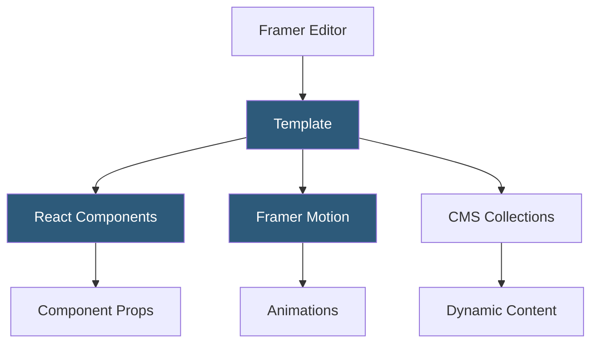

**Category:** Template Marketplaces
**Difficulty:** Intermediate
**Reading time:** 5 min read

---

The Framer Template Community is a marketplace of free and premium website templates built for the Framer visual web builder, which generates React-based websites. Templates range from single-page landing pages to multi-page marketing sites and are distributed through Framer's built-in template browser and the public community marketplace.

- **React-Based Output** — Framer generates optimized React components from visual designs, unlike traditional HTML builders
- **Framer Motion** — Framer's animation library providing physics-based and keyframe transitions usable in templates
- **Component Properties** — templates use Framer's component system with exposed variant and property controls
- **CMS Integration** — Framer CMS connects template layouts to structured content collections for dynamic pages
- **Smart Components** — interactive components with built-in state management for menus, carousels, and forms
- **Template Remixing** — Framer templates can be duplicated to a user's project for full customization
- **Framer Sites Hosting** — templates deploy directly to Framer's global CDN with automatic HTTPS

Framer templates are Framer project files (`.framer` JSON format) containing the full design tree, component definitions, CMS schemas, and site settings. When remixed, Framer creates a copy in the user's workspace. The Framer canvas operates as a visual React editor—each layer becomes a JSX element with CSS properties. Framer's compiler transforms this design tree into production React code with Server-Side Rendering capabilities.

Framer Motion powers all animations in templates. Designers define animations visually through the Interactions panel, which generates the corresponding `motion.div` variants and transition configs. Physics-based spring animations use the `spring` transition type, while scroll-triggered reveals use Framer's scroll-linked animation hooks. The output is valid Framer Motion code that advanced users can inspect in the code panel.

CMS-connected templates bind layout components to collection schemas. A blog template's article card, for instance, is a component with fields mapped to CMS fields (title, date, image, excerpt). When CMS data changes, Framer re-generates static pages at build time via its incremental static regeneration system. Smart Components (Framer's interactive primitives) encapsulate state transitions—a mobile menu Smart Component manages open/closed state through variant switching without external JavaScript.

- Tech startups building polished marketing sites with micro-interactions
- Designers prototyping and shipping production websites from a single tool
- Agencies delivering animated landing pages with physics-based scroll effects
- SaaS companies creating documentation and marketing sites with CMS blogs
- Creative professionals building interactive portfolio experiences

| Advantage | Disadvantage |
|-----------|--------------|
| React output enables high-performance production sites | Framer-specific platform creates lock-in for design workflow |
| Framer Motion animations are best-in-class for the web | Higher skill floor than traditional drag-and-drop builders |
| CMS handles dynamic content without external services | Exported code requires Framer context and isn't fully portable |
| Templates can be inspected down to React component level | Pricing scales with traffic and CMS usage |

- [Webflow Templates Marketplace](webflow-templates-marketplace.md)
- [Squarespace Template Store](squarespace-template-store.md)
- [Canva Template Library](canva-template-library.md)

---
*Part of the [Template Marketplaces](index.md) category · [Back to Master Index](../../index.md)*
