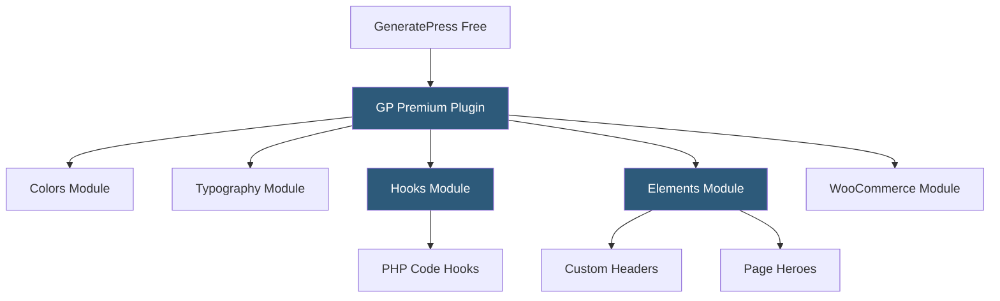

**Category:** Template Marketplaces
**Difficulty:** Intermediate
**Reading time:** 6 min read

---

GeneratePress is a performance-first WordPress theme developed by Tom Usborne, offering a free base theme and a premium module add-on sold as an annual or lifetime license. It is consistently ranked among the highest-performing WordPress themes by size and server request count, targeting developers and performance-sensitive projects where code cleanliness matters.

- **GeneratePress Premium** — add-on plugin unlocking advanced modules: Colors, Typography, Backgrounds, Blog, Hooks, WooCommerce, Disable Elements, and more
- **GP Premium Sites** — starter site library providing complete Gutenberg, Elementor, and Beaver Builder templates
- **Site Library** — web-based collection of complete site designs importable via GeneratePress Dashboard plugin
- **Hooks Module** — code execution at any of GeneratePress's action hooks directly from the admin panel, no PHP file editing required
- **Elements Module** — visual layout builder for headers, hooks, page heroes, and custom content without code
- **Block Elements** — modern Element type targeting Full Site Editing (block themes variant)
- **Clean Code Output** — GeneratePress generates valid, semantic HTML5 with BEM-style class naming
- **Lightweight Core** — theme core is under 10KB compressed; optional scripts load only when their features are active

GeneratePress is architecturally closer to Genesis Framework in philosophy than to builder themes like Divi. The core theme provides a solid HTML structure, accessibility features, and a comprehensive system of action hooks. The GP Premium add-on then unlocks modules that extend the theme's capabilities without fundamentally changing the base.

The Hooks module deserves particular attention. It allows site administrators to write PHP code that executes at any of GeneratePress's action hooks — typically a task requiring a child theme's `functions.php` or a code snippet plugin. The hooks interface provides a hook selector (all 70+ GeneratePress hooks are listed), a code editor with syntax highlighting, and conditional display rules. This bridges the gap between developer-oriented hook systems and accessible no-code tools.

The Elements module provides a content editor for building custom layout elements — custom headers, custom footer layouts, page heroes (large header sections), and block-style content sections. Elements use WordPress's native block editor for content composition and then use conditional logic to determine where they appear: specific pages, post types, taxonomies, or user roles. This makes GeneratePress capable of complex, conditional layouts without a separate page builder.

The WooCommerce module applies styling and layout options to shop pages that match GeneratePress's design language, including off-canvas sidebar filters, quick view, and shop page layout controls. The module prioritizes performance — it generates minimal CSS and avoids JavaScript-heavy interactions.

GeneratePress's license model offers a Personal tier (single site) and a GP Premium license for unlimited sites, with lifetime options. The unlimited license is competitively priced for agencies, and the lifetime tier provides exceptional long-term value. Active development and community support through official forums are strong points.

- Developer-oriented WordPress projects where code quality and semantic HTML matter
- Performance-critical sites where theme CSS weight is a competitive concern
- Gutenberg-first workflows using GeneratePress Elements for custom layouts
- Complex conditional layouts (per-page headers, category-specific templates) without PHP
- Agencies standardizing on a single high-performance theme foundation

| Advantage | Disadvantage |
|-----------|--------------|
| Extremely lightweight code (<10KB core) | Learning curve for Elements and Hooks modules |
| Hooks module enables code-free PHP customization | Less visual demo content than builder themes |
| Conditional Elements replace complex template logic | Smaller third-party ecosystem than Elementor |
| Clean semantic HTML favored by SEO tools | Full Site Editing support still maturing |
| Unlimited site license suitable for agencies | Marketing less flashy; requires technical evaluation |

- [Astra Theme Ecosystem](astra-theme-ecosystem.md)
- [StudioPress Genesis Themes](studiopress-genesis-themes.md)
- [Kadence Theme Blocks](kadence-theme-blocks.md)

---
*Part of the [Template Marketplaces](index.md) category · [Back to Master Index](../../index.md)*
