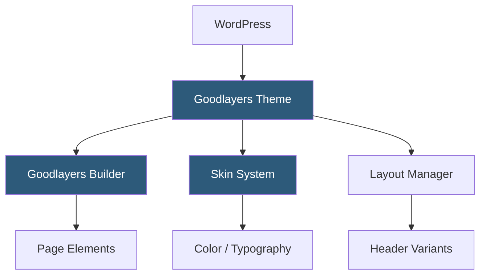

**Category:** Template Marketplaces
**Difficulty:** Beginner
**Reading time:** 5 min read

---

Goodlayers is a WordPress theme developer and marketplace known for its Landingpage Builder and a suite of niche-specific themes across travel, hotel, restaurant, and corporate verticals. Their themes bundle a proprietary page builder focused on simplicity and professional design coherence.

- **Goodlayers Page Builder** — proprietary drag-and-drop builder with a simplified element set optimized for fast page construction
- **Travel Theme** — flagship theme for travel agencies with itinerary, tour listing, and booking integration
- **Hotel Booking Integration** — native compatibility with booking plugins for reservation management
- **Skin System** — pre-configured color schemes and typography sets switchable from the theme panel
- **Layout Manager** — header and footer layout variations selectable per page or globally
- **Custom Portfolio Types** — built-in portfolio layouts with filterable category displays
- **Shortcode Library** — backup shortcode access for any page builder content blocks

Goodlayers themes ship with a companion core plugin that registers the proprietary page builder, custom post types (tour, room, portfolio), and theme-specific widgets. The page builder stores content as serialized JSON in post meta, which the front end deserializes into HTML at render time. This architecture means the content is stored independently of shortcodes, avoiding the bracket-pollution problem common with WPBakery-based themes.

The Skin System works through the WordPress Customizer, where each skin is a preset JSON object defining CSS custom property values. Switching skins triggers a Customizer live preview that immediately updates colors and fonts without saving, letting users compare options visually before committing.

The Layout Manager uses conditional tag logic in header.php to load different header PHP partials based on per-page meta settings or global Customizer defaults. Sticky navigation, transparent overlays, and mobile menu styles are configured through a structured options tree rather than scattered inline settings. Translation and WPML compatibility is built in, with `.pot` files provided for each theme.

- Travel agencies listing tours with pricing and booking
- Boutique hotels needing room showcase and reservations
- Restaurants requiring menu and reservation pages
- Corporate sites needing polished professional layouts
- Event venues promoting packages and availability calendars

| Advantage | Disadvantage |
|-----------|--------------|
| Niche themes reduce customization needed for specific industries | Proprietary page builder limits migration paths |
| Clean JSON content storage avoids shortcode dependency | Smaller ecosystem than ThemeForest mega-themes |
| Simple UI reduces training time for non-technical users | Fewer third-party plugin integrations than mainstream themes |
| Consistent design language across the theme lineup | Less frequent update cadence compared to larger studios |

- [ThemeForest Templates Marketplace](themeforest-templates-marketplace.md)
- [Avada Theme Builder](avada-theme-builder.md)
- [BeTheme Multipurpose Theme](betheme-multipurpose-theme.md)

---
*Part of the [Template Marketplaces](index.md) category · [Back to Master Index](../../index.md)*
