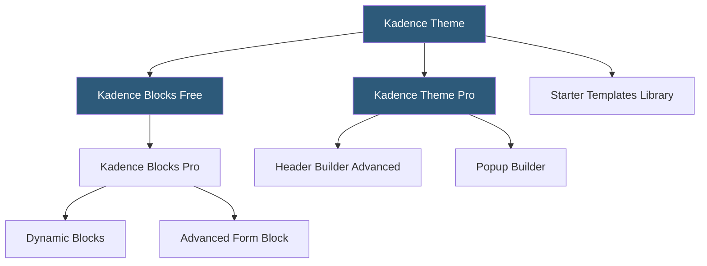

**Category:** Template Marketplaces
**Difficulty:** Beginner
**Reading time:** 5 min read

---

Kadence Theme is a modern WordPress theme built by Kadence WP, tightly integrated with Kadence Blocks — a Gutenberg block library that extends native block capabilities with advanced layout and design options. Together they form a cohesive design system that competes with page builder themes while remaining aligned with WordPress's native Full Site Editing direction.

- **Kadence Blocks** — free Gutenberg block plugin adding Row Layout, Advanced Heading, Advanced Button, Testimonials, and 20+ other blocks
- **Kadence Theme Pro** — premium upgrade adding advanced header builder, scroll animations, WooCommerce enhancements, and popup builder
- **Starter Templates** — importable site templates built with Kadence Blocks and the native block editor
- **Global Typography** — theme-level font management defining scales for headings and body text globally
- **Global Colors** — color palette management allowing brand color changes to propagate across all blocks
- **Full Site Editing Support** — Kadence Theme supports FSE block templates for headers, footers, and post templates
- **Row Layout Block** — Kadence's primary layout block providing multi-column grids with per-column settings
- **Dynamic Blocks** — Pro feature enabling blocks to display dynamic post data (featured image, custom fields) from queries

Kadence WP's strategic bet is that the WordPress ecosystem is fundamentally moving toward block-based editing, and that themes deeply integrated with Gutenberg will outperform page builder themes as WordPress core matures. Kadence Blocks serves this bet by providing a comprehensive block library without requiring a separate page builder plugin.

The Row Layout block is the structural foundation of most Kadence-built pages. It functions as a full-width section container with configurable column counts, gap settings, min-height, background (color, gradient, or image with overlay), vertical alignment, and per-column responsive control. Nesting multiple Row Layout blocks creates the section-based page architecture typical of landing pages.

Global Colors and Global Typography are Kadence's system for design consistency. Rather than setting colors in each block individually, designers define a palette of brand colors in theme settings (primary, secondary, tertiary, etc.) and use palette references throughout blocks. When a brand color changes, all blocks referencing that palette slot update simultaneously — a significant workflow improvement over manually hunting down hardcoded hex values.

The Starter Templates library includes 100+ complete site imports, all built with Kadence Blocks — no page builder dependency. This is a differentiator: imported sites require only Kadence Theme and Kadence Blocks rather than Elementor, Divi, or WPBakery, reducing the plugin footprint.

Kadence Theme Pro extends the built-in header builder with mega menus, transparent/sticky header behavior, off-canvas mobile navigation, and the ability to design entirely custom header layouts with drag-and-drop row and column composition. The Pro popup builder adds exit-intent, scroll-triggered, and timed popups without a separate plugin.

- Gutenberg-native sites wanting advanced blocks without a separate page builder
- WooCommerce stores using Kadence Pro's shop enhancements
- Sites maintaining design consistency via Global Colors system
- Full Site Editing projects using Kadence's FSE block template support
- Agencies preferring lightweight Kadence Blocks over Elementor dependencies

| Advantage | Disadvantage |
|-----------|--------------|
| Gutenberg-native approach avoids page builder lock-in | Smaller ecosystem than Elementor or Divi |
| Global Colors enable efficient brand updates | Full Site Editing features still maturing |
| Row Layout block covers most layout needs natively | Advanced animations require Pro license |
| Starter templates require no page builder plugins | Dynamic blocks require Pro license |
| Active development aligned with WordPress core direction | Less visual polish in free tier than competing paid themes |

- [Astra Theme Ecosystem](astra-theme-ecosystem.md)
- [GeneratePress Premium Themes](generatepress-premium-themes.md)
- [Neve Theme Templates](neve-theme-templates.md)

---
*Part of the [Template Marketplaces](index.md) category · [Back to Master Index](../../index.md)*
