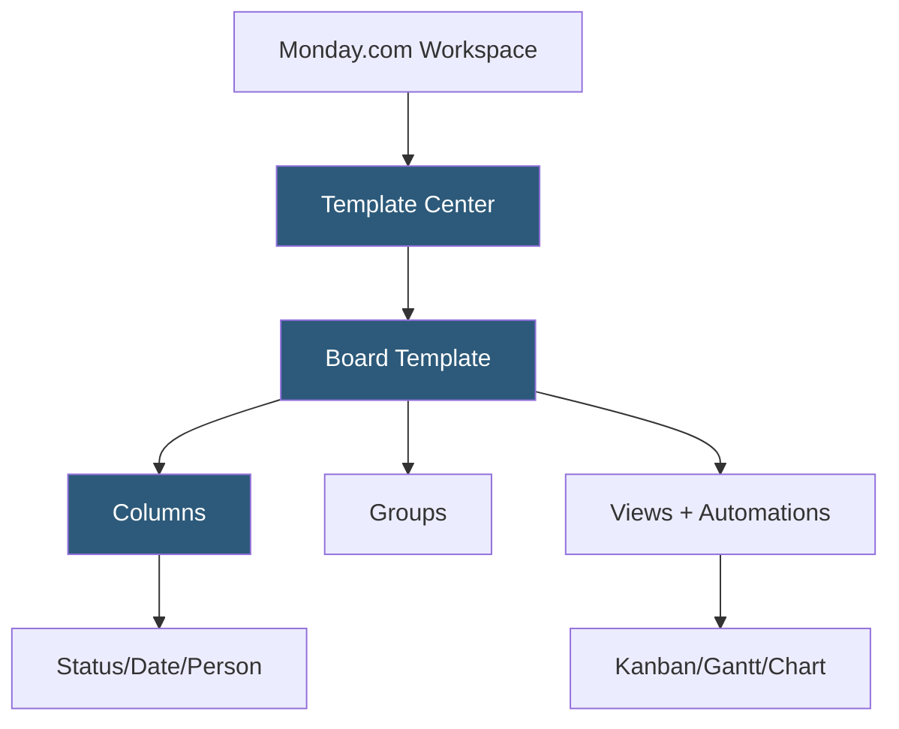

**Category:** Template Marketplaces
**Difficulty:** Beginner
**Reading time:** 5 min read

---

The Monday.com Template Center is Monday.com's collection of pre-built board and workspace templates covering project management, marketing, sales, HR, IT, and construction workflows. Templates install as fully configured Monday.com boards with columns, groups, item examples, views, and automations ready for immediate team use.

- **Boards** — Monday.com's primary work unit; templates create pre-configured boards with column types and sample items
- **Column Types** — typed data fields including Status, Person, Date, Numbers, Formula, Tags, and Connect Boards
- **Groups** — named row sections within a board, used in templates to organize phases, categories, or priorities
- **Views** — pre-set board visualizations including Kanban, Gantt, Calendar, Chart, Workload, and Table
- **Automations** — built-in no-code automation recipes included in templates for common workflow actions
- **Integrations** — connections to Slack, Jira, GitHub, Salesforce, and others configured within board automations
- **WorkDocs** — collaborative documents linked to board items, included in some advanced templates

Monday.com templates are server-stored board configurations accessible through the Template Center in the workspace. Installing a template triggers an API call that creates a new board with all column definitions, group structures, sample item rows, view configurations, and automation recipes replicated. Connect Boards columns (Monday.com's relational linking feature) are instantiated within the new board but must be reconnected to actual target boards by the user.

Column types are Monday.com's equivalent of database field types. Status columns use pre-defined label sets with color assignments—a project management template might define statuses as Not Started (grey), In Progress (blue), Review (orange), Done (green). Formula columns reference other columns with spreadsheet-style expressions, enabling calculated fields like percentage completion, budget variance, or days until deadline.

Automations are the workflow engine. Monday.com provides "automation recipes"—configurable if/then statements using a natural language interface. A template might include "When status changes to Done, notify owner" or "When date arrives, create a new item in another board." These recipes are copied with template installation but require re-authorization for external integration steps. The Automation Center tracks all active automations across boards with execution history, making it easier to debug workflow issues post-template-installation.

- Construction project managers tracking phases, milestones, and contractor dependencies
- Marketing teams coordinating campaign assets across channels with approval workflows
- HR departments managing recruitment pipelines from job posting to offer
- IT teams tracking service desk tickets with SLA automation
- Sales teams building pipeline dashboards with forecast rollups

| Advantage | Disadvantage |
|-----------|--------------|
| No-code automation recipes reduce setup time for non-technical teams | Premium pricing is high compared to simpler alternatives |
| Visual board interface is intuitive for non-project-managers | Automation external integrations require reconfiguration after copy |
| Large official template library with industry-specific examples | Connect Boards relational feature requires manual reconnection |
| Detailed audit trail and permission controls suit enterprise use | Complex multi-board templates have steep initial configuration |

- [ClickUp Template Center](clickup-template-center.md)
- [Airtable Template Marketplace](airtable-template-marketplace.md)
- [Trello Template Gallery](trello-template-gallery.md)

---
*Part of the [Template Marketplaces](index.md) category · [Back to Master Index](../../index.md)*
