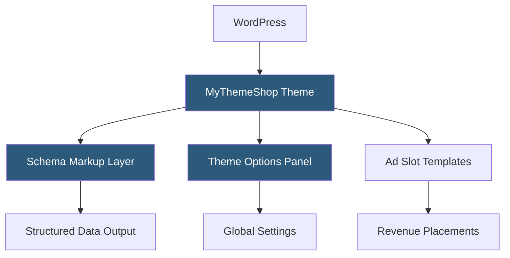

**Category:** Template Marketplaces
**Difficulty:** Beginner
**Reading time:** 5 min read

---

MyThemeShop is a WordPress theme and plugin marketplace offering an extensive library of SEO-optimized, fast-loading themes for bloggers, news sites, and businesses. Their themes emphasize AdSense monetization layouts, Schema markup integration, and lightweight performance profiles for content-heavy publishing sites.

- **Schema Pro Integration** — built-in structured data markup for articles, reviews, and breadcrumbs to boost search rich snippets
- **Speed Optimization** — minimal JavaScript, deferred loading, and clean CSS for fast Time to Interactive
- **Magazine Layouts** — grid-based multi-column layouts optimized for high-volume news and blog publishing
- **Theme Options Panel** — comprehensive settings admin page replacing the Customizer for advanced configuration
- **AdSense Optimization** — strategically placed ad slot templates compliant with Google's ad policies
- **Membership Plans** — subscription or lifetime access covering the full theme and plugin catalog
- **WooCommerce Themes** — dedicated shop themes with product grid and checkout layout customizations

MyThemeShop themes use a custom-built Theme Options Panel implemented as a WordPress admin page with JavaScript-driven tab navigation and AJAX saving. Unlike Customizer-based themes, changes are committed via AJAX on save rather than previewed live, which is a deliberate tradeoff that allows more complex option types (color pickers, sortable lists, code editors) than the Customizer API natively supports.

Schema markup is output via PHP functions hooked into WordPress's `wp_head` action and template parts. Article schema is dynamically populated from post meta (author, date, category), and Review schema integrates with compatible review plugins. Breadcrumb schema is generated from the current page's hierarchical position, reducing dependence on Yoast or RankMath for this data.

Ad slot templates use PHP constants and hook positions defined in the theme to insert AdSense code blocks at above-the-fold, mid-content, and sidebar positions. Site owners paste ad unit codes into the Theme Options Panel, which are then output at the registered positions. This approach avoids ad-blocking plugin conflicts and ensures ad code is served as part of the HTML rather than loaded asynchronously in a way that can trigger layout shifts.

- High-traffic news blogs monetizing through display advertising
- Affiliate review sites needing SEO-structured content templates
- Multi-author magazines requiring scalable archive layouts
- Niche content sites targeting Google Discover traffic
- Developers building performance-critical editorial sites

| Advantage | Disadvantage |
|-----------|--------------|
| Strong built-in SEO and Schema reduces plugin dependencies | Non-Customizer options panel lacks live preview |
| Optimized for AdSense revenue layout patterns | Less flexible than full page-builder themes for custom designs |
| Membership provides all themes at a low annual cost | Code style can be dated compared to block-editor native themes |
| Lightweight and fast for content-heavy sites | Limited visual differentiation between some themes in catalog |

- [ThemeForest Templates Marketplace](themeforest-templates-marketplace.md)
- [Colorlib Free Themes](colorlib-free-themes.md)
- [ThemeIsle WordPress Themes](themeisle-wordpress-themes.md)

---
*Part of the [Template Marketplaces](index.md) category · [Back to Master Index](../../index.md)*
