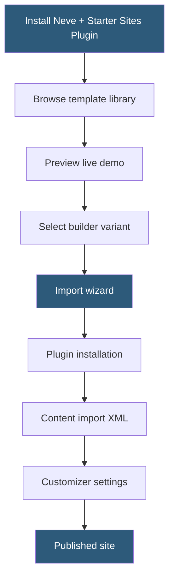

**Category:** Template Marketplaces
**Difficulty:** Beginner
**Reading time:** 5 min read

---

Neve's template system provides over 100 starter sites accessible through the Neve Starter Sites plugin, covering diverse industries and built for compatibility with Elementor, Gutenberg, Beaver Builder, and Brizy. These templates represent complete site designs — not just page layouts — enabling one-click deployment of a multi-page website with cohesive visual identity.

- **Starter Sites** — complete multi-page website templates importable in one click via the companion plugin
- **Gutenberg Templates** — starter sites built entirely with native WordPress blocks for no additional builder dependency
- **Page Builder Variants** — the same niche template built for multiple builders (Elementor and Gutenberg versions of the same design)
- **Import Wizard** — step-by-step guide that installs required plugins, imports content, and configures the theme
- **Selective Import** — ability to import only specific pages from a starter site rather than the full template
- **Template Preview** — live demo link from each starter site card before importing
- **Woo-Starter Sites** — subset of starter sites optimized for WooCommerce with product catalog and cart pages
- **Free vs Premium Templates** — basic templates available in free tier; full library requires Neve Pro

Neve's starter sites function as living templates stored on ThemeIsle's servers. When the Neve Starter Sites plugin connects to the library, it downloads a manifest of available templates with preview images, required plugin lists, and import package URLs. The display updates as new templates are released, meaning the library grows after installation without requiring plugin updates.

Template selection involves choosing both the design (niche) and the builder (Gutenberg, Elementor, or Brizy). Templates are designed specifically for each builder — the Elementor variant uses Elementor sections and widgets, while the Gutenberg variant uses blocks and patterns. Switching after import is not straightforward, so the builder choice at import time has lasting implications.

The import wizard operates in phases. First, it identifies required plugins for the chosen template (WooCommerce for shop templates, Elementor for Elementor templates) and prompts installation. Second, it imports a WordPress export XML file containing posts, pages, and media. Third, it imports widget settings via the Widget Importer & Exporter format. Fourth, it imports Customizer settings as JSON. Finally, it assigns the imported pages to menu locations and sets the front page and posts page.

Selective import mode allows choosing specific pages from a template rather than importing the full site. This is useful when building a site page by page or adding a well-designed contact page to an existing site without disrupting current content.

Performance characteristics carry through from templates to the base theme. Because Neve is lightweight, starter sites built with Gutenberg blocks load particularly fast — Gutenberg generates cleaner markup than most page builder plugins, and Neve's CSS is purpose-built to style that markup efficiently.

- Small businesses launching a complete website quickly from an industry-specific template
- Freelancers delivering client sites from polished starting points rather than blank themes
- Developers evaluating Neve for a project by testing multiple starter site previews
- WooCommerce store owners using Neve's e-commerce starter sites
- Gutenberg-first deployments wanting visually polished block-based templates

| Advantage | Disadvantage |
|-----------|--------------|
| Multi-page templates vs single-page layouts | Full library requires Neve Pro subscription |
| Builder-specific variants for clean code output | Switching builders after import requires starting over |
| Selective import reduces content disruption | Import process can fail on restricted hosting environments |
| Active template library with new additions | Template niches may not match all business types |
| Good Gutenberg templates avoid builder plugin dependency | Less template variety than Elementor's template cloud |

- [ThemeIsle WordPress Themes](themeisle-wordpress-themes.md)
- [Astra Theme Ecosystem](astra-theme-ecosystem.md)
- [Kadence Theme Blocks](kadence-theme-blocks.md)

---
*Part of the [Template Marketplaces](index.md) category · [Back to Master Index](../../index.md)*
