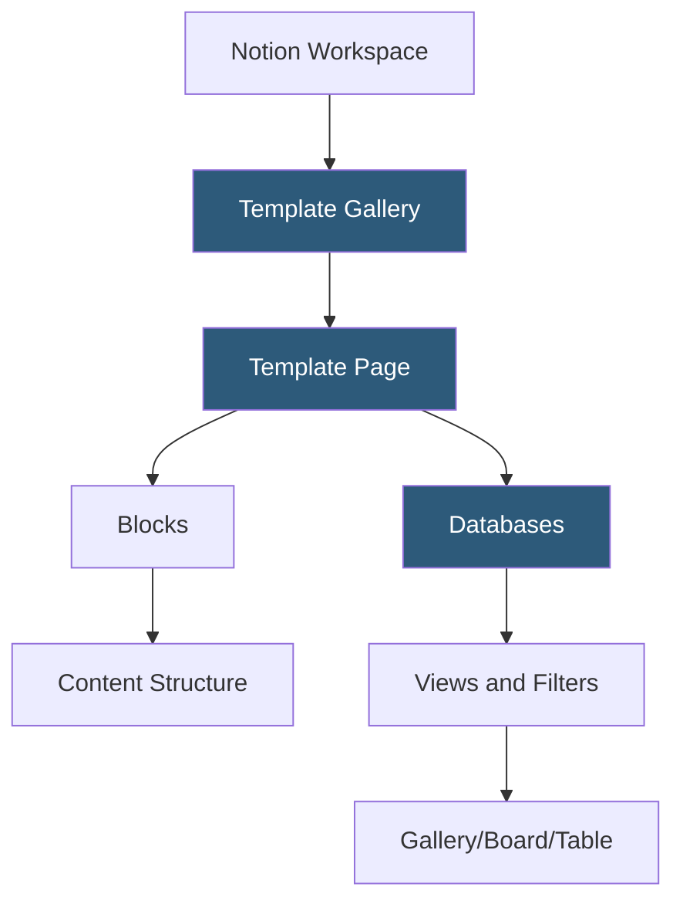

**Category:** Template Marketplaces
**Difficulty:** Beginner
**Reading time:** 5 min read

---

The Notion Template Gallery is Notion's official collection of free and paid workspace templates covering personal productivity, project management, business operations, and team wikis. Templates are duplicated directly into users' workspaces and customized using Notion's block-based editor.

- **Block-Based Templates** — Notion templates are structured compositions of blocks (text, databases, embeds, callouts) duplicated into workspaces
- **Database Templates** — pre-configured Notion databases with defined properties, views, and filters for specific workflows
- **Template Buttons** — Notion's native feature for creating repeatable page templates within a database
- **Gallery/Board/Table Views** — pre-set database views within templates optimizing the layout for the template's purpose
- **Linked Databases** — templates using Notion's linked view feature to display the same database across multiple pages
- **Official vs Community Templates** — Notion curates official templates but also features community-submitted ones in the gallery
- **Template Monetization** — creators can sell templates through Gumroad, Notion's template gallery (paid tier), or personal sites

Notion templates are Notion pages exported with a "Duplicate to workspace" link. This link triggers Notion's duplication API, which creates a recursive copy of the page and all nested pages, databases, and their contents into the user's workspace. The copy is fully independent—changes to the original template do not propagate to duplicated copies.

Database templates are the most valuable component of Notion template design. A project management template, for instance, contains a Tasks database with properties (Status, Priority, Due Date, Assignee), multiple saved views (Kanban board by Status, Timeline by Due Date, Table for export), and filters (Hide completed tasks). All of this configuration is captured in the duplicate.

Template Buttons, available within Notion pages, allow users to create pre-populated sub-pages or database entries with a single click. A meeting notes template button, for example, creates a new page with pre-filled sections (Attendees, Agenda, Action Items) and automatically applies a created-date property. Community creators distribute templates as paid products through external platforms, with Gumroad being the dominant sales channel—high-quality templates in niches like PARA organization or content calendars can generate significant creator revenue.

- Personal productivity systems using GTD, PARA, or Zettelkasten methodologies
- Project management dashboards for small teams and freelancers
- Company wikis and employee onboarding documentation
- Content calendar and editorial planning systems
- Student study and course management organizations

| Advantage | Disadvantage |
|-----------|--------------|
| Instant duplication gets users productive immediately | Duplicated templates diverge from source; no updates propagate |
| Huge community ecosystem covers extremely diverse use cases | Template quality varies enormously in the community gallery |
| Block-based format means templates are platform-native | Templates require Notion subscription for full feature access |
| Free templates available for most common workflows | Database-heavy templates can have performance issues at scale |

- [Coda Template Gallery](coda-template-gallery.md)
- [Airtable Template Marketplace](airtable-template-marketplace.md)
- [ClickUp Template Center](clickup-template-center.md)

---
*Part of the [Template Marketplaces](index.md) category · [Back to Master Index](../../index.md)*
