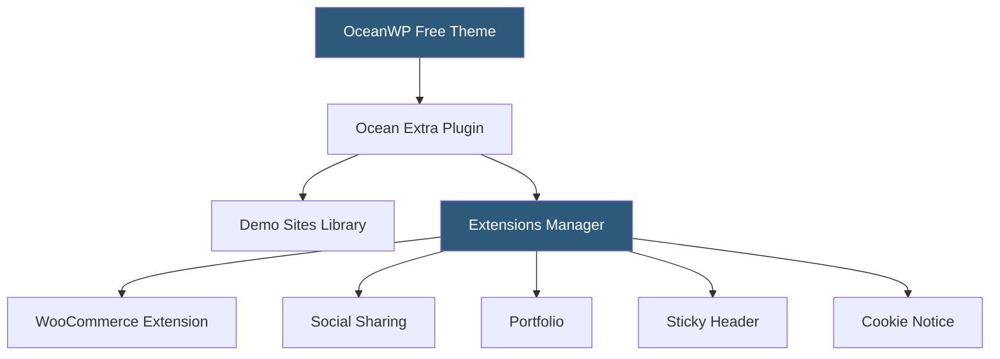

**Category:** Template Marketplaces
**Difficulty:** Beginner
**Reading time:** 5 min read

---

OceanWP is a free WordPress theme with an extensive library of companion extensions available individually or through a bundle subscription. It is designed to work with Elementor and offers deep WooCommerce integration, with particular strength in e-commerce-focused template designs and a modular extension architecture that prevents feature bloat.

- **Core Extensions Bundle** — paid package of all OceanWP extensions covering WooCommerce, social sharing, blog layouts, and more
- **Ocean Extra Plugin** — free companion plugin providing demo importer and core customization hooks
- **WooCommerce Module** — extension adding product quick-view, ajax cart, off-canvas cart, and checkout customizations
- **Sticky Header** — extension for fixed-position header that remains visible during scroll
- **Portfolio Module** — extension adding filterable portfolio grid layouts with lightbox support
- **Ocean Sites Library** — cloud-hosted collection of pre-built demo sites for one-click import
- **Full-Width Templates** — per-page template options for removing sidebar, header, or footer sections
- **White Label Option** — renaming OceanWP branding in the admin panel for agency client handoffs

OceanWP's design philosophy differs from themes like Divi or Avada that bundle every conceivable feature into a single package. Instead, OceanWP starts as a clean, lightweight base theme and offers extensions as individually activatable modules. Users install only the extensions they need, keeping the footprint smaller than all-inclusive themes.

The Ocean Extra plugin is the bridge between the free theme and the premium extension system. It handles demo site imports, extension activation, and some customization options not available in the native WordPress Customizer. Installing Ocean Extra is the first step after activating the OceanWP theme.

The WooCommerce extension is OceanWP's most feature-rich add-on, reflecting the theme's strong positioning in the e-commerce space. It adds: product quick-view modal triggered from catalog pages; an AJAX-powered floating cart that slides in from the screen edge without leaving the current page; off-canvas cart drawer; product quantity selector styling; checkout field customization; and order tracking page styling. These collectively create a more polished shopping experience than WooCommerce's default styling provides.

Demo site imports use the standard WordPress import mechanism under the hood but wrapped in a wizard that handles plugin installation, content import, widget setup, and Customizer configuration sequentially. OceanWP's demo library emphasizes e-commerce, agency, and creative portfolio templates, with both free and premium demo variants.

The modular extension model means upgrades affect individual components independently — a breaking change in the WooCommerce extension doesn't require updating the full theme or all other extensions. This isolation improves the long-term maintainability of OceanWP-based sites.

- WooCommerce stores wanting AJAX cart and quick-view without additional plugins
- Elementor users who want a lightweight theme foundation with targeted extension capabilities
- Agencies needing white-label option for client site handoffs
- Portfolio and creative sites using OceanWP's portfolio extension
- Performance-conscious developers who want to activate only needed features

| Advantage | Disadvantage |
|-----------|--------------|
| Modular extensions prevent unwanted feature loading | Extension management requires understanding of the system |
| Strong WooCommerce out-of-the-box experience | Extensions cost extra beyond the free theme |
| White-label option for clean agency deliverables | Fewer starter templates than Astra or Neve |
| Individual extensions updateable independently | Extension quality varies across the library |
| Good Elementor compatibility | Less active community than largest WordPress themes |

- [Astra Theme Ecosystem](astra-theme-ecosystem.md)
- [GeneratePress Premium Themes](generatepress-premium-themes.md)
- [ThemeForest WordPress Themes](themeforest-wordpress-themes.md)

---
*Part of the [Template Marketplaces](index.md) category · [Back to Master Index](../../index.md)*
