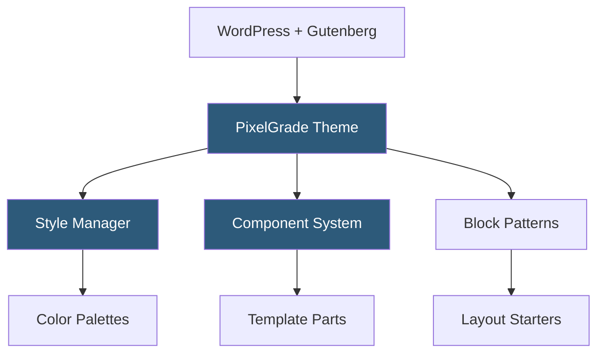

**Category:** Template Marketplaces
**Difficulty:** Beginner
**Reading time:** 5 min read

---

PixelGrade is a boutique WordPress theme studio known for crafting thoughtfully designed, performance-conscious themes for bloggers, publishers, and creative professionals. Their themes prioritize editorial typography, clean code, and Gutenberg-first design rather than heavy page builder dependencies.

- **Gutenberg-First Design** — themes built around native WordPress block editor rather than third-party page builders
- **Style Manager** — PixelGrade's proprietary Customizer section for color palettes and typography pairings
- **Component Architecture** — modular PHP component system for reusable template parts across themes
- **Editorial Typography** — curated font pairing systems designed for long-form reading comfort
- **Pixelgrade Cloud** — subscription service offering themes, support, and ongoing updates
- **Pixelgrade Care** — managed hosting and setup service for non-technical users
- **Block Patterns** — Gutenberg block patterns shipped with themes for rapid layout assembly

PixelGrade themes are structured around WordPress's standard template hierarchy, extended with a custom component system that loads PHP partials from a `/components` directory. Each component (header, footer, entry card, sidebar) is self-contained with its own CSS, PHP, and optional JavaScript. This creates predictable override paths in child themes—developers know exactly which file to copy and modify.

The Style Manager integrates into the WordPress Customizer as a dedicated panel. It stores color palette selections and font pairings as theme mods, then generates CSS custom properties that cascade through all component styles. Users can switch between curated palettes (e.g., "Sunrise", "Minimal") with live preview. Typography pairings are similarly preset but allow custom Google Fonts overrides.

Themes ship with Gutenberg block patterns—pre-designed collections of core blocks forming full-page sections. Users select patterns from the inserter, customize text and images inline, and build pages entirely within the block editor. This approach means sites remain portable: no proprietary shortcodes lock content to the theme. Performance is aided by minimal JavaScript, strategic CSS loading, and no bundled page builder scripts.

- Independent bloggers and writers needing beautiful reading experiences
- Online magazines with editorial-first content presentation
- Creative professionals showcasing portfolios with minimal UI
- Small businesses wanting clean, fast WordPress sites
- Developers who prefer standards-compliant, hackable codebases

| Advantage | Disadvantage |
|-----------|--------------|
| Gutenberg-native ensures long-term WordPress compatibility | Less visual control than drag-and-drop builders |
| Clean codebase enables fast page loads | Smaller template library than mega-theme studios |
| Portable content with no shortcode lock-in | Premium subscription model rather than one-time purchase |
| Excellent typography defaults reduce design decisions | Niche focus means fewer industry-specific demos |

- [ThemeForest Templates Marketplace](themeforest-templates-marketplace.md)
- [Array Themes Collection](array-themes-collection.md)
- [Neve Theme Templates](neve-theme-templates.md)

---
*Part of the [Template Marketplaces](index.md) category · [Back to Master Index](../../index.md)*
