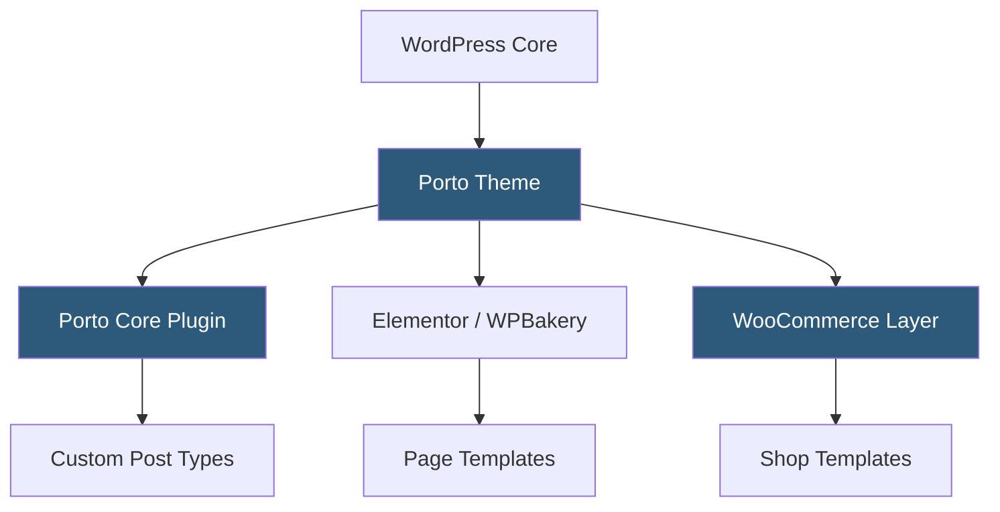

**Category:** Template Marketplaces
**Difficulty:** Beginner
**Reading time:** 5 min read

---

Porto is a high-performance multipurpose WordPress and WooCommerce theme known for its exceptional page-speed scores and modular architecture. It provides over 100 pre-built demos spanning e-commerce, corporate, and creative verticals with support for Elementor, WPBakery, and the native block editor.

- **Demo Importer** — one-click content import system that loads demo pages, widgets, and settings simultaneously
- **Porto Core Plugin** — companion plugin that registers custom post types, shortcodes, and widgets specific to Porto
- **Elementor Compatibility** — full support for Elementor Pro's theme builder for header/footer/archive templates
- **Speed Optimization** — built-in critical CSS generation, deferred JS loading, and image lazy-loading
- **WooCommerce Builder** — custom product page, shop archive, and cart templates with drag-and-drop control
- **Sticky Headers** — configurable fixed navigation with transparent-to-solid scroll transitions
- **RTL Support** — right-to-left layout rendering for Arabic, Hebrew, and similar languages

Porto registers its functionality through a companion plugin (Porto Core) to keep theme-agnostic features from being lost on theme switches. The theme uses a modular template hierarchy where individual components—headers, footers, sidebars—are loaded via hooks rather than hardcoded includes, enabling granular overrides in child themes.

Page builder integration works through conditional enqueue logic: Porto detects whether Elementor or WPBakery is active and loads the appropriate compatibility layer. For WooCommerce, Porto replaces default woocommerce templates with custom versions stored under `porto/woocommerce/`, following WooCommerce's standard override convention.

Performance tuning is baked in: Porto ships with a built-in critical-path CSS extractor and a JS deferral option in the theme panel. Combined with WordPress caching plugins, pages routinely achieve sub-second Time to First Byte. The demo importer uses the WordPress Importer under the hood plus a custom settings serializer to restore Customizer values and widget areas in a single operation.

- High-traffic WooCommerce stores needing fast page loads
- Multi-brand agencies managing several demo-based sites
- Marketplace sites with complex product filtering needs
- Corporate sites requiring both landing pages and blog sections
- International sites requiring RTL language support

| Advantage | Disadvantage |
|-----------|--------------|
| Exceptional out-of-box performance scores | Very large theme with many unused features |
| Dual page-builder support (Elementor + WPBakery) | Companion plugin creates dependency coupling |
| Extensive WooCommerce customization | Over 100 demos make selection overwhelming |
| Active updates and long support history | Some legacy shortcodes deprecated over versions |

- [ThemeForest Templates Marketplace](themeforest-templates-marketplace.md)
- [Flatsome WooCommerce Theme](flatsome-woocommerce-theme.md)
- [Avada Theme Builder](avada-theme-builder.md)

---
*Part of the [Template Marketplaces](index.md) category · [Back to Master Index](../../index.md)*
