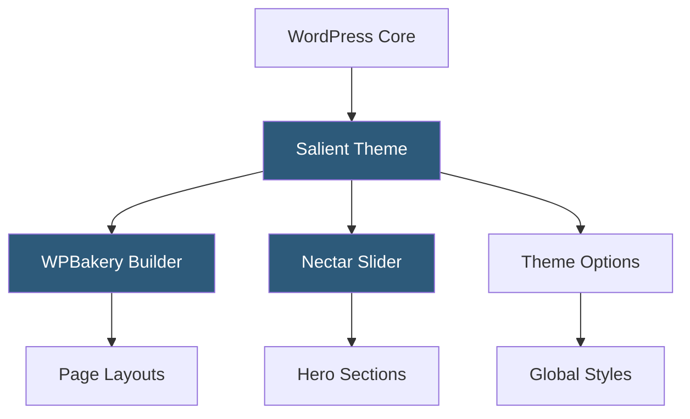

**Category:** Template Marketplaces
**Difficulty:** Beginner
**Reading time:** 5 min read

---

Salient is a premium multipurpose WordPress theme built for creative agencies, portfolios, and businesses requiring high-impact visual presentations. It bundles the WPBakery page builder with extensive pre-built demos and a drag-and-drop interface for rapid site construction.

- **WPBakery Page Builder** — visual drag-and-drop editor included with Salient for building complex layouts without code
- **Nectar Slider** — Salient's proprietary full-screen slider component with parallax and video background support
- **Pre-built Demos** — one-click importable site templates covering dozens of industry niches
- **Nectar Elements** — custom shortcode elements extending WPBakery for agency-centric design blocks
- **Theme Options Panel** — centralized admin panel for global styling, typography, and layout control
- **Parallax Sections** — depth-effect scroll sections using CSS transforms and JavaScript listeners
- **WooCommerce Integration** — styled product pages and checkout flows for e-commerce use

Salient ships as a standard WordPress theme activated through the Appearance panel. Upon activation, the required WPBakery Page Builder plugin is installed via TGM Plugin Activation. Users then import a demo via the one-click import wizard, which pulls XML content and widget data to replicate the demo environment exactly.

Page construction relies on WPBakery's frontend or backend editor. Salient augments WPBakery with Nectar-specific elements—sticky headers, full-screen sections, animated counters, and testimonial sliders—accessible through the standard element library. The Nectar Options panel controls site-wide decisions including font pairings (loaded from Google Fonts), color schemes, header styles (transparent, sticky, split), and footer configurations.

Performance is managed through lazy-loading images, conditional script loading per page type, and optional integration with caching plugins like WP Rocket. The theme registers custom post types for portfolio items and team members, each with their own template files and Customizer settings. Child theme support follows standard WordPress conventions, allowing CSS and template overrides without modifying core theme files that would be lost on update.

- Creative agency portfolio sites with animated transitions
- Product launch pages requiring cinematic hero sections
- Corporate websites needing multi-layout flexibility
- Freelancer showcase sites with project galleries
- Restaurant or event sites benefiting from full-screen imagery

| Advantage | Disadvantage |
|-----------|--------------|
| Extensive pre-built demos speed up launch | WPBakery lock-in makes migrating to block editor difficult |
| Nectar elements provide unique visual effects | Large CSS and JS footprint requires optimization effort |
| Active ThemeForest community with support | Premium pricing plus potential plugin upsells |
| Regular updates for WordPress compatibility | Complex options panel has steep learning curve |

- [ThemeForest Templates Marketplace](themeforest-templates-marketplace.md)
- [Avada Theme Builder](avada-theme-builder.md)
- [Bridge Creative Theme](bridge-creative-theme.md)

---
*Part of the [Template Marketplaces](index.md) category · [Back to Master Index](../../index.md)*
