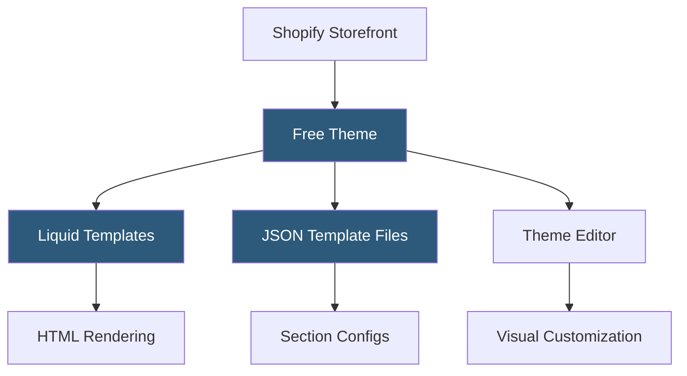

**Category:** Template Marketplaces
**Difficulty:** Beginner
**Reading time:** 5 min read

---

Shopify's free themes are a curated collection of officially developed and supported storefront templates available at no cost to all Shopify merchants. Built on the Liquid templating language and Dawn design system, they provide fully functional e-commerce storefronts optimized for conversion, accessibility, and Online Store 2.0 features.

- **Online Store 2.0** — Shopify's theme architecture enabling sections and blocks on all pages, not just the homepage
- **Liquid Templating** — Shopify's Ruby-inspired templating language used for all theme template files
- **Dawn Theme** — Shopify's reference implementation and design system baseline used by all official free themes
- **JSON Templates** — template files storing section and block configurations in JSON for the Theme Editor
- **Theme Editor** — drag-and-drop visual editor in Shopify admin for customizing sections and settings
- **Sections Everywhere** — Online Store 2.0 feature allowing sections to be added to any page type
- **Metafield Integration** — themes can display product, collection, and page metafields configured in admin

Shopify free themes are hosted on GitHub and distributed through the Shopify Theme Store. Installation adds a copy of the theme's file tree to the merchant's `themes/` directory within Shopify's platform. Theme files include Liquid templates (`.liquid`), JSON template configurations (`.json`), CSS (`assets/`), and JavaScript (`assets/`).

JSON template files define which sections appear on a page and their initial settings. For example, `templates/product.json` specifies the product information section, media gallery section, and recommendations section, each with their schema-defined settings defaults. The Theme Editor reads these JSON files to render the drag-and-drop interface, where merchants add, remove, reorder, and configure sections without code.

Liquid templates handle dynamic content by accessing Shopify's global objects: `product`, `collection`, `cart`, `customer`, etc. Filters, tags, and loops in Liquid generate HTML that Shopify's CDN serves to shoppers. Free themes ship with settings_schema.json defining the Theme Editor's settings panel, covering color schemes, typography, button styles, and layout options. All free themes are fully open source under the MIT license, enabling modification and use as a base for custom development.

- New merchants launching stores quickly without upfront theme costs
- Developers using Dawn as a base for custom theme development
- Small stores with straightforward catalog and checkout needs
- Merchants testing Shopify before committing to premium theme investment
- Brand-focused stores customizing colors and fonts through the editor

| Advantage | Disadvantage |
|-----------|--------------|
| Zero cost with official Shopify support | Fewer design options than premium themes |
| Online Store 2.0 architecture future-proofs customization | Visual differentiation limited without developer customization |
| Open source MIT license for full modification freedom | No built-in advanced features like wishlist or size guides |
| Optimized by Shopify engineers for performance | May require developer work to match competitor premium theme polish |

- [Shopify Theme Store](shopify-theme-store.md)
- [Shopify Premium Themes](shopify-premium-themes.md)
- [Flatsome WooCommerce Theme](flatsome-woocommerce-theme.md)

---
*Part of the [Template Marketplaces](index.md) category · [Back to Master Index](../../index.md)*
