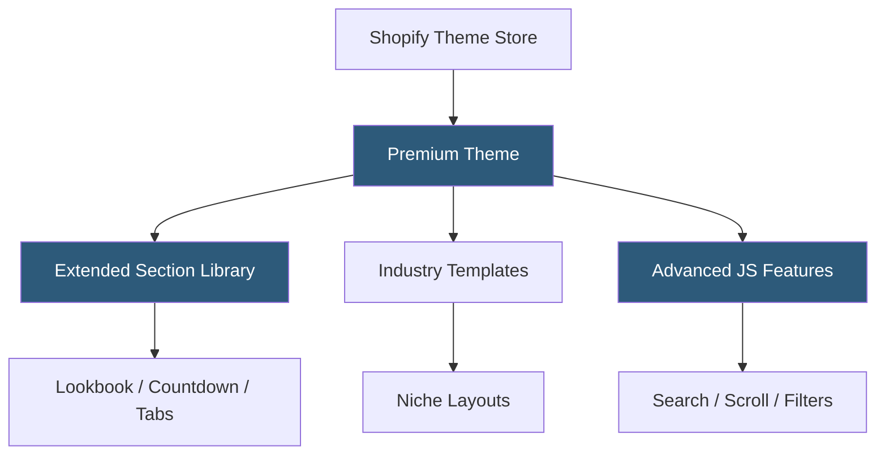

**Category:** Template Marketplaces
**Difficulty:** Intermediate
**Reading time:** 5 min read

---

Shopify premium themes are paid storefront templates sold through the official Shopify Theme Store, developed by both Shopify and third-party partners. They provide advanced design capabilities, niche-specific layouts, and enhanced conversion features beyond what free themes offer, with one-time purchase pricing and official quality guarantees.

- **Theme Store Vetting** — all premium themes reviewed by Shopify for performance, accessibility, and feature standards before listing
- **One-Time Purchase** — premium themes are bought once and owned permanently, with free updates included
- **Industry-Specific Designs** — themes built for specific niches (apparel, home goods, electronics, beauty) with matching layout conventions
- **Advanced Sections** — premium themes ship with specialized sections like lookbooks, before/after sliders, and promotional countdowns
- **Theme Support** — developers provide dedicated customer support for their themes, typically for one year post-purchase
- **Predictive Search** — enhanced search UI with instant product results appearing as merchants type
- **Infinite Scroll** — collection pages loading additional products automatically without pagination clicks

Premium themes follow the same Online Store 2.0 architecture as free themes—Liquid templates, JSON template configurations, and the Theme Editor—but extend the section and block library with more sophisticated components. Developers register additional section types in their theme's `sections/` directory, each with a Liquid rendering file and a `schema` JSON block defining the Theme Editor controls.

Advanced JavaScript features in premium themes typically use Vanilla JS or lightweight libraries rather than jQuery, in alignment with Shopify's performance guidelines. Predictive search is implemented via the Shopify Predictive Search API, which returns results as JSON that the theme's JavaScript inserts into a dropdown overlay. Infinite scroll uses the Intersection Observer API to detect when the user reaches the bottom of a product grid, then fetches the next page's products from the collection pagination endpoint.

Conditional loading patterns keep theme performance high despite larger feature sets. JavaScript modules are split by feature area and loaded with `type="module"` plus dynamic `import()` for sections that may not be active on a given page. CSS is organized to avoid render-blocking where possible. Theme Store listing requirements mandate a minimum Lighthouse performance score and accessibility compliance, ensuring merchants aren't buying themes that hurt Core Web Vitals.

- Fashion and apparel brands needing lookbook and size guide features
- High-volume DTC brands requiring advanced filtering and search
- Luxury goods stores needing premium aesthetic differentiation
- Electronics retailers needing comparison and specification tables
- Subscription-box businesses with specialized checkout flows

| Advantage | Disadvantage |
|-----------|--------------|
| Industry-specific designs reduce customization needed | One-time cost of $180–$400 USD per theme |
| Official vetting ensures performance and accessibility baseline | Update frequency varies by developer post-purchase |
| Support period provides recourse for issues | Customizations can become outdated after theme updates |
| Advanced features reduce need for paid Shopify apps | Requires App Store apps for features beyond theme scope |

- [Shopify Theme Store](shopify-theme-store.md)
- [Shopify Free Themes](shopify-free-themes.md)
- [ThemeForest Templates Marketplace](themeforest-templates-marketplace.md)

---
*Part of the [Template Marketplaces](index.md) category · [Back to Master Index](../../index.md)*
