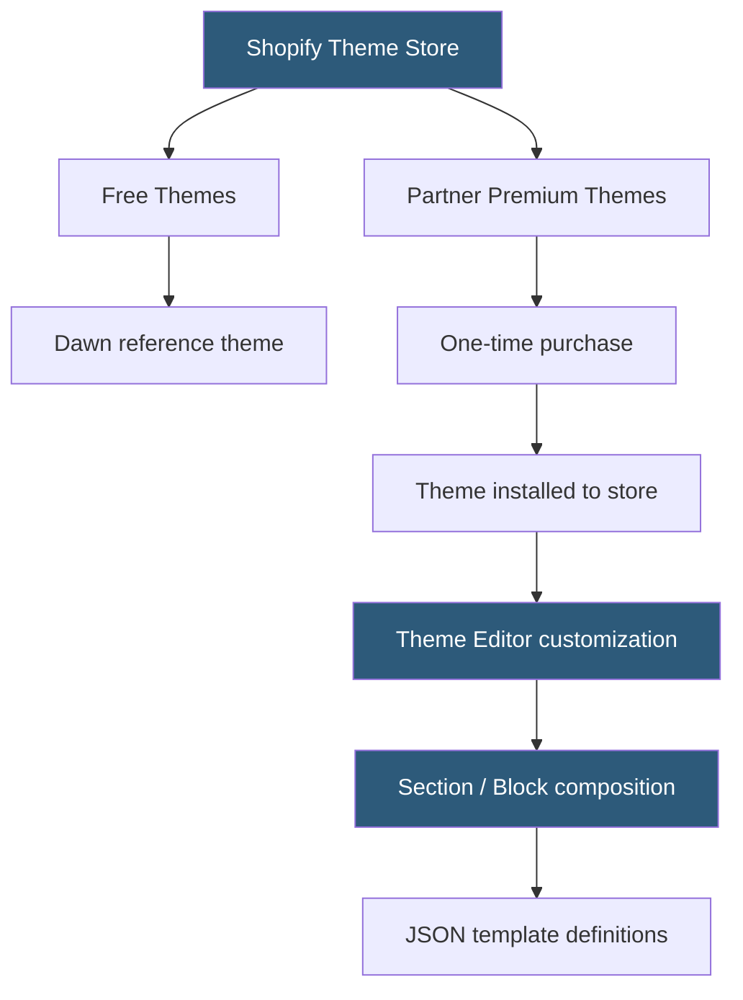

**Category:** Template Marketplaces
**Difficulty:** Beginner
**Reading time:** 5 min read

---

The Shopify Theme Store is the official marketplace for Shopify storefront themes, with themes built exclusively for the Shopify platform using Liquid templating, JSON templates, and Shopify's section/block architecture. Unlike third-party marketplaces, all themes are reviewed by Shopify and must meet performance, accessibility, and merchant experience standards.

- **Liquid** — Shopify's open-source templating language used in theme files to render dynamic store data
- **Sections** — modular theme components that merchants can add, remove, and reorder on pages using the theme editor
- **Blocks** — sub-components within sections that provide smaller content elements (text, images, buttons)
- **Online Store 2.0** — Shopify's 2021 theme architecture update enabling sections on all pages (not just homepage)
- **JSON Templates** — file format replacing Liquid templates for page layouts, enabling the new flexible sections system
- **Theme Editor** — Shopify admin tool for visual customization without code, using the section/block composition model
- **Dawn** — Shopify's free reference theme built to Online Store 2.0 standards with performance benchmarks
- **Partner Themes** — themes built by Shopify design partners and sold through the official store at one-time prices

The Shopify Theme Store operates under a controlled quality standard that distinguishes it from open marketplaces like ThemeForest. Every theme must pass Shopify's review process evaluating performance (Lighthouse scores), accessibility (WCAG compliance), and merchant UX best practices. This results in a smaller but consistently higher-quality catalog compared to open marketplaces.

Themes use the Liquid templating language — Shopify's own Ruby-inspired template syntax for outputting store data. Template files render product pages, collection (category) pages, cart, checkout, and blog posts. The Online Store 2.0 architecture replaced monolithic Liquid templates with JSON template files that declare which sections appear on a page, enabling the flexible drag-and-drop editing model in the theme editor.

The theme editor is Shopify's built-in visual customization tool. Merchants add, remove, and reorder sections using a left sidebar panel while previewing the page on the right. Each section contains configurable blocks — a slideshow section might have individual slide blocks, each editable for image, heading text, button label, and link. Changes apply to the live store immediately or via a save action.

Shopify's free themes (approximately 12 options led by Dawn) are built to the same quality standards as paid themes and cover common store archetypes. Dawn is intentionally minimalist and performance-focused, scoring consistently above 90 on Lighthouse, and serves as both a usable theme and a development reference for partners building new themes.

Partner premium themes range from $170–$380 (one-time payment) and offer specialized features for high-volume stores: advanced mega menus, wishlist functionality, dynamic product filtering, Ajax cart drawer with upsell sections, and industry-specific layouts for fashion, electronics, beauty, or home goods.

- Launching a new Shopify store with a professional, Shopify-reviewed design
- Upgrading an older pre-OS2.0 theme to enable flexible sections on all pages
- Selecting an industry-specific paid theme (fashion, electronics) for targeted conversion optimization
- Developers building custom Shopify themes using Dawn as a code reference
- Merchants who need reliable theme support from Shopify-vetted partners

| Advantage | Disadvantage |
|-----------|--------------|
| All themes Shopify-reviewed for quality standards | Smaller selection than third-party marketplaces |
| Online Store 2.0 sections system enables no-code layouts | Premium themes cost $170–$380 one-time |
| Performance benchmarks enforced at review | Theme switching loses customization (needs migration) |
| Shopify partner support accountability | No subscription model; each theme is a separate purchase |
| Free themes meet same quality bar as paid | Liquid templating has learning curve for custom development |

- [Shopify Free Themes](shopify-free-themes.md)
- [Shopify Premium Themes](shopify-premium-themes.md)
- [Webflow Templates Marketplace](webflow-templates-marketplace.md)

---
*Part of the [Template Marketplaces](index.md) category · [Back to Master Index](../../index.md)*
