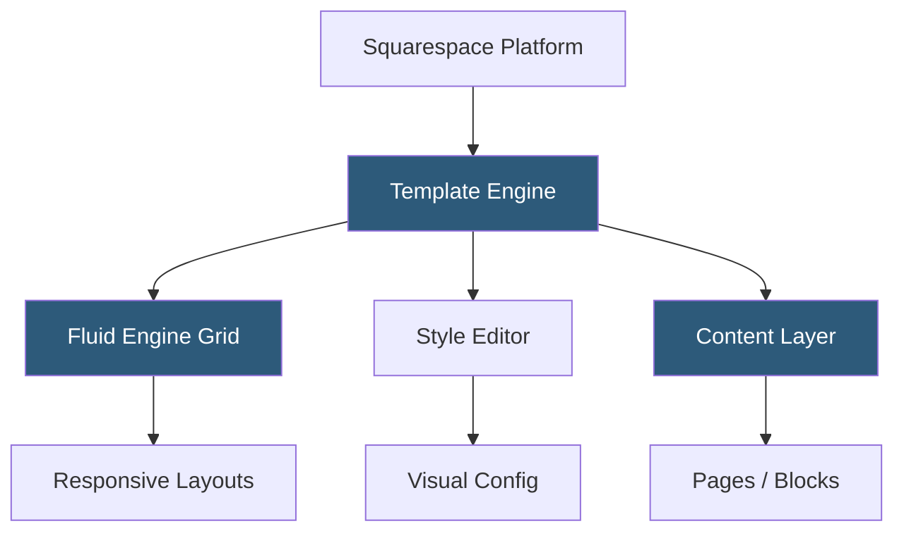

**Category:** Template Marketplaces
**Difficulty:** Beginner
**Reading time:** 5 min read

---

Squarespace's template collection provides professionally designed website starting points for its hosted website builder platform. All Squarespace templates share a unified design engine and are fully interchangeable, meaning users can switch templates at any time without losing content—a key architectural advantage over competing platforms.

- **Template Switching** — any template can be applied to an existing Squarespace site without content loss, unlike Wix
- **Style Editor** — per-template visual customization panel for colors, fonts, spacing, and layout without code
- **Fluid Engine** — Squarespace 7.1's grid-based responsive layout system replacing the older column-based system
- **Design Families** — template groups sharing a common design language and feature set within Squarespace's catalog
- **Cover Pages** — full-screen single-page template variants often used for launch pages or portfolio covers
- **Developer Mode** — optional code-level access for advanced customization via LESS/CSS and template JSON
- **Commerce Templates** — templates with pre-configured product, cart, and checkout page layouts

Squarespace decouples content from design by storing all site content (pages, blocks, images, text) in a content layer independent of the template layer. Templates define the visual presentation—layout, typography defaults, color palettes—but reference the same content objects. Switching templates swaps the presentation layer while the content layer remains intact, which is the mechanism enabling seamless template changes.

The Fluid Engine (introduced in version 7.1) uses a CSS grid-based layout system where blocks are positioned within named grid areas. Unlike Squarespace 7.0's fixed-column system, Fluid Engine allows free placement within a proportional grid, enabling more complex asymmetric compositions. The Style Editor exposes template-specific design tokens (hex color values, font families, spacing multipliers) that feed into CSS custom properties applied globally.

Developer Mode unlocks file system access through a Git-based workflow or SFTP, where developers can edit LESS stylesheets, template JSON configurations, and block rendering logic. The JSON Template Language (JSONT) is Squarespace's proprietary template syntax for defining block layouts and data binding. Custom CSS is always available without Developer Mode through the Custom CSS editor in Settings, which injects styles after the template's compiled CSS.

- Creative professionals wanting a polished portfolio with zero maintenance
- Small businesses needing an all-in-one site and commerce solution
- Bloggers wanting clean typography and editorial-quality design
- Service-based businesses booking appointments through Acuity integration
- Makers and artists selling physical or digital products

| Advantage | Disadvantage |
|-----------|--------------|
| Template switching without content loss enables experimentation | Closed platform limits third-party integration flexibility |
| All templates share consistent quality standards | Custom functionality requires Developer Mode and JSONT knowledge |
| Unified design system ensures visual coherence | Higher monthly pricing than WordPress equivalents |
| Commerce and booking features built into platform | SEO customization less granular than open-source alternatives |

- [Wix Template Gallery](wix-template-gallery.md)
- [Webflow Templates Marketplace](webflow-templates-marketplace.md)
- [Framer Template Community](framer-template-community.md)

---
*Part of the [Template Marketplaces](index.md) category · [Back to Master Index](../../index.md)*
