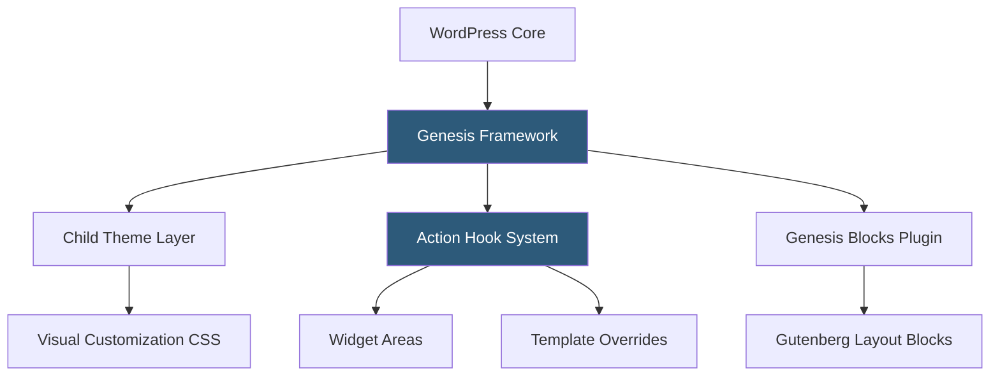

**Category:** Template Marketplaces
**Difficulty:** Intermediate
**Reading time:** 6 min read

---

StudioPress is the company behind the Genesis Framework, a foundational WordPress parent theme architecture on which child themes are built. Acquired by WP Engine in 2018, StudioPress operates both as a theme marketplace and as the steward of Genesis Pro, a subscription that bundles the framework, all child themes, and Genesis Blocks for Gutenberg-based site building.

- **Genesis Framework** — parent theme providing a hook/filter system, SEO meta boxes, layout options, and security hardening
- **Child Theme** — a theme that inherits Genesis functionality, using CSS and template overrides to define visual presentation
- **Action Hooks** — WordPress action hooks added by Genesis (e.g., `genesis_before_content`) allowing content injection without modifying parent files
- **Filter Hooks** — Genesis filter hooks for modifying output (title formats, breadcrumbs, author boxes) programmatically
- **Genesis Blocks** — Gutenberg block library for content layout included with Genesis Pro
- **SEO Settings** — built-in per-post SEO meta boxes (title, description, robots) before third-party plugins made this standard
- **Breadcrumb Support** — integrated breadcrumb navigation with schema markup built into the framework
- **Genesis Pro** — $360/year subscription including all StudioPress themes, Genesis Blocks, and Genesis Custom Blocks

The Genesis Framework is architecturally different from multipurpose themes like Divi or Avada. Rather than providing a feature-heavy visual builder, Genesis establishes a structured, semantic HTML5 framework and exposes an extensive system of hooks and filters that developers use to customize behavior through PHP code or child theme template files.

The hook system is Genesis's most powerful and distinctive feature. Genesis fires approximately 80 action hooks at specific points in the page rendering process — before the header, after the header, before the loop, inside the loop, after the loop, in the footer. Developers and child themes hook into these points to inject content, remove default elements, or reorganize page sections without touching the parent theme's files. This means child themes survive Genesis parent updates without losing customizations.

Child themes for Genesis are deliberately minimal — they typically contain a `functions.php`, `style.css`, and optionally a `front-page.php` for the homepage. All heavy lifting (schema markup, accessibility features, performance optimizations) lives in the parent framework. This makes Genesis child themes very maintainable and lightweight compared to self-contained commercial themes that bundle dozens of features.

The Genesis Pro subscription shifted the model toward modern WordPress development practices. Genesis Blocks provides Gutenberg-native layout blocks (Section, Grid, Columns, Accordion, etc.) that work independently of the classic Genesis hook system, acknowledging that the WordPress ecosystem is moving toward the block editor paradigm.

WP Engine's acquisition brought Genesis into the managed hosting sphere — WP Engine customers can access Genesis themes for free on qualifying plans, integrating theme licensing with hosting product tiers.

- Building performance-optimized WordPress sites for SEO-sensitive clients
- Developer workflows where PHP hooks provide predictable customization points
- Creating maintainable long-term sites where upgrade safety matters
- Agencies standardizing on a single parent framework across all client sites
- Gutenberg-first site building using Genesis Blocks for block-based layouts

| Advantage | Disadvantage |
|-----------|--------------|
| Hook/filter system enables safe customization | Developer-oriented; less accessible to non-coders |
| Lightweight framework with good performance | Child themes require CSS knowledge to style |
| SEO and accessibility features baked into framework | Smaller child theme marketplace than Elementor ecosystem |
| Parent updates don't break child customizations | Visual editing requires Genesis Blocks or third-party builders |
| WP Engine bundle reduces cost for hosted customers | Less flashy pre-built demo content than builder themes |

- [Elegant Themes Marketplace](elegant-themes-marketplace.md)
- [Astra Theme Ecosystem](astra-theme-ecosystem.md)
- [GeneratePress Premium Themes](generatepress-premium-themes.md)

---
*Part of the [Template Marketplaces](index.md) category · [Back to Master Index](../../index.md)*
