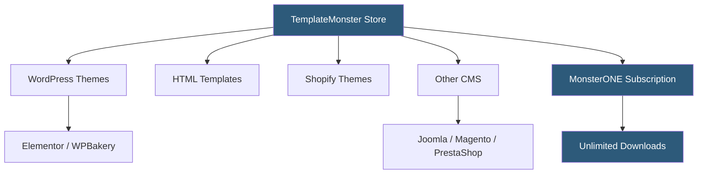

**Category:** Template Marketplaces
**Difficulty:** Beginner
**Reading time:** 5 min read

---

TemplateMonster is one of the oldest and largest independent template marketplaces, operating since 2002 and offering over 75,000 products including website templates, WordPress themes, WooCommerce themes, OpenCart templates, and digital assets. Unlike Envato, TemplateMonster operates both its own marketplace and MonsterONE, a subscription service for unlimited downloads.

- **MonsterONE** — subscription plan offering unlimited template downloads for a flat annual or monthly fee
- **One Domain License** — standard license permitting deployment on a single domain
- **Developer License** — multi-project license for agencies building sites for clients
- **Free Templates** — curated selection of no-cost items used as traffic acquisition and upsell funnel
- **Template Customization Service** — paid service where TemplateMonster's team customizes a purchased template
- **CMS Coverage** — templates for WordPress, Joomla, Drupal, Magento, PrestaShop, and Shopify
- **Live Chat Support** — 24/7 support chat for pre-sale questions and installation help
- **Template Reviews** — verified buyer reviews including screenshots of deployed sites

TemplateMonster functions differently from Envato in key structural ways. While ThemeForest is a two-sided marketplace where independent authors set prices, TemplateMonster historically produced templates in-house with a staff of designers and later opened to third-party contributors through its marketplace model.

The MonsterONE subscription (analogous to Envato Elements) provides unlimited access to the entire catalog for a recurring fee. This dramatically changes the economics for agencies and freelancers who need multiple templates per year — the break-even is typically after 2–3 individual template purchases.

Template quality undergoes editorial review, but TemplateMonster's catalog spans a wider quality range than ThemeForest due to its larger contributor base. The platform provides detailed filtering by industry, color scheme, page count, and compatible plugins, making it possible to narrow a search to very specific requirements.

Installation support is a differentiating service. TemplateMonster offers optional paid installation services where their team will set up the template on a buyer's hosting, import demo content, and configure basic settings. For non-technical users, this reduces the friction of the template purchase-to-launch journey.

The template preview system includes both standard desktop previews and mobile responsive previews. Some templates also provide speed test scores (Lighthouse/GTmetrix) as part of the listing, allowing buyers to evaluate performance characteristics before purchase — a practice less common on competing marketplaces.

Updates and ongoing compatibility maintenance is handled differently per template. Premium items from established authors receive WordPress core compatibility updates; older or lower-tier items may not be updated after initial release.

- Finding CMS-specific templates for platforms underserved by ThemeForest (Joomla, PrestaShop)
- Subscribing to MonsterONE for agency-scale template access
- Purchasing a template with optional professional installation service
- Sourcing Shopify themes with industry-specific layouts
- Exploring free template options before committing to a paid purchase

| Advantage | Disadvantage |
|-----------|--------------|
| Broad CMS coverage beyond WordPress | Template quality is less consistent than ThemeForest |
| MonsterONE subscription suits high-volume users | Subscription required for best economics on multiple projects |
| Professional installation services available | Template catalog can feel dated in design trends |
| 24/7 live chat for pre-sale queries | Refund process more complex than Envato's |
| Long track record and stable platform | Less community ecosystem than Envato authors |

- [ThemeForest Templates Marketplace](themeforest-templates-marketplace.md)
- [Envato Elements Subscription](envato-elements-subscription.md)
- [TemplateMonster Website Builder](templatemonster-website-builder.md)

---
*Part of the [Template Marketplaces](index.md) category · [Back to Master Index](../../index.md)*
