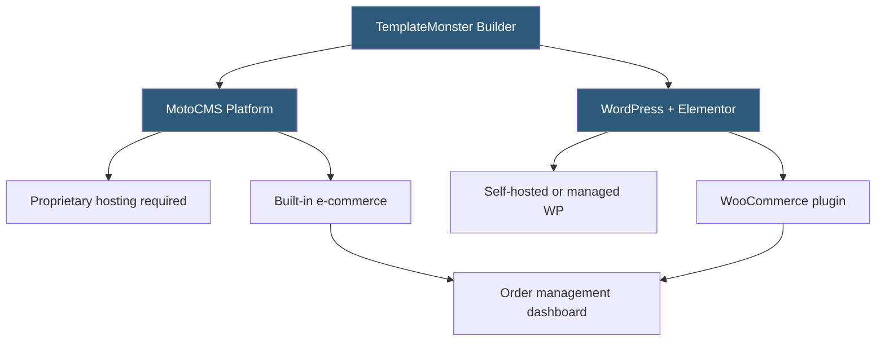

**Category:** Template Marketplaces
**Difficulty:** Beginner
**Reading time:** 5 min read

---

TemplateMonster's website builder product, built on the Monstroid2 and MotoCMS platforms, offers a drag-and-drop site construction experience layered on top of their template library. It bridges the gap between purchasing a static template and deploying a managed website, targeting small business owners who want professional design without developer involvement.

- **MotoCMS** — proprietary website builder platform underlying some TemplateMonster builder templates
- **Monstroid2** — multipurpose WordPress theme optimized for Elementor with modular page building
- **Drag-and-Drop Editor** — visual interface for repositioning and resizing content blocks without CSS knowledge
- **Content Blocks Library** — pre-designed sections (hero, pricing, testimonials) insertable into pages
- **One-Click Installation** — automated setup that configures hosting, installs CMS, and applies demo content
- **E-commerce Integration** — WooCommerce or MotoCMS shop modules for product catalog and checkout
- **Mobile Preview Mode** — live editor view of how the site appears on mobile without leaving the editor
- **SEO Settings Panel** — per-page meta title and description fields accessible from the builder interface

TemplateMonster offers two distinct builder experiences that buyers should understand before purchasing. The MotoCMS-based templates are fully self-contained — they come with their own CMS, admin panel, and hosting requirements, meaning they cannot be hosted on arbitrary infrastructure without licensing the MotoCMS software. WordPress-based builder templates (like Monstroid2) are standard WordPress themes that work on any WP-capable hosting.

The MotoCMS editor functions as an in-browser visual editor where users click elements directly on the page to edit them, drag components from a panel, and see changes reflected in real time. Content changes are saved to MotoCMS's database and the system handles asset compilation. This is comparable to Wix or Weebly in user experience but with a one-time purchase model rather than a subscription.

The WordPress/Elementor path is more flexible. Monstroid2 ships with a child theme, 150+ pre-designed section templates, header and footer builder, a mega menu module, and WooCommerce support. The Elementor visual editor provides a row-column-widget composition model, and Monstroid2 extends it with proprietary widgets for sliders, pricing tables, and portfolio layouts.

Both paths include demo content importers that populate the site with placeholder content matching the template preview. The import process for WordPress handles media attachments, page assignments, widget areas, and Customizer settings in a sequential import flow, which typically takes 2–5 minutes depending on the demo's asset size.

- Small business owners building a site without hiring a developer
- Non-technical clients of agencies being handed a self-service editing tool
- E-commerce merchants who want a visual product management interface
- Freelancers delivering a finished site with a user-friendly CMS handoff
- Businesses needing multilingual sites using MotoCMS's built-in language switcher

| Advantage | Disadvantage |
|-----------|--------------|
| No coding required for visual editing | MotoCMS creates platform lock-in on hosting |
| One-time purchase avoids SaaS subscriptions | Less flexible than pure WordPress installations |
| Large template library for visual starting points | Builder features lag behind Elementor/Divi ecosystems |
| Integrated e-commerce with minimal setup | Customization ceiling below custom-coded sites |
| 24/7 TemplateMonster support included | MotoCMS community is smaller than WordPress ecosystem |

- [TemplateMonster Template Store](templatemonster-template-store.md)
- [Webflow Templates Marketplace](webflow-templates-marketplace.md)
- [Astra Theme Ecosystem](astra-theme-ecosystem.md)

---
*Part of the [Template Marketplaces](index.md) category · [Back to Master Index](../../index.md)*
