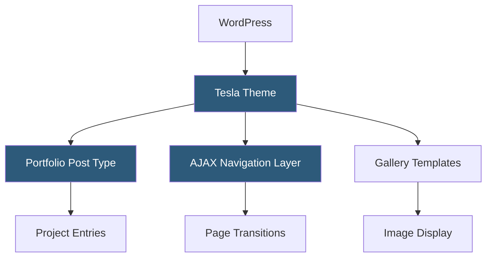

**Category:** Template Marketplaces
**Difficulty:** Beginner
**Reading time:** 5 min read

---

Tesla Themes is a WordPress theme developer specializing in portfolio, photography, and creative professional themes. Their catalog focuses on visual-first layouts with full-screen imagery, smooth transitions, and minimal UI chrome to let creative work remain the focal point.

- **Full-Screen Portfolio Layouts** — themes designed around edge-to-edge imagery and video as the primary design element
- **Photography-Optimized Templates** — gallery and portfolio templates tuned for high-resolution image display
- **Smooth Transitions** — JavaScript-driven page transitions using AJAX loading to avoid hard page reloads
- **Minimal Admin Options** — lean Customizer panels focused on essential controls without option overload
- **AJAX Navigation** — client-side page loading maintaining scroll position and reducing perceived latency
- **Portfolio Post Type** — custom post type for project entries separate from standard WordPress posts
- **Theme Bundle Membership** — access to all Tesla themes under a single membership plan

Tesla themes implement AJAX navigation by intercepting internal anchor clicks with jQuery event delegation. When a user clicks a page link, the handler fires an AJAX request to fetch the target page's content container HTML. The response is injected into the current page's content div, history.pushState updates the browser URL, and a CSS transition (typically opacity fade or slide) masks the content swap. This provides a single-page app feel without requiring a JavaScript framework.

Portfolio items are registered as a custom post type with taxonomy support for project categories and tags. Individual portfolio templates use a custom page template file that outputs the featured image, gallery fields (stored in ACF or custom post meta), and project detail metadata. Archive templates use Isotope.js for filterable masonry grids.

Image loading is optimized through WordPress's native responsive image srcset, combined with a lazy-loading implementation that defers off-screen images. High-resolution retina support is handled by registering additional image sizes via `add_image_size()` and referencing them in `srcset` attributes. The lean Customizer panel exposes color accent selection, font choices, and header layout toggles without exposing low-level CSS controls.

- Photographers showcasing client work galleries
- Graphic designers displaying branding and identity portfolios
- Illustrators and artists selling prints or commissions
- Architects presenting project case studies
- Videographers embedding showreel content

| Advantage | Disadvantage |
|-----------|--------------|
| Visual-first design prioritizes creative work display | Narrow niche means poor fit for non-portfolio content types |
| AJAX transitions create premium user experience | AJAX navigation can complicate analytics tracking setup |
| Lean options reduce decision fatigue | Limited flexibility for non-creative business use cases |
| Photography-optimized templates minimize setup time | Smaller community than mainstream ThemeForest themes |

- [ThemeForest Templates Marketplace](themeforest-templates-marketplace.md)
- [Bridge Creative Theme](bridge-creative-theme.md)
- [Uncode Creative Theme](uncode-creative-theme.md)

---
*Part of the [Template Marketplaces](index.md) category · [Back to Master Index](../../index.md)*
