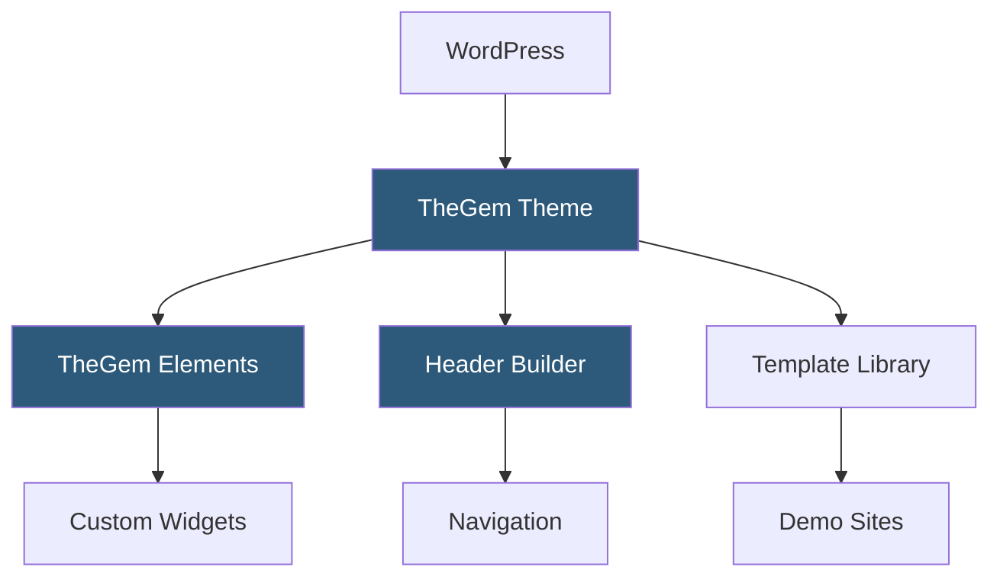

**Category:** Template Marketplaces
**Difficulty:** Beginner
**Reading time:** 5 min read

---

TheGem is a premium WordPress creative theme on ThemeForest, acclaimed for its extensive website template library with over 400 pre-built demos. It supports WPBakery, Elementor, and WordPress block editor workflows, making it adaptable for agencies, freelancers, and enterprises building visually sophisticated sites.

- **Template Library** — 400+ pre-built page and site templates importable with a single click
- **TheGem Elements Plugin** — bundled companion plugin providing custom widgets and shortcodes
- **Multi-Builder Support** — compatible with WPBakery, Elementor, and native Gutenberg blocks
- **Header Builder** — drag-and-drop header constructor with mobile-specific layout controls
- **Mega Menu** — advanced navigation system supporting multi-column dropdowns with icons and images
- **WPML Compatibility** — full support for the WordPress Multilingual Plugin for localized sites
- **WooCommerce Skins** — dedicated shop layout variants with custom product card styles

TheGem's architecture separates layout capabilities into two layers: the WordPress theme itself handles template hierarchy, typography, and color system via the Customizer, while TheGem Elements plugin registers the custom post types and shortcodes that power interactive components like portfolios, team members, and testimonials.

The template library is accessed through a modal overlay inside the page builder. When a user selects a demo, TheGem sends an API request to retrieve a JSON configuration, then generates the corresponding page builder markup locally before inserting it into the current page. Full site demos use the one-click importer, which leverages WordPress XML import for content and a custom serializer for Customizer settings and widget data.

Header and footer construction uses a custom builder panel that exposes header rows, columns, and elements as a grid. Changes are saved as theme options rather than custom post types, which means headers are global by default—per-page headers require header override meta boxes on individual posts. Mobile responsiveness is controlled through breakpoint-specific toggles in both the header builder and the page builder columns.

- Digital agencies needing diverse demo options for client pitches
- Creative studios building portfolio and case study sites
- SaaS companies wanting multi-language marketing sites
- Bloggers and media publishers seeking typography-rich layouts
- E-commerce brands wanting styled product showcases

| Advantage | Disadvantage |
|-----------|--------------|
| 400+ templates eliminate blank-canvas paralysis | Plugin dependencies increase maintenance overhead |
| Multi-builder flexibility suits mixed teams | Large code footprint requires caching for good performance |
| Responsive header builder streamlines mobile UX | Updates can occasionally break custom child-theme overrides |
| Active forum support from developer team | Premium license required for each domain |

- [ThemeForest Templates Marketplace](themeforest-templates-marketplace.md)
- [Bridge Creative Theme](bridge-creative-theme.md)
- [Avada Theme Builder](avada-theme-builder.md)

---
*Part of the [Template Marketplaces](index.md) category · [Back to Master Index](../../index.md)*
