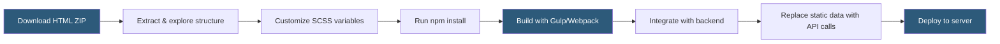

**Category:** Template Marketplaces
**Difficulty:** Beginner
**Reading time:** 5 min read

---

ThemeForest's HTML template category offers static and framework-based front-end templates built with HTML5, CSS3, and JavaScript, independent of any CMS. These templates serve as starting points for custom web development, admin dashboards, landing pages, and email designs where developers need full control without a backend opinionation.

- **Bootstrap Template** — theme built on the Bootstrap CSS framework providing responsive grid and components
- **Admin Dashboard Template** — HTML/CSS/JS template for back-office interfaces with charts, tables, and data components
- **Landing Page Template** — single-page marketing template optimized for conversions
- **Email Template** — table-based HTML designed to render correctly across mail clients
- **SCSS Source Files** — preprocessed CSS source that buyers can customize before compiling
- **Gulp/Webpack Build Tools** — included build pipelines for compiling assets in development
- **Framework Agnostic** — pure HTML templates that can be integrated with any backend language
- **RTL Support** — right-to-left language variant included for Arabic/Hebrew markets

HTML templates on ThemeForest are delivered as compressed archives containing an organized directory structure: `assets/` for CSS, JS, images, and fonts; `html/` or root-level `.html` files for page templates; and often a `src/` folder with raw SCSS/TypeScript source files alongside a `package.json` defining the build toolchain.

Unlike CMS themes, HTML templates require developer involvement to integrate with a data source. A developer takes the static `.html` files and converts them to their framework's templating language — Blade for Laravel, Jinja2 for Flask, EJS for Node.js, or JSX for React. The CSS and JavaScript assets remain largely unchanged.

Admin dashboard templates are particularly popular in this category. Products like Adminto, Metronic, or Dashonic come with dozens of pre-built UI components: data tables using DataTables.js, chart libraries like ApexCharts or Chart.js, calendar widgets, form validation, and CRUD page examples. Developers use these as UI starter kits rather than functional applications.

Build toolchains vary by template vintage. Older templates use Gulp with manually configured tasks; newer ones use Vite or webpack 5. Buyers should check Node.js compatibility requirements in documentation before purchasing, as some older templates use deprecated npm packages requiring `--legacy-peer-deps` flags to install.

Email templates represent a separate subcategory following entirely different technical constraints — they use table-based layouts and inline CSS to achieve cross-client compatibility, as modern CSS features are unsupported in Outlook and many mobile mail apps.

- Building a custom CMS or SaaS backend UI without a front-end framework
- Creating marketing landing pages with unique visual designs
- Starting an admin panel for a custom web application
- Prototyping client-facing interfaces for approval before backend development
- Developing HTML email campaigns with professional design

| Advantage | Disadvantage |
|-----------|--------------|
| CMS-independent, works with any backend | Requires developer effort to integrate with data sources |
| Full access to source files for deep customization | Build tool dependencies can be outdated |
| Large variety of admin dashboard UI kits | No automatic CMS or plugin ecosystem |
| Often includes multiple color schemes and layouts | Accessibility may not be baked in |
| Email templates handle cross-client complexity | Static demos don't reveal all integration edge cases |

- [ThemeForest Templates Marketplace](themeforest-templates-marketplace.md)
- [CodeCanyon Scripts and Plugins](codecanyon-scripts-plugins.md)
- [Webflow Templates Marketplace](webflow-templates-marketplace.md)

---
*Part of the [Template Marketplaces](index.md) category · [Back to Master Index](../../index.md)*
