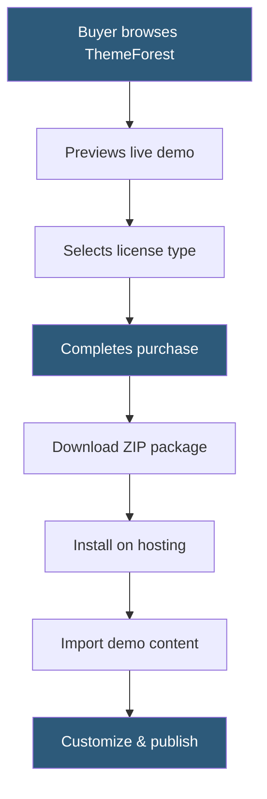

**Category:** Template Marketplaces
**Difficulty:** Beginner
**Reading time:** 5 min read

---

ThemeForest is Envato's flagship digital marketplace for website themes and templates, hosting over 50,000 items including WordPress themes, HTML templates, and site builder templates. It operates on a buyer-pays-once model where authors set prices and Envato takes a commission percentage that varies based on the author's exclusivity status.

- **Regular License** — allows use of a theme on a single end product that is free to end users
- **Extended License** — allows use in a product that charges end users, costing significantly more
- **Item Support** — paid 6- or 12-month support periods authors offer for bug fixes and questions
- **Envato Author** — a registered creator who uploads and sells items on the marketplace
- **Elite Author** — status granted to authors who exceed $75,000 in lifetime sales
- **Envato Elements** — subscription alternative offering unlimited downloads from a curated library
- **Rating & Reviews** — buyer feedback system influencing item visibility and trust signals
- **Item Updates** — authors push versioned updates purchasers can re-download at no extra cost

ThemeForest operates as a curated marketplace — every submission goes through a review process where Envato staff evaluate design quality, code standards, documentation, and security. Approved items appear in category listings ranked by recent sales, ratings, and recency.

Authors set their own prices within Envato's suggested ranges. The commission structure incentivizes exclusivity: exclusive authors (selling only on Envato) earn 50–70% of the sale price depending on lifetime earnings; non-exclusive authors earn a flat 30–55%. Prices typically range from $14 to $79 for WordPress themes.

When a buyer purchases an item, they receive access to a download package containing the theme files, documentation, and any bundled plugins. Many premium themes bundle plugins such as Revolution Slider or Visual Composer as included extras, bypassing the need to purchase them separately.

Support is handled through Envato's commenting system or dedicated author support portals. Authors are required to respond to support requests within 72 hours during included support periods. After the initial support period expires, buyers can purchase extensions.

Item updates are perpetual — once purchased, buyers can re-download updated versions indefinitely. However, if an author abandons a theme, support and updates cease, leaving buyers dependent on community resources or migration to a maintained alternative.

- Launching a WordPress business or portfolio site without custom development
- Acquiring HTML email templates for marketing campaigns
- Purchasing WooCommerce themes for e-commerce stores
- Finding React or Vue.js admin dashboard templates
- Obtaining specialized niche themes (real estate, medical, restaurant)

| Advantage | Disadvantage |
|-----------|--------------|
| Massive selection across all categories | Theme bloat from bundled plugins and features |
| One-time payment with lifetime updates | Support quality varies significantly by author |
| Live preview demos before purchase | License restrictions on multi-site use |
| Established review process ensures baseline quality | Popular themes can look generic across many sites |
| Refund policy via Envato if theme is fundamentally broken | Abandoned themes leave buyers without security patches |

- [ThemeForest WordPress Themes](themeforest-wordpress-themes.md)
- [Envato Elements Subscription](envato-elements-subscription.md)
- [WordPress.org Theme Directory](wordpress-org-theme-directory.md)

---
*Part of the [Template Marketplaces](index.md) category · [Back to Master Index](../../index.md)*
