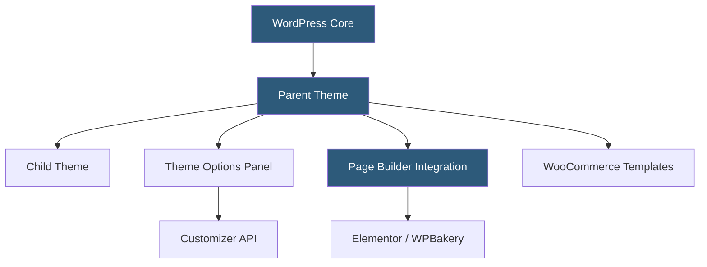

**Category:** Template Marketplaces
**Difficulty:** Beginner
**Reading time:** 5 min read

---

ThemeForest hosts the world's largest collection of premium WordPress themes, ranging from multipurpose page-builder themes to highly specialized niche templates. These commercial themes differ from free repository themes by offering bundled premium plugins, dedicated support, and regular feature updates tied to the WordPress and WooCommerce release cycles.

- **Child Theme** — a theme that inherits functionality from a parent, allowing safe customization without losing updates
- **Page Builder Compatibility** — integration with Elementor, WPBakery, Divi, or Gutenberg block editors
- **Demo Importer** — one-click tool that imports sample content, widgets, and settings to replicate the preview
- **Theme Options Panel** — custom admin UI (often using Redux Framework or Customizer) for configuring colors, layouts, and typography
- **WooCommerce Ready** — theme built with hooks and templates to support e-commerce out of the box
- **Bundled Premium Plugins** — included third-party plugins (e.g., Revolution Slider, WPML, ACF Pro) adding value but also complexity
- **GPL License** — WordPress themes must comply with GPL v2 or later for code components
- **Theme Check** — automated and manual validation ensuring themes meet WordPress coding standards

Premium WordPress themes on ThemeForest are ZIP archives containing a parent theme, optional child theme starter, bundled plugins, and documentation. Installation occurs via the WordPress admin Appearance > Themes > Add New > Upload screen or via FTP directly to the `wp-content/themes/` directory.

After activation, most themes prompt installation of required and recommended plugins through a TGM Plugin Activation library that handles downloading bundled plugins from a secure Envato distribution server. The demo importer then pulls XML content data, widget settings exported as JSON, and customizer settings to replicate what was shown in the live preview.

Theme options are stored in the WordPress options table, either through the Customizer (live preview changes) or a separate admin panel. Many themes use Redux Framework for their options panels, though newer themes increasingly move to native Customizer sections for better compatibility with the Full Site Editing direction WordPress is heading.

Updates are delivered via the Envato Market plugin, which authenticates with the API using a personal token and notifies the admin panel when new theme versions are available — functioning similarly to automatic plugin updates but for commercial themes.

Security depends heavily on the author. High-quality themes sanitize inputs, escape outputs, and avoid bundling outdated plugin versions. Poor-quality themes may bundle vulnerable plugin versions or use deprecated WordPress functions that generate warnings on newer PHP versions.

- Building a corporate website with professional design without a custom theme budget
- Launching a WooCommerce store with built-in product page layouts
- Creating a multi-purpose site that can serve different client niches via demo imports
- Deploying a magazine or blog with pre-built category and archive templates
- Rapid prototyping of a WordPress site for client approval

| Advantage | Disadvantage |
|-----------|--------------|
| Bundled premium plugins save hundreds of dollars | Bundled plugins complicate updates and ownership |
| Professional design with responsive layouts | Theme lock-in: switching themes is labor-intensive |
| Active community with forums and tutorials | Performance bloat from loading unused features |
| Demo imports accelerate launch timelines | Opinionated page builders conflict with native Gutenberg |
| Regular updates for WordPress compatibility | Theme abandonment leaves security gaps |

- [ThemeForest Templates Marketplace](themeforest-templates-marketplace.md)
- [Astra Theme Ecosystem](astra-theme-ecosystem.md)
- [WordPress.org Theme Directory](wordpress-org-theme-directory.md)

---
*Part of the [Template Marketplaces](index.md) category · [Back to Master Index](../../index.md)*
