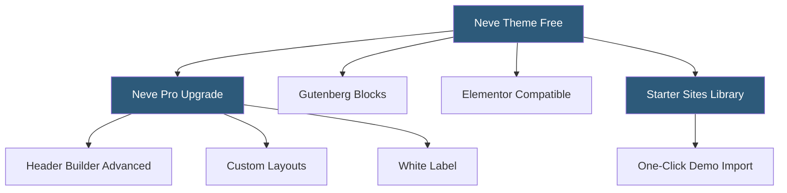

**Category:** Template Marketplaces
**Difficulty:** Beginner
**Reading time:** 5 min read

---

ThemeIsle is a Romanian-based WordPress theme and plugin company known for the Neve and Hestia themes, with a business model combining free themes on WordPress.org with paid upgrades via neve Pro. The company focuses on performance-first themes that score well on Google PageSpeed and Core Web Vitals, with strong Gutenberg and Elementor compatibility.

- **Neve Theme** — lightweight multipurpose theme with modular header and footer builder, AMP support, and starter sites
- **Hestia Theme** — one-page material design WordPress theme with WooCommerce compatibility
- **Starter Sites** — pre-built complete site templates importable via a plugin with one-click demo import
- **Neve Pro** — premium license adding header booster, custom layouts, White Label option, and advanced modules
- **AMP Compatibility** — Accelerated Mobile Pages support baked into Neve for fast mobile delivery
- **Core Web Vitals** — Google's performance metrics (LCP, FID, CLS) that ThemeIsle benchmarks heavily in marketing
- **White Label** — Neve Pro feature removing ThemeIsle branding, useful for agencies delivering client sites
- **FSE (Full Site Editing)** — compatibility with WordPress block-based site editor available in newer Neve versions

ThemeIsle follows a freemium model — Neve and Hestia are available for free on the WordPress.org theme repository, which drives massive adoption. The free themes include enough functionality for simple sites, and the Pro upgrades add capabilities that growing sites eventually need, creating a natural upgrade funnel.

Neve's architecture centers on performance. The theme generates a minimal CSS footprint by loading only the styles needed for active features, avoiding the CSS bloat common in multipurpose themes. It scores consistently well on Lighthouse performance audits, which matters for SEO-conscious clients. The theme also supports Google AMP (Accelerated Mobile Pages) through the official AMP plugin, enabling ultra-fast mobile page delivery for content-heavy sites.

The Starter Sites library, accessed via a companion plugin, provides complete site templates across dozens of niches: travel, photography, restaurant, yoga studio, e-commerce. Each starter site is built with a specific builder in mind — some target Elementor, others Gutenberg or Brizy. The import wizard detects the active page builder and imports the appropriate template variant.

The header and footer builder is a visual drag-and-drop composer for the site's header and footer regions — adding elements like search bars, cart icons, social links, and navigation menus with pixel-precise positioning control. The Pro version extends this with mega menus, transparent headers on scroll, sticky headers, and off-canvas navigation patterns.

ThemeIsle's plugin portfolio (Neve Pro, Otter Blocks, Visualizer) integrates tightly with their themes, creating a cohesive product stack. Otter Blocks provides additional Gutenberg blocks; Visualizer adds chart and table blocks — all optimized for use with Neve.

- Building performance-optimized WordPress sites for clients prioritizing Core Web Vitals scores
- WooCommerce stores needing a lightweight, fast-loading theme foundation
- Agencies using White Label feature to present clean unbranded client deliverables
- Sites targeting AMP for mobile performance on slow connections
- Gutenberg-first workflows with Otter Blocks integration

| Advantage | Disadvantage |
|-----------|--------------|
| Free base theme on WordPress.org for unlimited use | Pro features require paid license per number of sites |
| Performance-first design scores well on Lighthouse | Less flashy visual demo content than premium-only themes |
| Strong Gutenberg and Elementor compatibility | Smaller plugin ecosystem than Divi or Elementor |
| White Label option suits agency workflows | Support for free users limited to community forums |
| AMP support for mobile-critical sites | Some advanced layouts still require builder plugin knowledge |

- [Astra Theme Ecosystem](astra-theme-ecosystem.md)
- [GeneratePress Premium Themes](generatepress-premium-themes.md)
- [Neve Theme Templates](neve-theme-templates.md)

---
*Part of the [Template Marketplaces](index.md) category · [Back to Master Index](../../index.md)*
