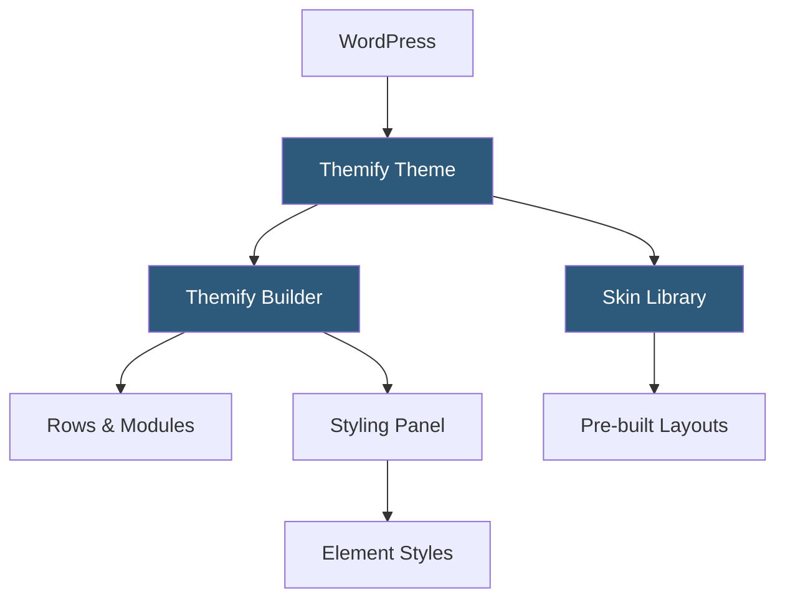

**Category:** Template Marketplaces
**Difficulty:** Beginner
**Reading time:** 5 min read

---

Themify is a WordPress theme shop offering a lineup of themes built around their proprietary Themify Builder—one of the earliest drag-and-drop page builders in the WordPress ecosystem. Themes are available individually or through an all-access club membership covering the full catalog and premium plugins.

- **Themify Builder** — proprietary visual drag-and-drop page builder with row/column/module hierarchy
- **Theme Club Membership** — subscription plan granting access to all Themify themes and plugins
- **Skin Library** — downloadable layout skins (pre-designed page configurations) for each theme
- **Builder Addon Plugins** — optional paid add-ons extending the Builder with additional modules
- **WooCommerce Integration** — styled shop, product, and cart templates within Builder context
- **Builder Styling Panel** — per-element styling controls covering spacing, typography, and animation
- **Live Preview Builder** — frontend editing mode showing changes in real time without page reloads

Themify Builder stores page layout data as post meta in a custom serialized format. When a page loads on the front end, the Builder PHP renderer reads the meta, processes each row and module definition, and outputs HTML alongside module-specific CSS inlined in a `<style>` block or appended to a cached stylesheet. The frontend editing mode uses JavaScript to make the rendered HTML directly manipulable—clicking an element opens an inline styling panel without navigating to a separate backend editor.

Skin installation works through a WordPress importer variant: skins are packaged as XML files containing content and Builder meta. The importer creates new pages with the skin's layout intact, which users then customize with their own content. This workflow differs from one-click demo importers in that skins target individual pages rather than full site configurations.

Addon plugins (e.g., Maps, Sliders, WooCommerce Builder) extend the module library by registering new Builder module types via a plugin hook API. Each module registers its settings fields, rendering function, and optional JavaScript dependencies. The addon architecture allows Themify to sell incremental functionality without bundling everything into the core theme.

- Small business sites needing visual control without developer involvement
- Blogs requiring structured post and archive layouts
- Portfolio sites using grid and masonry layout modules
- E-commerce stores built on WooCommerce with custom product pages
- Landing pages for lead generation campaigns

| Advantage | Disadvantage |
|-----------|--------------|
| Club membership provides excellent value for multiple sites | Proprietary builder creates content lock-in on switching themes |
| Frontend live editing reduces iteration cycle time | Performance overhead from inline styles and Builder scripts |
| Long-established with large user community | Builder less powerful than modern alternatives like Elementor |
| Builder addon system enables targeted feature expansion | Some addons require additional paid purchases |

- [ThemeForest Templates Marketplace](themeforest-templates-marketplace.md)
- [Elegant Themes Marketplace](elegant-themes-marketplace.md)
- [Avada Theme Builder](avada-theme-builder.md)

---
*Part of the [Template Marketplaces](index.md) category · [Back to Master Index](../../index.md)*
