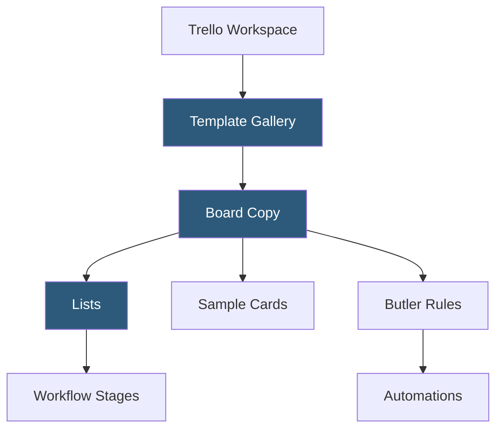

**Category:** Template Marketplaces
**Difficulty:** Beginner
**Reading time:** 5 min read

---

The Trello Template Gallery is Trello's library of pre-built Kanban board templates spanning project management, marketing, HR, sales, design, and personal productivity. Templates create fully configured Trello boards with lists, sample cards, Power-Ups, and automation rules ready for immediate team adoption.

- **Boards** — the primary Trello workspace; templates create boards with predefined list columns and sample cards
- **Lists** — column-based workflow stages (e.g., To Do, In Progress, Done) pre-configured in templates
- **Cards** — individual task items with checklists, labels, attachments, due dates, and member assignments
- **Power-Ups** — Trello's integration system (Calendar, Jira, Slack, GitHub) included in some templates
- **Butler Automations** — Trello's built-in rule-based automation for card movement, label assignment, and notifications
- **Card Templates** — card-level templates within boards ensuring consistent structure for new task creation
- **Workspace Templates** — multi-board template configurations for complex team setups

Trello templates are shared boards accessible via a template link in the gallery. Using a template triggers Trello's board copy API, which duplicates the list structure, all cards (including their checklists, labels, and descriptions), Butler automation rules, and Power-Up configurations. Cards are copied with their content but without member assignments, due dates, or attachments, since these are user-specific values that need to be set fresh.

Butler automations are Trello's no-code workflow engine. Templates may include Butler rules like "When a card is moved to Done, set due date complete and archive after 7 days" or "When a card is added to Review, assign the QA label." These rules are serialized as Butler rule definitions and included in template copies. Power-Up configurations are copied structurally but require users to re-authenticate their own service connections.

Card Templates, introduced as a separate Trello feature, allow a template card to be defined within a list—a pre-filled card structure that spawns new cards with consistent checklists, labels, and descriptions. A "New Feature" card template might pre-populate a checklist covering requirements, design review, implementation, and testing phases. This ensures all team members create consistently structured cards without manual formatting.

- Software development teams managing sprints with backlog and review columns
- Content teams tracking articles from ideation through publication
- Remote teams coordinating asynchronous work across time zones
- Event coordinators managing task checklists for complex event logistics
- Personal task management with GTD or inbox-zero style workflows

| Advantage | Disadvantage |
|-----------|--------------|
| Simple Kanban model is instantly understandable for all users | Limited data model compared to Airtable, ClickUp, or Monday.com |
| Free tier is genuinely useful without paid limitations | Power-Ups per board limited on free plan |
| Butler provides capable automation without coding | Less suitable for complex multi-project portfolio management |
| Community template gallery is large and diverse | Cards lack rich field types compared to database-first tools |

- [ClickUp Template Center](clickup-template-center.md)
- [Monday.com Template Center](monday-com-template-center.md)
- [Notion Template Gallery](notion-template-gallery.md)

---
*Part of the [Template Marketplaces](index.md) category · [Back to Master Index](../../index.md)*
