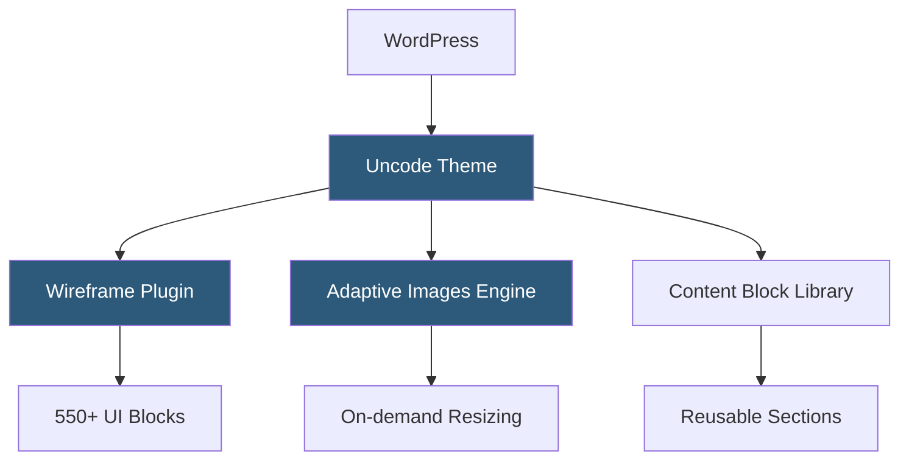

**Category:** Template Marketplaces
**Difficulty:** Intermediate
**Reading time:** 5 min read

---

Uncode is a premium WordPress theme targeting creative professionals and agencies, distinguished by its pixel-perfect grid system and focus on design fidelity. It uses a customized version of WPBakery augmented with its own Wireframe feature set, enabling high-fidelity layout prototyping directly in the CMS.

- **Wireframe Plugin** — Uncode's proprietary UI kit of 550+ content blocks for rapid page assembly
- **Adaptive Images** — automatic server-side image resizing to exact layout dimensions, eliminating oversized requests
- **Isotope Grid** — JavaScript-powered filterable portfolio and blog grids with smooth animation
- **Content Block Library** — reusable saved sections (header, CTA, footer variants) stored as custom post types
- **Undo History** — multi-step undo functionality within the visual editor for non-destructive changes
- **Inner Row System** — nested layout containers enabling complex asymmetric grid compositions
- **Social Feed Integration** — native Instagram and social media feed embeds within portfolio grids

Uncode extends WPBakery by registering a parallel block library called Wireframe. When a user opens the page editor, the Wireframe panel appears as a sidebar offering categorized content blocks. Selecting a block injects pre-configured WPBakery shortcode markup into the page, which is then rendered visually. This differs from standard WPBakery workflows by providing opinionated, design-ready starting points rather than empty element placeholders.

Adaptive Images is technically a PHP-based image resizing middleware. When WordPress outputs an image tag, Uncode intercepts the requested dimensions, checks a cached directory for a pre-generated crop, and creates one dynamically if absent. This ensures images fill their grid cells at exact pixel dimensions, preventing content-aware crop inconsistencies common with WordPress's default thumbnail system.

Content Blocks are stored as a custom post type (`uncode_content`) and referenced by shortcode or block. This allows designers to maintain a header variant library or CTA block set and update all instances site-wide by editing the source content block. Child theme support follows standard conventions, with Uncode encouraging per-project child themes to protect customizations through upgrades.

- Photography and videography portfolio sites
- Architecture and interior design firm websites
- Fashion and lifestyle brand editorial pages
- Digital agency credential and case study showcases
- Art gallery and museum exhibition sites

| Advantage | Disadvantage |
|-----------|--------------|
| Adaptive Images produces pixel-perfect layouts | Tight WPBakery coupling limits editor flexibility |
| Wireframe blocks enable fast high-quality assembly | Non-standard WPBakery fork complicates migrations |
| Content Blocks reduce global-change effort | Heavier than lightweight themes; needs optimization |
| Strong visual design philosophy ensures coherence | Learning curve for Wireframe vs standard WPBakery |

- [ThemeForest Templates Marketplace](themeforest-templates-marketplace.md)
- [Bridge Creative Theme](bridge-creative-theme.md)
- [Salient Creative Theme](salient-creative-theme.md)

---
*Part of the [Template Marketplaces](index.md) category · [Back to Master Index](../../index.md)*
