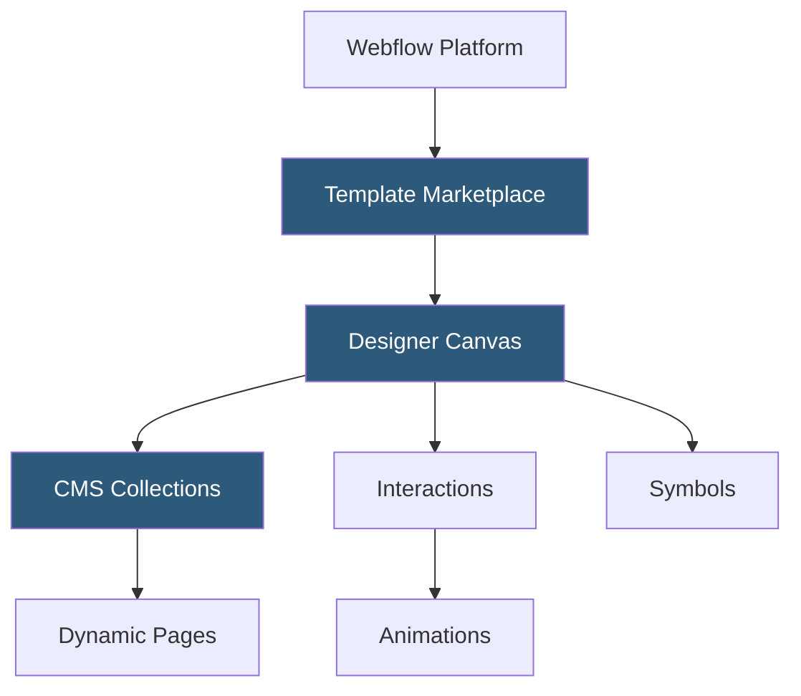

**Category:** Template Marketplaces
**Difficulty:** Intermediate
**Reading time:** 5 min read

---

The Webflow Templates Marketplace offers premium and free website templates built natively on the Webflow platform, covering marketing sites, portfolios, e-commerce, and SaaS landing pages. Templates are cloneable design systems that buyers own permanently, with the full Webflow Designer available for pixel-level customization.

- **Cloneable Templates** — purchased or free templates create an independent site copy in the buyer's Webflow workspace
- **CMS Collections** — Webflow's content management layer enabling dynamic pages from structured data sets
- **Interactions** — Webflow's visual animation tool allowing scroll, hover, click, and load-triggered animations
- **Symbols** — reusable components (navigations, footers, cards) that sync updates across all instances
- **Class-Based Styling** — Webflow's CSS class system mirrors standard CSS, giving designers precise style control
- **Webflow Ecommerce** — storefront templates with product listings, carts, and checkout flows
- **Webflow University** — official learning platform for understanding template structure and customization

Webflow templates are complete site configurations exported as JSON data structures representing the full DOM tree, style classes, CMS schemas, and interaction definitions. When a user clones a template, Webflow's API creates a deep copy of this data in the buyer's account. The template opens in the Webflow Designer—a browser-based editor that maps one-to-one with standard HTML/CSS/JavaScript—allowing direct manipulation of every element.

Each element in the designer maps to real CSS properties: setting padding in the designer writes `padding` values to the class definition. The CSS panel exposes all standard properties including flexbox, CSS Grid, transforms, and filters. This transparency makes Webflow templates educational: developers can inspect exactly how any visual effect is achieved by examining the class styles.

CMS Collections within templates define structured content schemas (blog posts, team members, case studies) with typed fields. Collection list components dynamically render items from the CMS, enabling unlimited additions without design changes. The Interactions panel uses a trigger/action model: a scroll-into-view trigger on a section can fire an opacity animation on a heading using bezier-curve easing, all defined without JavaScript. The output is vanilla JavaScript generated by Webflow at publish time.

- Marketing agencies building landing pages with advanced scroll animations
- SaaS companies creating product marketing sites with CMS-powered blog sections
- Designers learning Webflow conventions from professionally structured templates
- Freelancers delivering client sites using proven template foundations
- E-commerce brands needing custom-designed storefronts beyond builder defaults

| Advantage | Disadvantage |
|-----------|--------------|
| Real CSS/HTML mapping makes templates educational and hackable | Webflow Designer has significant learning curve |
| CMS enables dynamic content without external integrations | Platform pricing can be expensive for multi-site agencies |
| Interaction system replaces custom JavaScript for most animations | Exported code is optimized for Webflow's CDN; complex to host elsewhere |
| Permanent ownership of cloned template assets | Marketplace templates vary widely in code quality |

- [Squarespace Template Store](squarespace-template-store.md)
- [Framer Template Community](framer-template-community.md)
- [Wix Template Gallery](wix-template-gallery.md)

---
*Part of the [Template Marketplaces](index.md) category · [Back to Master Index](../../index.md)*
