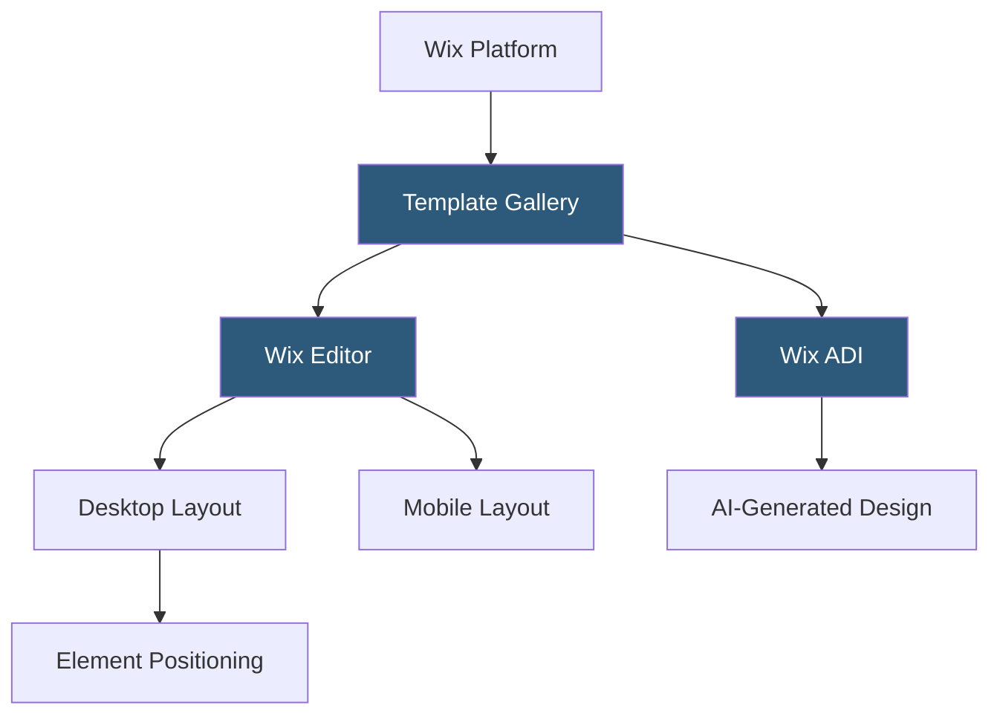

**Category:** Template Marketplaces
**Difficulty:** Beginner
**Reading time:** 5 min read

---

The Wix Template Gallery is the collection of 900+ professionally designed website templates available to all Wix users at no additional cost. Templates cover every major industry and site type, and are the primary starting point for Wix site creation, providing full design systems editable through the Wix Editor or Wix ADI.

- **Wix Editor** — drag-and-drop website builder where templates are customized with pixel-level placement freedom
- **Wix ADI (Artificial Design Intelligence)** — AI-driven setup wizard that generates a personalized site from answers rather than a template selection
- **Template Categories** — structured browsing taxonomy covering business, portfolio, store, blog, events, and 30+ sub-categories
- **Blank Templates** — minimal starting points for designers preferring to build from scratch within Wix's editor
- **Template Locking** — templates cannot be switched after site creation without rebuilding, making initial selection critical
- **Mobile Editor** — separate mobile layout configuration that doesn't auto-inherit all desktop changes
- **Wix Velo** — JavaScript development platform allowing custom code within Wix templates for dynamic functionality

Wix templates are JSON-defined site configurations stored on Wix's servers. When a user selects a template, Wix creates a copy of that configuration as the user's site document. The Wix Editor renders this document as an interactive canvas where elements are absolutely positioned rather than flow-based—a deliberate design choice that enables pixel-precise layout control at the cost of automatic responsive reflow.

Desktop and mobile layouts are stored as separate configuration layers. Changes to desktop layout do not automatically propagate to mobile; designers must manually adjust mobile separately in the mobile editor. Wix introduced the "Wix Editor X" (now "Wix Studio") for responsive, grid-based editing that addresses this limitation, though the classic Editor remains available.

Wix Velo (formerly Corvid) enables JavaScript code injection into Wix sites. Developers add code in a built-in IDE panel that runs in the Wix platform's Node.js-based backend (`wix-backend`) or client-side. Backend functions connect to databases (Wix Content Manager), external APIs via `wix-fetch`, and Wix platform APIs for users, payments, and CRM. This turns Wix templates from static designs into fully dynamic applications without leaving the platform.

- Small businesses launching sites quickly without technical expertise
- Event organizers needing single-event landing pages fast
- Service professionals building appointment booking sites
- Portfolio sites for photographers, artists, and freelancers
- Local restaurants and retail stores needing basic web presence

| Advantage | Disadvantage |
|-----------|--------------|
| 900+ templates covering nearly every industry vertical | Template cannot be changed after site creation |
| No coding required for full professional-looking sites | Absolute positioning creates mobile layout management overhead |
| Wix Velo enables advanced functionality within the platform | Content and design tightly locked to Wix platform |
| Free tier allows experimentation before purchasing | SEO flexibility more limited than WordPress or headless CMS |

- [Squarespace Template Store](squarespace-template-store.md)
- [Webflow Templates Marketplace](webflow-templates-marketplace.md)
- [Canva Template Library](canva-template-library.md)

---
*Part of the [Template Marketplaces](index.md) category · [Back to Master Index](../../index.md)*
