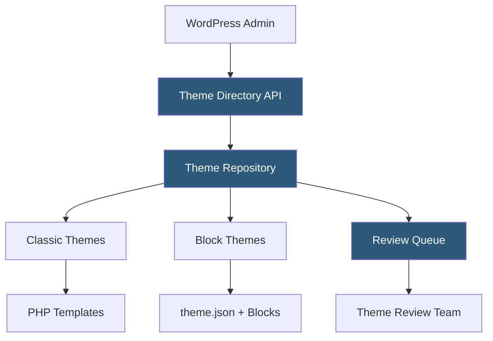

**Category:** Template Marketplaces
**Difficulty:** Beginner
**Reading time:** 5 min read

---

The WordPress.org Theme Directory is the official repository of free WordPress themes, hosting thousands of GPL-licensed themes reviewed and verified by the WordPress theme review team. It serves as the primary distribution channel for free themes and integrates directly with the WordPress admin for one-click installation.

- **Theme Review Process** — volunteer-driven code review checking for GPL compliance, security, coding standards, and accessibility
- **GPL License Requirement** — all hosted themes must be GPL v2 or compatible, ensuring user freedom to modify and redistribute
- **Theme Unit Test** — standardized test content dataset used by reviewers and developers to verify theme robustness
- **Featured/Popular Tags** — curation system surfacing high-quality themes through editorial and algorithmic ranking
- **Automatic Updates** — themes installed from the directory receive automatic update notifications in WordPress admin
- **Block Themes** — native Full Site Editing themes built entirely with Gutenberg blocks and theme.json configuration
- **Classic Themes** — traditional PHP template-based themes using the original WordPress template hierarchy

The Theme Directory is powered by a WordPress.org installation using the `wporg-themes` plugin. Developers submit themes as ZIP files through the directory interface. Automated checks (using `Theme Check` plugin standards) run first, followed by manual review by volunteer theme reviewers who assess code quality, security, accessibility, and guideline compliance.

Approved themes are stored in the SVN repository at `themes.svn.wordpress.org`. The directory API exposes a JSON endpoint consumed by the WordPress admin's Appearance > Themes browser. When a user clicks Install, WordPress fetches the ZIP from the directory, extracts it to `wp-content/themes/`, and activates it. Version updates are pushed through SVN commits, which the directory detects and lists as available updates in WordPress dashboards.

Block themes use a `theme.json` file as the central configuration layer, defining color palettes, typography scales, spacing presets, and block-level style overrides in JSON rather than PHP or CSS. The Full Site Editor renders templates defined as block patterns in the `templates/` and `parts/` directories, making every aspect of the site—header, footer, archive, single post—editable without touching code.

- Websites needing free, trusted, auto-updating themes
- Developers building themes for broad public distribution
- Organizations requiring GPL-compliant software stacks
- WordPress learners exploring theme variety at no cost
- Block editor adopters seeking Full Site Editing compatible themes

| Advantage | Disadvantage |
|-----------|--------------|
| Automatic updates through WordPress core infrastructure | Review process can take weeks for new theme approvals |
| Trust signal from official WordPress curation | Quality varies widely despite review standards |
| One-click installation from admin without leaving site | Commercial upsells and premium plugins still present in many free themes |
| GPL licensing ensures full user control | Advanced design features typically locked behind premium versions |

- [Colorlib Free Themes](colorlib-free-themes.md)
- [ThemeIsle WordPress Themes](themeisle-wordpress-themes.md)
- [Astra Theme Ecosystem](astra-theme-ecosystem.md)

---
*Part of the [Template Marketplaces](index.md) category · [Back to Master Index](../../index.md)*
