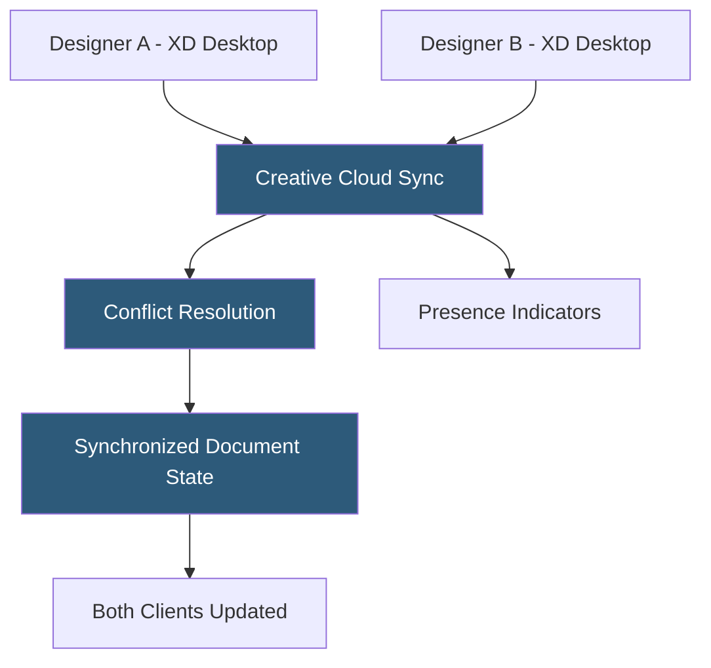

**Category:** UI/UX Design Platforms
**Difficulty:** Intermediate
**Reading time:** 5 min read

---

Adobe XD Co-editing is the real-time collaborative editing feature in Adobe XD allowing multiple team members to work simultaneously on the same XD document. It synchronizes changes across participants through Creative Cloud, showing collaborator cursors and resolving concurrent edits to enable distributed design team workflows.

- **Creative Cloud Sync** — XD co-editing is built on Creative Cloud file sync infrastructure rather than a dedicated collaboration server
- **Coeditor Cursors** — colored cursor labels indicating each connected collaborator's position on the canvas
- **Lock Mechanism** — XD automatically locks elements being edited by one user to prevent concurrent conflicts
- **Document Owner** — the Creative Cloud user who owns the file and controls sharing permissions
- **Invite to Co-edit** — collaborators are invited via Creative Cloud email invitation with editor access
- **Offline Sync** — changes made offline are queued and synced when connectivity is restored
- **Co-editing Indicators** — real-time status showing which collaborators are currently active in the file

XD co-editing differs architecturally from Figma's approach. Where Figma uses dedicated WebSocket servers for real-time operational transforms, XD routes collaboration through Creative Cloud's file sync infrastructure. When a collaborator edits an element, XD serializes the change as a delta and pushes it through the Creative Cloud sync pipeline, which then notifies other connected clients to apply the update.

The lock mechanism addresses concurrent edit conflicts. When user A selects an artboard or element, XD marks it as locked in the sync layer—other users see a lock icon and cannot select the same object. When A deselects, the lock releases and others can edit. This pessimistic locking model prevents true simultaneous editing of the same element but avoids complex operational transform merge conflicts.

Collaborator presence is shown through named cursor labels with user avatar colors derived from their Creative Cloud profile. Active users are listed in a participants panel. Users editing different artboards simultaneously do not interfere, enabling parallel work on separate screens of the same prototype. A designer working on the settings screens and another on the onboarding flow can edit concurrently without collisions.

Co-editing requires all collaborators to have Creative Cloud accounts. The document owner shares access through XD's "Invite to co-edit" feature or via Creative Cloud sharing links. Free plan users have limited co-editing access; full concurrent collaboration requires a Creative Cloud subscription for all participants.

- Remote design teams working on shared app UI in different time zones
- Designer-developer pairs reviewing and annotating designs together
- Design review sessions where stakeholders can make direct annotations
- Agency teams with junior designers working under senior oversight on shared files
- Collaborative design critique sessions with live editing capabilities

| Advantage | Disadvantage |
|-----------|--------------|
| Creative Cloud integration leverages existing Adobe account infrastructure | File-sync architecture has higher latency than Figma's dedicated WebSocket system |
| Pessimistic locking prevents complex merge conflicts | Lock-based model prevents true simultaneous editing of same elements |
| Familiar Adobe interface for existing Creative Cloud users | Requires all collaborators to have Creative Cloud accounts |
| Offline changes sync when connection restores | Product discontinued; co-editing issues won't receive bug fixes |

- [Adobe XD Design Platform](adobe-xd-design-platform.md)
- [Figma Collaborative Design](figma-collaborative-design.md)
- [Sketch Cloud Collaboration](sketch-cloud-collaboration.md)

---
*Part of the [UI/UX Design Platforms](index.md) category · [Back to Master Index](../../index.md)*
