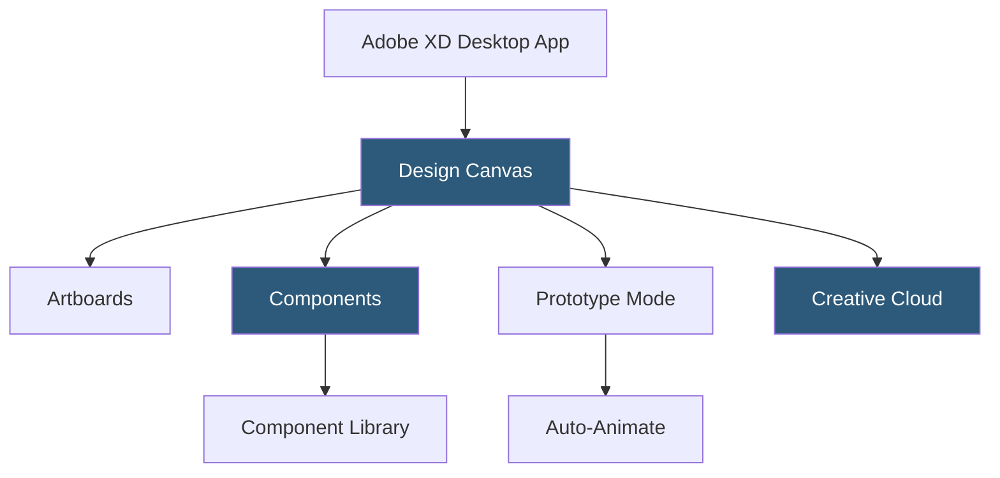

**Category:** UI/UX Design Platforms
**Difficulty:** Intermediate
**Reading time:** 5 min read

---

Adobe XD is a vector-based UI/UX design tool developed by Adobe for designing and prototyping user experiences for web and mobile applications. As part of the Adobe Creative Cloud suite, it integrates with Photoshop, Illustrator, and After Effects, making it particularly suitable for teams already embedded in the Adobe ecosystem.

- **Artboards** — fixed-size canvas areas representing individual screens or states in a design
- **Repeat Grid** — time-saving feature for replicating a single element or group into a uniform grid with individual content overrides
- **Components** — reusable design elements with states (default, hover, disabled) tracked in a component library
- **Auto-Animate** — XD's Smart Animate equivalent for interpolating differences between connected artboards
- **Co-Editing** — real-time multiplayer collaboration allowing multiple designers to edit the same document simultaneously
- **Plugins** — third-party extensions built with XD's Plugin API for workflow automation and integrations
- **Share for Review** — cloud-hosted interactive prototypes with commenting for stakeholder feedback

Adobe XD operates as a native desktop application (macOS and Windows) with Creative Cloud sync for file storage and sharing. The application maintains two modes: Design and Prototype, toggled from the top toolbar. Design mode handles vector drawing, text, images, and component management. Prototype mode overlays interaction connections on the design canvas.

Repeat Grid is one of XD's distinctive features. Selecting any element or group and clicking Repeat Grid converts it into a gridded instance array. The grid's columns and rows are adjusted with drag handles. Unique to XD, users can populate the grid with different content by dragging text files or images directly onto the grid—XD distributes the content across instances sequentially. This makes creating realistic mock list views and card grids extremely fast.

Creative Cloud Libraries enable style sharing across XD and other Adobe applications. Color swatches, character styles, and components stored in a CC Library are accessible in Photoshop, Illustrator, and InDesign, creating a cross-application design system. XD Components support states with automatic transitions, enabling hover and pressed states to be designed and previewed without creating separate artboards.

Adobe discontinued active development of XD in late 2023, announcing users should migrate to Figma (after Adobe's attempted acquisition of Figma was blocked) or other alternatives. Existing XD files and workflows remain functional but the product no longer receives new features.

- Teams in the Adobe Creative Cloud ecosystem needing tight Photoshop/Illustrator integration
- Designers familiar with Adobe tooling preferring a consistent interface paradigm
- Projects requiring rapid list/grid layout creation using Repeat Grid
- Agencies delivering interactive prototypes for client review via Share for Review
- Mobile app design with device-specific artboard presets

| Advantage | Disadvantage |
|-----------|--------------|
| Deep Adobe Creative Cloud integration benefits existing Adobe users | Adobe has ceased active development; no new features planned |
| Repeat Grid enables uniquely fast list and card layout creation | Significantly smaller community and plugin ecosystem than Figma |
| Desktop-native performance without browser rendering overhead | Real-time collaboration less mature than Figma's implementation |
| Auto-Animate enables sophisticated micro-interaction prototyping | Long-term viability uncertain given development discontinuation |

- [Figma Collaborative Design](figma-collaborative-design.md)
- [Sketch Design Toolkit](sketch-design-toolkit.md)
- [Adobe XD Prototyping](adobe-xd-prototyping.md)

---
*Part of the [UI/UX Design Platforms](index.md) category · [Back to Master Index](../../index.md)*
