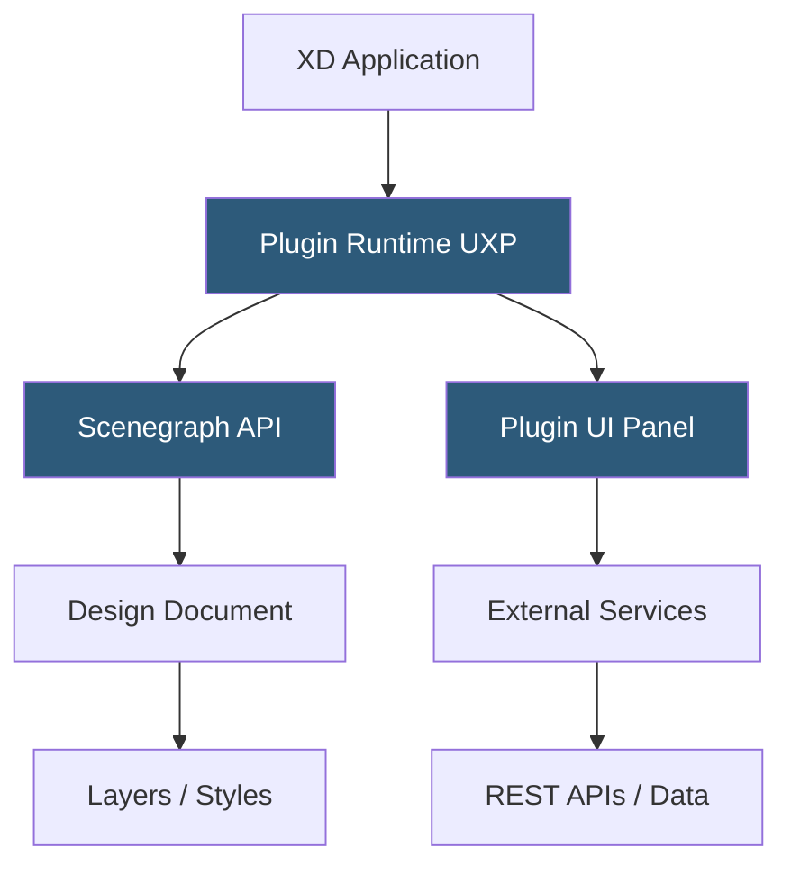

**Category:** UI/UX Design Platforms
**Difficulty:** Intermediate
**Reading time:** 5 min read

---

The Adobe XD plugin ecosystem provides third-party extensions built with the XD Plugin API that automate design workflows, integrate external services, and extend XD's capabilities. Plugins range from data population tools and icon libraries to export utilities and design system connectors.

- **XD Plugin API** — JavaScript API exposing XD's document model, scene graph, and UI APIs for plugin development
- **Plugin Manager** — in-app panel for discovering, installing, and managing XD plugins from the Creative Cloud marketplace
- **UI Manifest** — JSON configuration declaring plugin entry points, menu items, and permission requirements
- **Scenegraph API** — XD's DOM-equivalent API for reading and modifying design elements (nodes, paths, text)
- **Application API** — access to XD application state including current selection, viewport, and document structure
- **Plugin Data API** — persistent key-value storage for saving plugin state within XD documents
- **UXP (Unified Extensibility Platform)** — Adobe's cross-application plugin platform powering XD plugins and other Adobe app extensions

XD plugins use Adobe's Unified Extensibility Platform (UXP)—a JavaScript runtime with access to both XD's internal APIs and browser-standard APIs including `fetch` for network requests. Plugin code runs in a Node.js-like environment with access to the XD Scenegraph, which represents the design document as a tree of nodes. Plugins traverse this tree to select, read, modify, and create design objects programmatically.

The Scenegraph API exposes classes corresponding to XD element types: `Rectangle`, `Ellipse`, `Text`, `Group`, `SymbolInstance`, etc. Plugins iterate over these to perform bulk operations—replacing all text matching a pattern, applying a color style to all matching elements, or generating new elements based on external data. For example, a data population plugin calls an external API via `fetch`, receives JSON data, and populates selected text layers with the response values using the Text node's `text` property.

Plugin UI is built with standard HTML, CSS, and JavaScript rendered in a panel. UXP provides DOM APIs and CSS support, though not all browser APIs are available. Plugins can display forms, data tables, and interactive controls that communicate with the XD document through the Scenegraph API. Plugin state is persisted using the Plugin Data API, storing key-value pairs inside the XD document file itself.

Notable XD plugin categories include: content (Lorem ipsum, Unsplash image import, Icon libraries), workflow (Zeplin export, Jira integration, Slack design share), and automation (Rename Layers, Find and Replace, Batch Export). With XD's development discontinued, the plugin ecosystem is frozen—existing plugins remain usable but no new platform capabilities are being added.

- Content population with realistic placeholder text and images
- Icon library access with direct canvas insertion
- Zeplin or Avocode handoff export for developer specifications
- Design token export to JSON for code integration
- Batch layer renaming and organization automation

| Advantage | Disadvantage |
|-----------|--------------|
| UXP provides cross-Adobe-app development consistency | Ecosystem is frozen with discontinued product development |
| Network access enables rich data-driven design workflows | Much smaller plugin catalog than Figma's community ecosystem |
| Plugin Data API enables persistent state within documents | Fewer developers building for XD as community migrates to Figma |
| Standard HTML/CSS/JS plugin UI is accessible to web developers | Plugin API documentation and community support declining |

- [Adobe XD Design Platform](adobe-xd-design-platform.md)
- [Figma Plugins Ecosystem](figma-plugins-ecosystem.md)
- [Sketch Plugins Marketplace](sketch-plugins-marketplace.md)

---
*Part of the [UI/UX Design Platforms](index.md) category · [Back to Master Index](../../index.md)*
