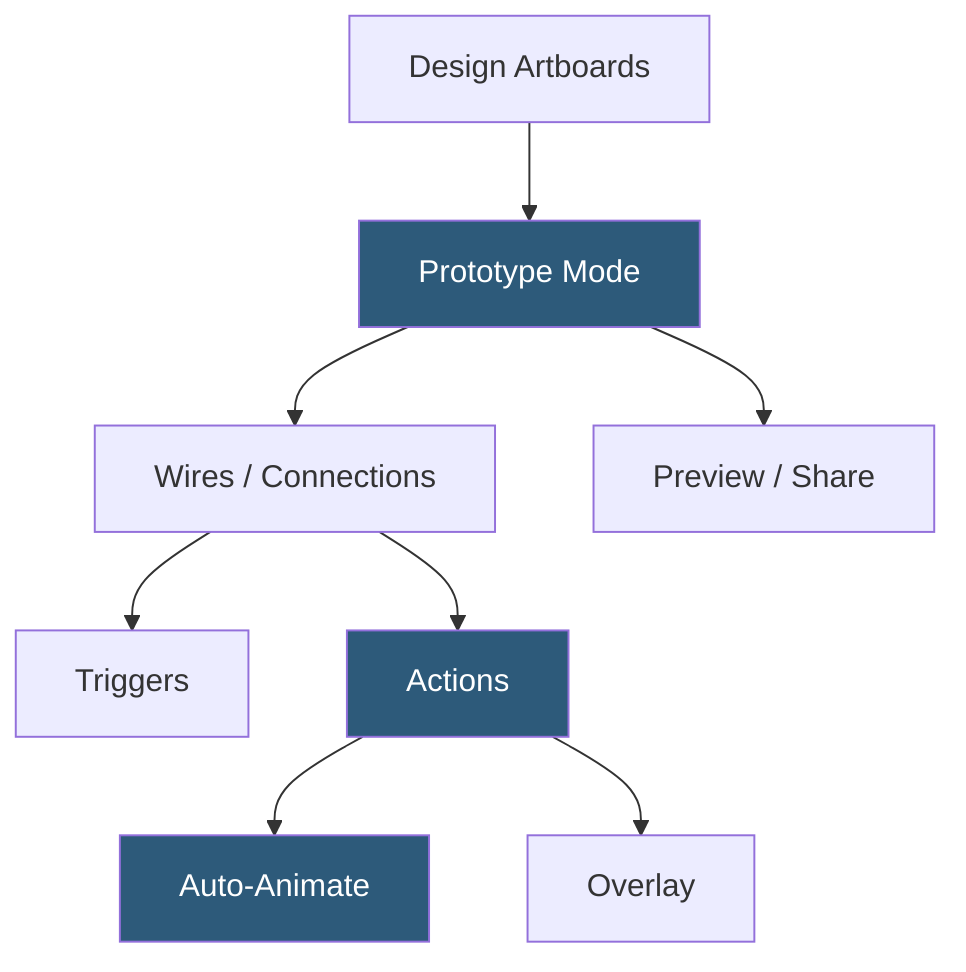

**Category:** UI/UX Design Platforms
**Difficulty:** Intermediate
**Reading time:** 5 min read

---

Adobe XD's prototyping system enables designers to create interactive, animated flows from design artboards. It features Auto-Animate for physics-based transitions, speech triggers for voice UI prototyping, time triggers for auto-advancing flows, and Share for Review for stakeholder feedback on cloud-hosted prototypes.

- **Wires** — blue arrows connecting artboards in Prototype mode defining navigation interactions
- **Auto-Animate** — XD's interpolation engine animating differences between artboards for smooth micro-interactions
- **Trigger Types** — On Tap, On Hover, Drag, Time (auto-advance), and Voice triggers supported
- **Action Types** — Transition, Auto-Animate, Overlay, Previous Artboard, and Speech Playback actions
- **Easing Options** — standard, snap, and custom bezier easing curves for transition timing control
- **Share for Review** — online hosted prototype link for stakeholder viewing and commenting
- **Fixed Elements** — sticky headers/footers remaining in position during scrollable artboard interaction

XD's prototyping works by connecting artboards with wires in Prototype mode. Each wire carries a trigger (what initiates the transition) and an action (what happens). The most powerful action is Auto-Animate, which compares the source and destination artboards for matching layer names and animates the differences. A card at a small size in artboard A animating to full-screen in artboard B will expand smoothly if the card layer name matches in both artboards.

The Drag trigger enables swipe gesture prototyping. Connecting artboards with a Drag trigger allows testers to swipe between screens in the preview as they would on a real device. Combined with momentum easing, this creates realistic scroll and carousel interactions in the prototype viewer.

Voice triggers leverage macOS and Windows speech recognition APIs to detect spoken commands and trigger transitions. This enables voice UI prototyping for conversational interfaces and smart speaker applications—a prototype of a voice-controlled smart home app can respond to "Turn on the lights" by transitioning to the lights-on artboard.

Share for Review generates a URL hosting the prototype on Adobe's servers. Stakeholders open the link in a browser to interact with the design and leave comments at specific points in the flow. Comments are synced back to the XD document, where the designer views and resolves them within the application. Design Spec mode within the shared link provides developer-facing inspection of layer properties.

- Mobile app interaction prototyping with swipe and tap gesture simulation
- Voice UI concept testing using speech triggers
- Stakeholder review sessions with embedded commenting workflow
- Micro-interaction design using Auto-Animate for state transitions
- Auto-advancing presentation flows for kiosk and display use cases

| Advantage | Disadvantage |
|-----------|--------------|
| Voice trigger support is unique among major design tools | Product discontinued; no new feature development |
| Auto-Animate produces high-quality micro-interaction previews | Prototype sharing requires Adobe Creative Cloud infrastructure |
| Time triggers enable self-running kiosk and presentation prototypes | Fewer conditional logic options than ProtoPie or Framer |
| Share for Review comment workflow integrates feedback efficiently | Community support diminishing as users migrate to Figma |

- [Adobe XD Design Platform](adobe-xd-design-platform.md)
- [Figma Prototyping](figma-prototyping.md)
- [ProtoPie Interaction Design](protopie-interaction-design.md)

---
*Part of the [UI/UX Design Platforms](index.md) category · [Back to Master Index](../../index.md)*
