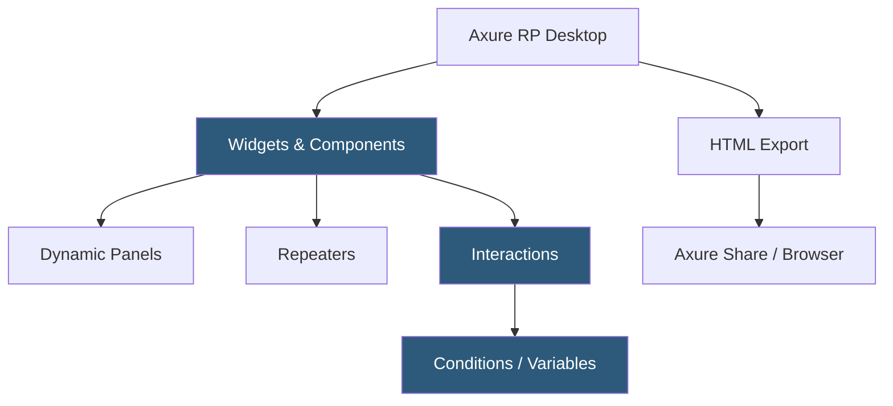

**Category:** UI/UX Design Platforms
**Difficulty:** Advanced
**Reading time:** 6 min read

---

Axure RP (Rapid Prototyping) is a professional UX design and prototyping tool for creating high-fidelity interactive wireframes and functional prototypes. It is favored in enterprise UX workflows for its powerful conditional logic, dynamic panels, repeaters, and form interaction capabilities that produce developer-documentation-quality specifications.

- **Dynamic Panels** — state-based containers enabling multi-state UI components, tabs, carousels, and modals
- **Repeaters** — data-driven list components that generate rows from a dataset with sortable, filterable behavior
- **Interactions** — event-handler system supporting conditional If/ElseIf/Else logic with dozens of event types
- **Variables** — global and page-level named values storing state for conditional interaction logic
- **Adaptive Views** — responsive design variants at different viewport widths from a single master design
- **Axure Share** — cloud hosting for sharing HTML prototypes with stakeholders for review and commenting
- **Specifications** — auto-generated design specification documents from annotated Axure files

Axure RP is a desktop application (macOS and Windows) storing files in the `.rp` format (XML-based). The canvas uses a widget-based design model where components are placed and configured through a properties panel. Unlike vector-first tools, Axure prioritizes interaction behavior over visual design fidelity—elements can have pixel-precise positioning but the visual rendering is optimized for prototype function over aesthetic polish.

Dynamic Panels are Axure's most powerful component. A Dynamic Panel contains multiple states—each state is a full canvas layer with its own content. Interaction events can set the visible state, creating accordions, tabs, image carousers, multi-step wizards, and modal overlays. States can also be set conditionally based on variable values, enabling login/logout UI states, form submission success/error screens, and feature-gated content.

Repeaters solve the data-driven prototype problem. A Repeater defines a template row and a dataset. Interaction rules within the Repeater template reference dataset columns to bind text, images, and styles to data values. Sorting and filtering Repeater datasets through interaction events creates live-searchable lists and interactive data tables within the prototype—without any code.

The Interactions panel supports comprehensive conditional logic. Each event handler (On Click, On Page Load, On Drag, etc.) can contain multiple cases with If/Else conditions comparing variable values, widget states, and adaptive view sizes. This enables prototyping complex business logic: a form that validates each field, shows inline errors, and only enables the submit button when all conditions pass.

- Enterprise UX teams prototyping complex data-heavy application flows
- Forms with real-time validation and conditional field display
- Admin dashboards with sortable, filterable data table prototypes
- Multi-step wizard flows with progress tracking and back navigation
- Functional specification documentation for development teams

| Advantage | Disadvantage |
|-----------|--------------|
| Repeaters enable data-driven prototypes unmatched in visual tools | Steeper learning curve than Figma or Sketch for visual design work |
| Dynamic Panels handle complex state management without code | Visual fidelity lower than modern vector tools |
| Conditional logic covers nearly all application interaction scenarios | Desktop-only; no browser-based editing or real-time collaboration |
| Auto-generated specifications reduce separate documentation effort | Large files can be slow; performance degrades with complex prototypes |

- [ProtoPie Interaction Design](protopie-interaction-design.md)
- [UXPin Design Platform](uxpin-design-platform.md)
- [Balsamiq Wireframing](balsamiq-wireframing.md)

---
*Part of the [UI/UX Design Platforms](index.md) category · [Back to Master Index](../../index.md)*
