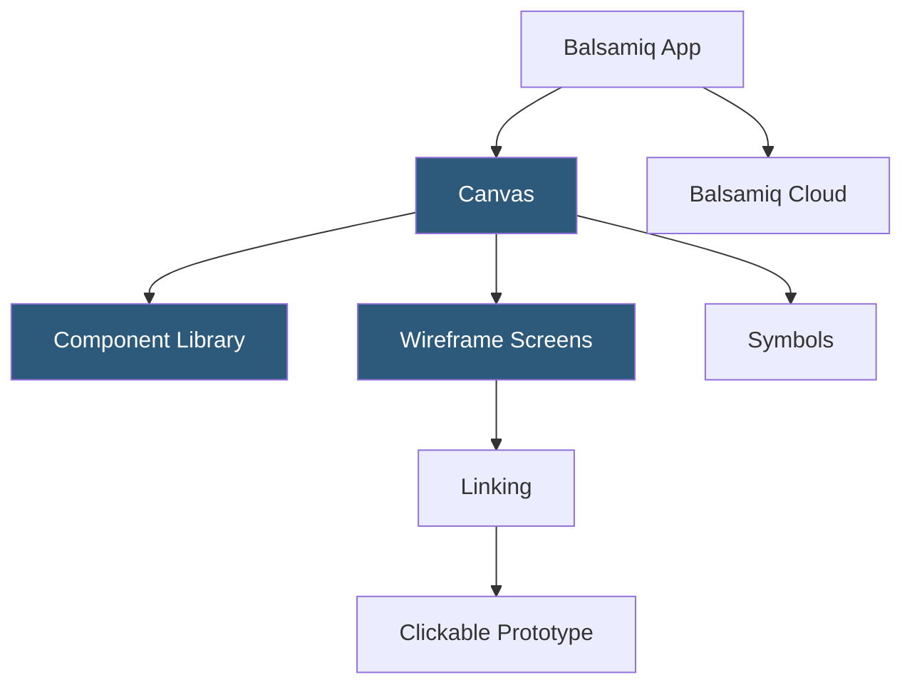

**Category:** UI/UX Design Platforms
**Difficulty:** Beginner
**Reading time:** 5 min read

---

Balsamiq is a rapid wireframing tool designed to keep designs intentionally low-fidelity, mimicking hand-drawn sketches to encourage focus on structure and workflow over visual design details. It is widely used for early-stage UX ideation, client requirement gathering, and communicating layout concepts without triggering aesthetic feedback.

- **Sketch Aesthetic** — deliberate hand-drawn visual style that signals "work in progress" to stakeholders and clients
- **Pre-built Components** — extensive library of UI components (forms, navigation, tables, mobile elements) ready to drag onto canvas
- **Linking** — clickable prototype links between wireframe screens for basic flow navigation
- **Mockup Symbols** — reusable custom component groups for shared elements like headers and footers
- **Balsamiq Cloud** — hosted SaaS version with real-time collaboration and project sharing
- **Atlassian Integration** — direct integration with Confluence and Jira for embedding wireframes in documentation
- **Text-to-UI** — Balsamiq's quick-add feature typing component names to insert them without clicking menus

Balsamiq's interface is organized around a component tray and a canvas. Components are drawn in a consistent sketch-style rasterization—all UI elements use the same hand-drawn font (Balsamiq Sans) and sketchy border rendering. This visual consistency is intentional: it prevents stakeholders from commenting on pixel-level design choices (colors, fonts, button styles) and keeps feedback focused on layout structure, information hierarchy, and user flow.

Components are placed by dragging from the library, double-clicking the canvas for a quick search, or typing component names with the Text-to-UI quick-add. Components are parameterized through properties: a dropdown shows its items when clicked, a data table shows configurable rows and columns. Component properties are edited inline with simple text configuration syntax (e.g., `Item 1, Item 2, Item 3` for a dropdown list).

Linking connects wireframe screens for basic prototype navigation. Selecting a component and setting a Link property to another wireframe makes it clickable in Prototype mode. The prototype opens in a full-screen viewer where testers navigate as they would an actual interface, though transitions are instant without animation. Link targets can also be external URLs, useful for prototypes integrating real web content.

Balsamiq Cloud extends the desktop tool to a browser-based collaborative environment. Multiple team members can comment on wireframes directly in the cloud interface, and project files sync between the Cloud and desktop app. The Confluence integration embeds wireframes as interactive iframes within Confluence pages, making wireframes part of the team's documentation workflow rather than separate files.

- Early client discovery sessions where visual fidelity distracts from structural feedback
- Rapid layout ideation for alternative approaches to the same screen
- Developer user story annotations showing expected UI layout context
- UX research discussion guides with screen references
- Requirement documentation with layout context in project management tools

| Advantage | Disadvantage |
|-----------|--------------|
| Sketch aesthetic prevents premature visual design discussions | Cannot transition to high-fidelity from Balsamiq; requires separate tool |
| Very low learning curve; non-designers productive within minutes | Limited interaction fidelity; no animations, hover states, or conditional logic |
| Atlassian integration embeds wireframes in existing documentation | Sketch rendering style may not suit all professional contexts |
| Quick component library covers most common UI patterns | Not suitable as a deliverable for visual design; wireframe-only tool |

- [Axure RP Prototyping](axure-rp-prototyping.md)
- [Whimsical Wireframes and Diagrams](whimsical-wireframes-diagrams.md)
- [Wireframe.cc Simple Wireframes](wireframe-cc-simple-wireframes.md)

---
*Part of the [UI/UX Design Platforms](index.md) category · [Back to Master Index](../../index.md)*
