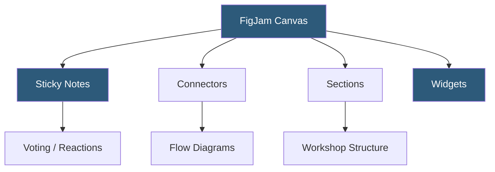

**Category:** UI/UX Design Platforms
**Difficulty:** Beginner
**Reading time:** 5 min read

---

FigJam is Figma's online collaborative whiteboarding tool for brainstorming, workshops, diagramming, and team ideation. It provides a persistent, infinite canvas with sticky notes, shapes, connectors, voting tools, and embedded media, designed for early-stage ideation before moving into the Figma design canvas.

- **Sticky Notes** — the primary FigJam element for capturing ideas with color coding and emoji reactions
- **Connectors** — flexible arrows linking elements to build flowcharts, mind maps, and user journey diagrams
- **Stamps and Reactions** — expressive feedback tools enabling non-verbal participation in live workshops
- **Sections** — organizational containers grouping related content on the infinite canvas
- **Templates** — FigJam-native templates for retrospectives, user story mapping, and design sprints
- **Voting** — built-in dot-voting feature for prioritization exercises in team workshops
- **Figma Integration** — FigJam boards link to Figma design files for seamless workflow transitions

FigJam uses the same real-time collaboration infrastructure as Figma—WebSockets for multiplayer sync and WebGL for rendering. The canvas is infinite with no fixed artboard boundaries, enabling organic content arrangement during brainstorming. All participants share the same synchronized view, and cursor positions with participant names are visible to all, supporting facilitated group sessions.

Sticky notes are the atomic unit of FigJam. Each note carries text content, a color, creator attribution, and timestamp. Notes can be grouped by dragging them into spatial clusters, and the Sorting feature (introduced for workshop facilitation) arranges notes by author, color, or date. Connectors auto-route between elements using orthogonal or curved paths, supporting the creation of flowcharts, swimlane diagrams, and mind maps.

FigJam Widgets (built with the Widget API) provide interactive tools embedded in the canvas: timers for timeboxed exercises, anonymous voting cards for psychological safety in retrospectives, estimation tools for planning poker. These widgets maintain state across sessions and sync their state to all participants in real time.

The Figma-to-FigJam workflow enables sketches and wireframes created in FigJam to transition into Figma design files. Users can copy frames from a FigJam board and paste into Figma, or embed Figma component thumbnails into FigJam boards as visual reference. This bidirectional linking supports design sprint workflows where teams move from discovery (FigJam) to design (Figma) within the same Figma organization workspace.

- Design sprint facilitation across distributed teams
- Team retrospectives with grouping and dot-voting exercises
- User journey mapping with persona swimlanes and touchpoint connectors
- Information architecture (IA) diagramming with collapsible site map trees
- Cross-functional brainstorming sessions combining design, product, and engineering input

| Advantage | Disadvantage |
|-----------|--------------|
| Seamless Figma integration supports end-to-end design workflow | Less specialized than dedicated workshop tools like Miro for facilitators |
| Real-time collaboration with visible cursors aids facilitation | Canvas performance degrades with very large numbers of stickies |
| Native voting and stamps reduce reliance on external tools | Template library smaller than Miro or Mural alternatives |
| Free for unlimited FigJam collaborators on Figma plans | Canvas can become disorganized without strong workshop facilitation |

- [Figma Collaborative Design](figma-collaborative-design.md)
- [Miro Collaborative Whiteboard](miro-collaborative-whiteboard.md)
- [Excalidraw Collaborative Sketching](excalidraw-collaborative-sketching.md)

---
*Part of the [UI/UX Design Platforms](index.md) category · [Back to Master Index](../../index.md)*
