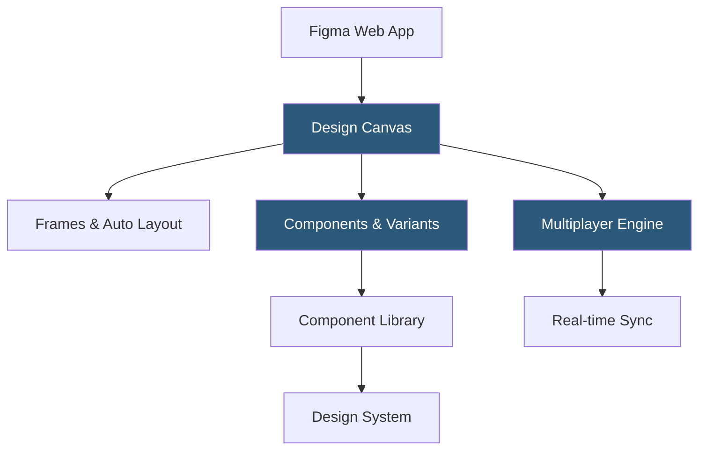

**Category:** UI/UX Design Platforms
**Difficulty:** Intermediate
**Reading time:** 6 min read

---

Figma is a browser-based collaborative design tool that enables multiple designers to work simultaneously on the same file in real time. It has become the industry-standard platform for UI/UX design, combining vector design tools, interactive prototyping, design system management, and developer handoff in a single environment.

- **Multiplayer Editing** — real-time collaborative editing where multiple users see each other's cursors and changes instantly
- **Frames** — Figma's primary layout containers, equivalent to artboards, supporting auto-layout and constraints
- **Auto Layout** — CSS flexbox-inspired layout system enabling responsive frame designs that reflow automatically
- **Components** — reusable design elements with master instances and overrides for consistent design system management
- **Variants** — component property system grouping related component states (hover, active, disabled) into a single component set
- **Design Tokens** — named values for colors, typography, and spacing that can be shared across files and teams
- **FigJam** — Figma's whiteboarding tool for brainstorming and ideation, integrated within the same workspace

Figma runs in the browser using WebGL for rendering and WebSockets for real-time collaboration. The rendering engine draws all design elements using the GPU, enabling smooth interaction with complex files containing thousands of layers. WebSockets maintain a persistent connection to Figma's servers, broadcasting operational transforms (similar to those used in collaborative text editors) that keep all connected clients synchronized.

Files are stored on Figma's servers rather than locally. The desktop app is an Electron wrapper providing offline capability through a local cache—files are synced when connectivity is restored. The design canvas uses a tree-based document model where frames, groups, and layers are nodes with properties serialized as JSON.

Auto Layout converts frames into flexbox-like containers. Setting a frame to horizontal auto layout causes child elements to stack in a row with configurable gap, padding, and alignment. When text or content inside changes size, the auto layout frame resizes to accommodate, similar to how a CSS flexbox container behaves. This makes responsive design prototyping accurate to how HTML will actually render.

Components create a reference-based system: changes to a main component propagate to all instances, while instance overrides (swapped text, different image) are preserved. Variants extend this by grouping multiple component states into an interactive set, where designers can toggle between states in prototypes.

- Product teams co-designing mobile and web UI in real time across geographies
- Design systems teams maintaining shared component libraries at scale
- Agencies managing client design reviews through shared prototype links
- Developers inspecting design specs and extracting CSS values in Dev Mode
- Solo designers building complete app UI flows from wireframe to high-fidelity

| Advantage | Disadvantage |
|-----------|--------------|
| Real-time collaboration eliminates file version conflicts | Requires internet connection for full functionality |
| Browser-based access works on any OS without installation | Complex files with many components can slow browser rendering |
| Strong component and design system support | Free tier has limitations on editors and file history |
| Dev Mode provides accurate spec extraction for engineers | Vendor lock-in; files cannot be opened in other design tools natively |

- [Figma Design Systems](figma-design-systems.md)
- [Figma Prototyping](figma-prototyping.md)
- [Figma Dev Mode](figma-dev-mode.md)

---
*Part of the [UI/UX Design Platforms](index.md) category · [Back to Master Index](../../index.md)*
