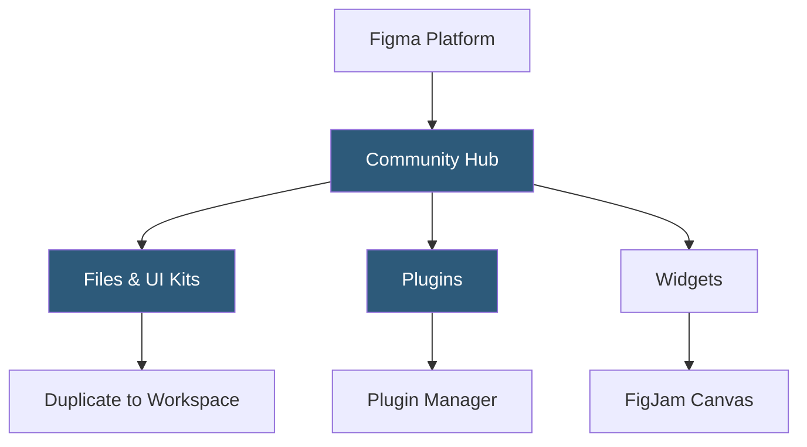

**Category:** UI/UX Design Platforms
**Difficulty:** Beginner
**Reading time:** 5 min read

---

Figma Community is the official platform for sharing and discovering free design files, UI kits, plugins, widgets, and templates created by Figma users worldwide. It serves as a collaborative open ecosystem where designers publish resources, explore others' work, and build on community-contributed foundations.

- **Community Files** — Figma design files shared publicly and duplicable directly to a user's workspace
- **UI Kits** — complete component libraries for design systems, including Material Design, iOS, and custom brand kits
- **Community Plugins** — shared plugins built with the Figma Plugin API and reviewed for installation
- **Widgets** — FigJam-compatible interactive objects built with Figma's Widget API for collaboration tools
- **Featured Resources** — Figma-curated collections highlighting high-quality community contributions
- **Creator Profiles** — public profiles for designers publishing resources with follower and like tracking
- **Figma Education** — community resources specifically tagged and curated for learning design fundamentals

Community files are shared from a designer's workspace by enabling the "Community" sharing option on a file, which publishes a snapshot of the file to the Community hub. Visitors can duplicate the file to their own workspace, creating an independent editable copy. The published community file is static—it does not update when the original creator updates their source file—providing version stability for consumers.

Plugins are built using the Figma Plugin API, which exposes access to the document tree, styles, and network requests through a sandboxed JavaScript environment. Plugins run in an iframe-based UI panel alongside the canvas. The Figma Community review process checks plugins for security violations (unauthorized network access, data exfiltration) before listing. Plugin managers handle installation, updates, and permission grants.

UI kits in the Community range from official platform kits (Apple iOS UI Kit, Material Design 3 Kit, Windows 11 UI Kit) to community-built third-party UI system kits (Tailwind CSS UI, Ant Design, Shadcn/UI). These are full Figma files with component libraries that teams can publish as shared libraries, enabling their use as a design system foundation without building from scratch.

Creator engagement is tracked through likes, duplications, and followers. Notable creators earn "Featured" badges, and Figma's editorial team curates featured collections around themes (Dark Mode Designs, Accessibility-First UI Kits, Icon Libraries). This creates discovery pathways for quality resources in an otherwise unmoderated marketplace.

- Designers bootstrapping projects using community UI kits as system foundations
- Teams installing Figma plugins to automate repetitive design tasks
- Students learning design by examining and deconstructing community files
- Design system teams sharing their organization's component library publicly
- Researchers and writers capturing real-world design pattern examples

| Advantage | Disadvantage |
|-----------|--------------|
| Massive free resource library accelerates project starts | Community file quality varies; no universal quality standard |
| Plugin ecosystem extends Figma with powerful automation | Published community files freeze at a snapshot and don't auto-update |
| Official platform kits ensure design-to-platform accuracy | Some plugins have privacy implications requiring careful vetting |
| Creator profiles build reputation and professional exposure | Popular UI kits can create design homogeneity across products |

- [Figma Collaborative Design](figma-collaborative-design.md)
- [Figma Plugins Ecosystem](figma-plugins-ecosystem.md)
- [Figma Design Systems](figma-design-systems.md)

---
*Part of the [UI/UX Design Platforms](index.md) category · [Back to Master Index](../../index.md)*
