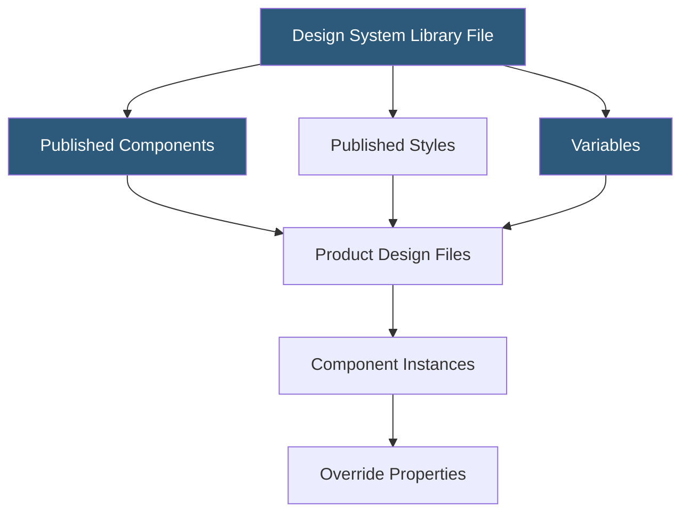

**Category:** UI/UX Design Platforms
**Difficulty:** Advanced
**Reading time:** 7 min read

---

Figma's design system capabilities allow organizations to build, maintain, and distribute shared component libraries, design tokens, and style guides across teams. Design systems in Figma function as single sources of truth for brand and UI consistency, published as shared libraries consumed by multiple product design files.

- **Shared Libraries** — published Figma files whose styles and components are available to all files in a team or organization
- **Library Publishing** — the act of pushing component and style updates to all subscribed files in a team
- **Component Properties** — parameterized component controls (text, boolean, instance swap) exposed in the Properties panel
- **Design Tokens** — named color, typography, and spacing values synced with code repositories via plugins or API
- **Style Guides** — Figma's built-in color styles, text styles, effect styles, and grid styles defining design system foundations
- **Library Analytics** — Figma Organization feature showing component usage across files for system governance
- **Variables** — Figma's structured token system supporting modes (light/dark) and responsive value sets

A Figma design system begins in a dedicated library file containing the source components and styles. Designers organize components in pages (Foundations, Components, Patterns) and define color styles, text styles, and—in newer Figma versions—Variables for token-level control. Publishing the library makes these resources available to all team files via the Assets panel.

Variables are Figma's advanced token system. Unlike flat color styles, Variables support multiple modes (light mode, dark mode, brand themes) defined as value collections. A `surface/background` variable might resolve to `#FFFFFF` in light mode and `#1A1A1A` in dark mode. Designers switch modes per frame, enabling accurate light/dark theme previews without maintaining separate component sets.

Component Properties (Text, Boolean, Instance Swap, Variant) are declared on main components and surfaced in the Properties panel when an instance is selected. Text properties allow renaming without navigating into the component. Boolean properties toggle visibility of layers. Instance Swap properties enable designers to swap nested components (e.g., icons inside a button) directly from the panel. These properties reduce the number of variants needed to cover state combinations.

Design token integration with code is typically handled through plugins (Tokens Studio, Figma Tokens) or the Figma REST API. Plugins read Variables and export them as JSON files compatible with Style Dictionary, enabling automated CSS custom property generation. This creates a codified link between the Figma system and the engineering component library.

- Enterprise product teams maintaining UI consistency across 10+ product squads
- Design agencies standardizing deliverable quality across client projects
- Open-source design system teams distributing community component libraries
- SaaS companies building white-label products requiring brandable design tokens
- Accessibility teams enforcing WCAG color contrast and type scale requirements

| Advantage | Disadvantage |
|-----------|--------------|
| Library publishing propagates updates organization-wide | Library management requires dedicated design system team investment |
| Variables enable multi-mode theming in a single component set | Variables and component properties have a steep learning curve |
| Library Analytics enable governance and deprecation tracking | Organization-level features require expensive Enterprise plan |
| REST API enables code-token synchronization pipelines | Design-to-code token sync still requires custom tooling or plugins |

- [Figma Collaborative Design](figma-collaborative-design.md)
- [Figma Dev Mode](figma-dev-mode.md)
- [Figma Plugins Ecosystem](figma-plugins-ecosystem.md)

---
*Part of the [UI/UX Design Platforms](index.md) category · [Back to Master Index](../../index.md)*
