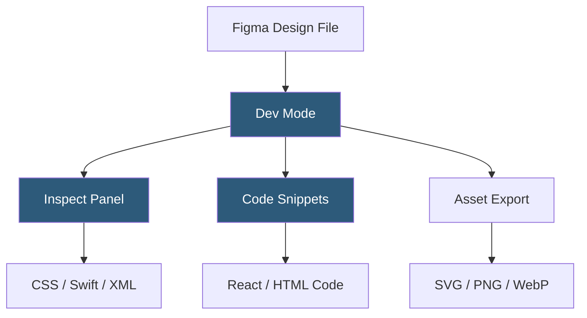

**Category:** UI/UX Design Platforms
**Difficulty:** Intermediate
**Reading time:** 5 min read

---

Figma Dev Mode is a purpose-built inspection environment within Figma tailored for developers, providing code snippets, measurement annotations, asset exports, and design token references extracted directly from design files. It reduces design-to-development friction by surfacing engineering-relevant information without requiring design tool expertise.

- **Inspect Panel** — Dev Mode's properties panel showing CSS, iOS Swift, Android XML, and React Native code for selected layers
- **Code Snippets** — auto-generated code in multiple languages reflecting the selected element's visual properties
- **Ready for Dev** — a workflow status flag designers set on frames to signal development readiness
- **Annotations** — measurement and specification overlays showing spacing, size, and alignment between elements
- **Asset Export** — configurable export settings for icons, images, and illustrations in SVG, PNG, WebP, and PDF
- **Component Links** — connections between Figma components and their corresponding code component counterparts in Storybook or repositories
- **Variable Inspection** — Dev Mode surfaces Variables and their resolved values, mapping to design tokens in code

Dev Mode is toggled via a switch in the Figma toolbar, shifting the interface from the design-centric editor to a developer-optimized inspection view. In Dev Mode, clicking any layer opens the Inspect panel, which reads the layer's properties and generates code representations. CSS output converts Figma properties to standard CSS: `background`, `border-radius`, `box-shadow`, `font-family`, `font-size`, `line-height`, and `letter-spacing` are all surfaced with their pixel or rem values.

For components, Dev Mode displays the component's name, variant properties, and any linked code component. The Code Connect feature (Figma's developer-facing framework) allows engineering teams to map Figma components to their production code counterparts. When a designer selects a Button component in Dev Mode, Code Connect can surface the actual React `<Button variant="primary" />` usage example from the codebase rather than just CSS values.

Annotations work by reading spacing and alignment relationships between layers. Hovering a layer in Dev Mode shows distance measurements to adjacent elements and the parent container. These measurements reflect the Figma layout properties (padding, gap, margins) and are rounded to match the design system's spacing scale where Variables are used.

The "Ready for Dev" flag is set by designers at the section or frame level. Developers can filter their Dev Mode view to show only sections marked Ready for Dev, creating a clear handoff queue without needing Jira tickets or separate communication. This status is tracked in Figma's design file and visible to all team members.

- Front-end developers extracting accurate CSS values from design files
- Engineering teams validating implemented components against design specifications
- Design system teams linking Figma components to Storybook component documentation
- QA engineers comparing implementation screenshots against design frame specifications
- Mobile developers extracting iOS Swift or Android XML property values

| Advantage | Disadvantage |
|-----------|--------------|
| Auto-generated code reduces transcription errors from design to development | Generated code is property-based, not structural—doesn't produce full component code |
| Ready for Dev flag creates explicit handoff without process overhead | Dev Mode is a paid feature requiring Figma Professional or Organization plan |
| Code Connect maps components to real codebase usage examples | Setting up Code Connect requires developer configuration per component |
| Asset export directly from design eliminates separate export workflow | Complex layouts may require developer judgment beyond what inspect shows |

- [Figma Collaborative Design](figma-collaborative-design.md)
- [Figma Design Systems](figma-design-systems.md)
- [Figma Plugins Ecosystem](figma-plugins-ecosystem.md)

---
*Part of the [UI/UX Design Platforms](index.md) category · [Back to Master Index](../../index.md)*
